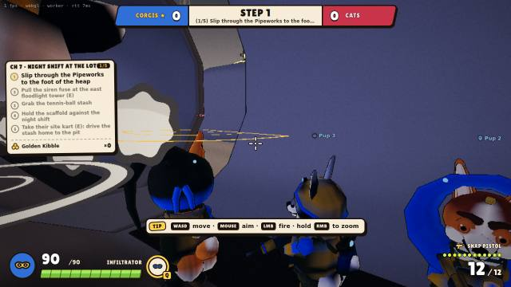
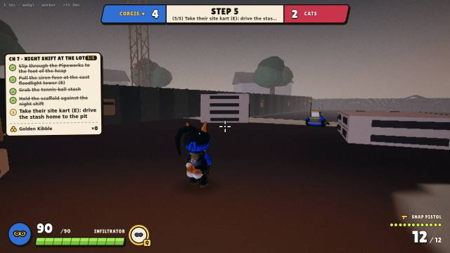
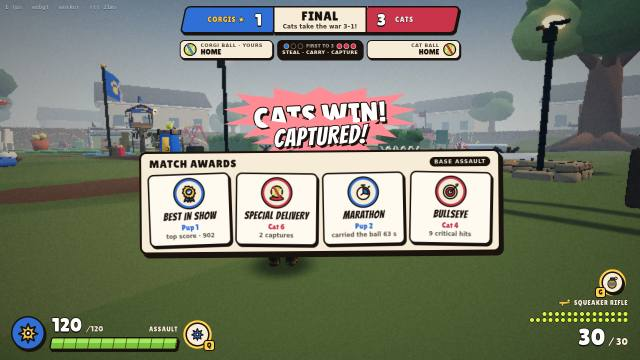
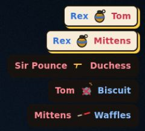
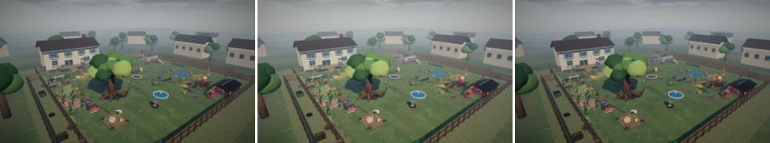
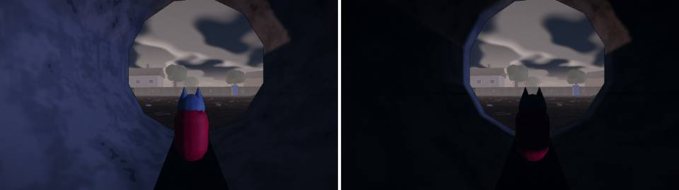
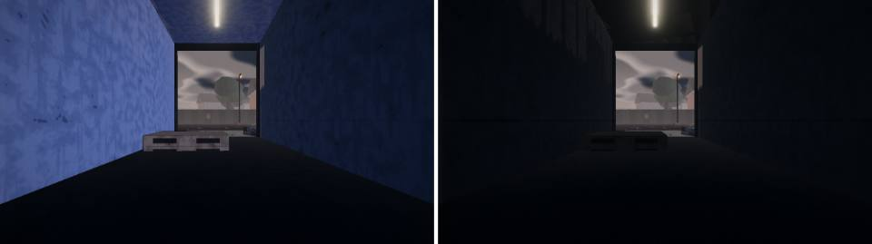
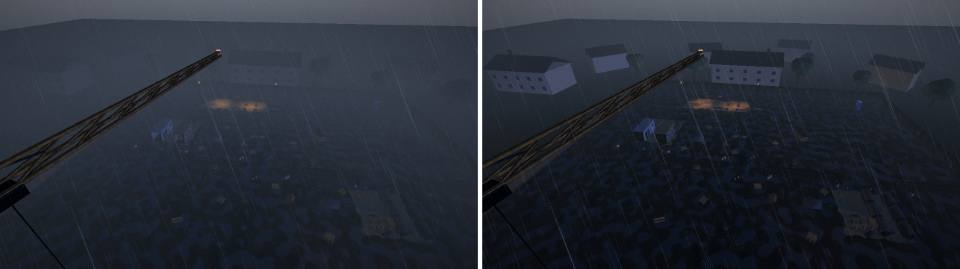

# Wave 10 gallery: depth

What Wave 10 added, one image per feature, with the numbers behind it. The images are small JPEGs made with
`tools/gallery-jpeg.mjs` from each lane's evidence (full-size PNGs in `artifacts/`, git-ignored). The renderer is
headless SwiftShader: judge the look here, frame times only on a real GPU.

Independent verification: `docs/qa/W10_VERIFICATION.md` (Q5, **75 / 100**, gate PASS, no P0; one P1: the West Yard's corgi side
wins Base Assault again since Wave 10, 23 of 30 decided matches, which fix lane F3 takes).

## Chapter 7 "Night Shift at The Lot" (A7)
The adventure's first chapter on The Lot. It unlocks after chapter 6 and plays at the Lot's own dusk with the
floodlights on (`?mode=adventure&chapter=night_shift`). Par 4:00; pups Infiltrator, Warden, Assault, Overwatch.

 

1. **The Pipeworks sneak:** under the site gate, across the causeway, through a dark pipe to the foot of the heap, past
   three pacing sentries. Being seen brings the heap's night shift hunting.
2. **The siren fuse** at the east floodlight tower (E), behind two kittens standing in the light pools.
3. **The stash:** four tennis balls around the scaffold.
4. **Hold the scaffold** for 40 s against a shield Heavy, tabbies, kittens and a Siamese.
5. **The getaway:** take the cats' site kart from the heap's west side and drive the stash home to the corgis' pit.

- Built only from the existing step types; a chapter now names its map (C10 `ChapterDef.map`), and online rooms
  advance only along chapters of their own map.
- **Open:** the sentries' cone is 14 m against a 45 m sight; an optional breakable generator was left for later.

## Match awards and the kill feed (U3)
 

- **Awards:** 3–5 of 13 comic awards after every match, tallied on the client from the event stream and the roster
  (BEST IN SHOW, SPECIAL DELIVERY, MARATHON, BULLSEYE, LOB STAR, GUARD DOG…). The card holds the scoreboard open.
- **The kill feed** shows the killing weapon from the death event (C10 `wpn`): the grenade and the hairball get their
  own glyphs, even on a self-knockout.
- **Base Assault tips** for a first match.
- **Open (pre-existing):** the CAPTURED! burst still overlaps the win banner, as seen above.

## The sound of the new war (AU2)
No image: judged by measurement (the `audio-w10-*` offline renders).
- **Base Assault:** the ball squeaks where it changes hands, with a field-bugle call per event that differs for us
  and for them. A capture fanfare plays, and a heartbeat pulse runs under the music while a ball is on the move.
- **Throwable fuse ticks** now stand 4 to 13 dB over a storm firefight in their band; they were 23 dB under.
- **The Lot's ambience** is placed from its world data and driven by the weather: rain on steel and tarps, the crane
  in the wind, floodlight hum, the ditch running. The West Yard's ambience is bit-identical to before.

## Look calls with data (P5)
**Daytime exposure:** left to right, pre-P4, the W9 tree, and now (the West Yard at noon).

- Exposure follows the time of day: 1 at dusk, at night and in a storm, and 0.78 from 16° of sun up.
- All 10 noon and match-start views are within +3 % of pre-P4 luma; the W9 tree was +15 to +34 %.

**Interiors:** before and after, a Lot pipe and a container at dusk.

- The sky fill stays out of 10 interior boxes (8 pipe bores, 2 containers) with no new light, pass or draw call.
- Luma at dusk: pipe mouth 43.6 → 23.6, container 43.8 → 16.4.
- **Watch:** the insides are now near-black, and a pet inside keeps only 25 % of its rim and fill (see the cat in the
  pipe). Judge this on a real monitor, and in chapter 7's Pipeworks sneak.

**The storm overview from 114 m:** before and after.

- High cameras thin the storm's extra fog. Contrast 18.8 → 23.5; the houses, the pit and the containers read.
- Player views and the West Yard overview are unchanged.

## Bots (N3)
- **Thin beams in the nav grid:** hedgehogs, posts and poles are now in the nav grid.
  - A bot sent through a hedgehog goes round it: 64 of 64 within 2.5 s (before: 14 took over 4 s, the worst 12.6 s).
  - Worst hedgehog pin in 30 matches: 1 s.
- **Lane weights** live in the map's `LOT_LANES`: picks are bit-identical to before.
- **A plane pilot in Base Assault:**
  - a bot flies the plane in 19 of 20 West Yard matches;
  - carriers never board it;
  - captures are 4.85 a match against 5.00 without a pilot.
- **The skirmish soak** now runs a 150 s window. At 120 s it had failed on chaotic seeds, not on a regression.
