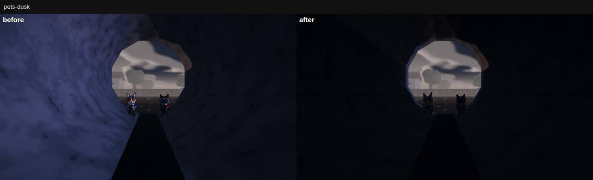
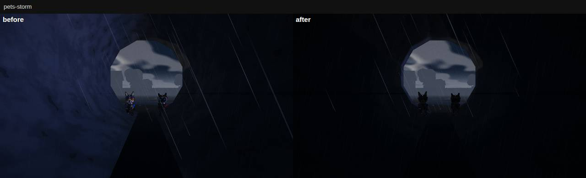

# W10 Verification: Q5 independent verifier (Wave 10)

**Verdict: Wave 10 is done and correct, with one P1 to fix before a human playtest: since Wave 10 the corgis win Base
Assault on the West Yard again.** Chapter 7, the awards, the new sound and the look calls all check out against
independent measurements, on seeds and scenes the lanes never used. The P1 is in the bots, not in the rules.
- On seeds 1–40, under the sim's own first-to-3 rule, the corgis win **23 of 30** decided matches. Before Wave 10, on the
  same seeds, they won 11 of 27 (Fisher p = 0.008).
- Mirrored, the team on the corgis' side still wins (8 : 5).
- The cats' late game fell: after 2:00 they capture 63 against 88 before.
- N3 is the only Wave 10 change to West Yard bots. Removing its new Base Assault pilot moves the numbers partway; the
  thin-beam nav change is the other suspect.

- **Gate** (clean `git archive abbcecb`):
  - typecheck clean, `BOUNDARIES: PASS`;
  - the 22 unit files Wave 10 added or changed: **210 / 210 pass**;
  - soak **PASS** on both maps, every mode the map hosts (West Yard 6 modes, score 93; The Lot 5 modes, score 93): 0 errors,
    stuck ≤ 1.5 s, tick p95 ≤ 1.49 ms;
  - build: **4.22 MB gzip** (budget 5).
  - The full unit suite and the e2e specs are the lead's `verify-commit abbcecb --e2e` (it ran 14:01–14:12; its result is the
    lead's to report). I did not re-run them.
- **A7, chapter 7 "Night Shift at The Lot": PASS.**
  - Bot squads finish **8 / 8 new seeds, all gold** (122.7–164.9 s against the 4:00 par, median 142.7 s).
  - A wipe forced at each checkpoint step restarts there and still finishes gold. A wipe in the getaway restarts at the
    hold.
  - It unlocks only after chapter 6. An online Lot room replays chapter 7 on The Lot, and a West Yard room goes 6 → 1.
  - A7's heap north-ramp slide (~40 s) is gone. A residual remains: a cat bot hops up the carved side for **7–9 s**
    (P2-3).
- **U3, awards: PASS.** An oracle built inside the authority, from raw sim events and per-tick ball state, agrees with
  the client's fold on **every counter of every player** in three real matches (Base Assault, TDM, Core Rush). It also
  agrees on every award shown.
  - The cards show 3–5 awards.
  - **No award goes to a player who left.** In all three matches a leaver would have won or shared a category (BULLSEYE
    twice, FIRST BITE, SPECIAL DELIVERY), and the card went to the best player still on the roster.
  - A hand-written stream (ties, a leaver, steals versus pick-ups, a throwable kill, a trailing streak) gives exactly the
    card I derived by hand.
- **AU2, audio: PASS on the output, with one headroom note.**
  - The output never clips: peak ≤ 0.88 in every scene (the model's master chain).
  - The busy Base Assault capture moment peaks at −0.4 dBFS into the limiter.
  - Inside a Lot container in a storm, the steel-rain clicks alone drive the sfx bus to **+10 dBFS** and the master mix to
    **+6 dBFS** before the limiter. That does not duck gunfire: a rifle's level is the same within 0.2 dB. It is P2-6.
  - CPU: The Lot's storm ambience costs **1.5–2.8× the West Yard's storm audio** on AU2's offline renderer. That is a
    JS renderer, so the ratio holds, not the absolute cost; AU2 measured up to 4.6× in Chromium. The low tier saves only
    17 % at a container (P2-6). A real machine is still owed.
- **P5, look: every number reproduces** at its bookmarks, all 27 within 2 luma: 24 within 0.6, the match-start deck 1.0
  over, and the container wall 1.9 / 1.5 over.
  - Noon and match start are within +0.7 to +2.9 % of pre-P4 (measured on a pre-P4 snapshot too).
  - Dusk and night are unchanged from P4.
  - The pipe mouth is 23.6 at dusk; the storm overview's contrast is 23.6 (was 18.8).
  - **Measured on real pets for the first time:** inside a tunnel, a corgi and a cat at 7 m go from readable to **black
    silhouettes** against the mouth. Their luma falls 43 → 25 and 30 → 22; the team hue falls 1.5–3 % → 0.1 %. Rain falls
    inside the tunnel (P2-2).
- **N3, bots:**
  - soak PASS;
  - the Lot's Base Assault is fair: the corgi side takes 51 % of captures over base + mirror;
  - hedgehogs never pin;
  - but see the P1 above;
  - and the mirrored West Yard has two long pins, 16.5 s and 10 s (P2-4).
- **Budgets:**
  - The Lot, live Base Assault, high: **272 draws / 0.59 M triangles at 4 v 4**, and **338 / 0.67 M at 8 v 8** (the URL
    cap).
  - The West Yard, 4 v 4: 299 / 1.15 M.
  - Tick p95 at 24 characters: **1.59 ms** on The Lot and **2.16 ms** on the West Yard (budget 3), with 22–28 KB/s of
    snapshots per client.

**P1:** since Wave 10 the West Yard's corgi side reaches 3 first in 23 of 30 decided Base Assault matches (before: 11
of 27). The cause is in N3: the pilot is a suspect, the thin-beam nav the other.
**P2s:**
1. the sentry cone is drawn at 14 m while sentries see 45 m;
2. real pets turn black in the tunnels, where rain also falls;
3. the heap ramp still costs a cat bot 7–9 s;
4. two long bot pins on the mirrored West Yard;
5. Base Assault endings: the Lot rarely reaches 3, and 10–22 % of West Yard matches end in a same-tick 3 : 3 draw;
6. the Lot's container rain (+6 dBFS into the limiter, 2.8× the West Yard's audio cost);
7. tooling.

Scorecard **75 / 100 (R 85 · I 75 · F 60)**, gate PASS. What needs a human or a real GPU (60 fps, whether the tunnels
are playable on a real monitor, whether the new sound is right by ear, the queue test) remains open.

| | |
|---|---|
| Verified SHA | **`abbcecb`** ("W10 P5: look calls with data"), the tip of Wave 10. It contains C10 `b128cb5`, N3 `36ad16c`, A7 `69b0e8b`, U3 `4d336b3`, AU2 `6809cb5` and P5 `abbcecb`. |
| Comparison trees | `c783329` (the commit before Wave 10) for the Base Assault A/B. `2cf62b9` (pre-P4) for P5's daytime claim. A scratch copy of `abbcecb` with `'base-assault'` removed from `PLANE_MODES` (the only change) to isolate N3's pilot. All are clean `git archive`s. |
| Method | A clean `git archive abbcecb` in `…/scratchpad/q5/snap`, with `node_modules` linked. Every run, build, server and browser used a snapshot; no product file was changed. Headless Chromium 1194, SwiftShader (WebGL2): I judged looks from screenshots I opened, and cost by draws and triangles. |
| Box | 4 shared cores, load 6–21: my own parallel runs and, from ~14:55, another agent's vitest and Chromium. The lead's verify had finished by 14:12. Timings are best-of-N, and each gives its load. |
| Servers | Vite dev of the snapshot on **:5320** and of `2cf62b9` on **:4320**, each with its own cache dir. `vite preview` of the snapshot's build on **:8820**. |
| My outputs | New read-only probes (the lead commits them with this report): • `tools/qa5-adv.mjs`: the unlock, the online advance and a Lot room looping chapter 7; • `tools/qa5-awards.mjs`: `script` (the hand-written stream) and `match` (a real Room plus the authority-side oracle, with leavers); • `tools/qa5-ramp.mjs`: the heap north ramp, 64 runs, and `--trace` for one run; • `tools/qa5-ba-sum.mjs`: qa4-ba's JSON under the shipping first-to-3 rule (same-tick captures grouped, 3 : 3 a draw), pooled; • `tools/qa5-audio.mjs`: `mix` (per-bus peak / RMS), `duck` (gunfire against the ambience), `cost` (relative render cost, West Yard vs The Lot); • `tools/qa5-look.mjs`: P5's bookmarks, plus real pets inside a tunnel with the interiors on and off. Raw output is in the snapshot's `artifacts/q5/`; the images this report shows are in `docs/qa/w10-q5/`. |

---

## 1. Gate

| Check | Command (snapshot root) | Result | Verdict |
|---|---|---|---|
| Typecheck, boundaries | `npx tsc --noEmit` · `node tools/check-boundaries.mjs` | clean (15.6 s) · `BOUNDARIES: PASS` | **PASS** |
| Wave 10's unit files | `npx vitest run` on the 22 files W10 added or changed: `adventure-lot*`, `adventure-{chapters,client,a2-client}`, `ai-nav-thin`, `ai-plane-ba`, `lot-lanes`, `audio-w10-*`, `contracts-w10`, `style-p5`, `ui-awards*`, `ui-killfeed-w10`, `cosmetics`, `combat` | `Test Files 22 passed (22)` · `Tests 210 passed (210)` · 138 s | **PASS** |
| Full unit suite, build, e2e | the lead's `node tools/verify-commit.mjs abbcecb --e2e` (14:01–14:12) | not re-run by Q5 | (lead) |
| Build + download | `npx vite build`, then `npx tsx server/precompress.ts dist` | 4 files, 11.57 MB → **gz 4.22 MB** · br 3.16 MB (W9: 4.20) | **PASS** |
| Soak, West Yard, 6 modes | `npx tsx tools/soak.mjs --modes yard-skirmish,team-deathmatch,core-rush,base-assault,boss-rush,adventure --repeat 2` | `SOAK PASS \| score 93 \| modes 6 · errors 0 · stuck max 1.5s · tick p95 1.49 ms · completed 5/6` • Skirmish 94 (21 : 4 at 71 s) • TDM 94 • core-rush 98 • base-assault 93: 3 steals, 1 capture, 1 : 0 • boss-rush 85 (still wave 1 at 60 s; completion not required) • adventure 94 (chapter 1 at 42 s) | **PASS** |
| Soak, The Lot, 5 modes | same with `--map the_lot` and no boss-rush (the Lot doesn't host it) | `SOAK PASS \| score 93 \| modes 5 · errors 0 · stuck max 1.5s · tick p95 1.19 ms · completed 4/5` • Skirmish 91 • TDM 96 • core-rush 94 • base-assault 94: 1 steal, 0 : 0 at the horn • adventure 88: chapter 7 at step 3 of 5 in 60 s, as A7 reported | **PASS** |

## 2. A7: chapter 7 "Night Shift at The Lot"

**Bot squads on new seeds.** `npx tsx tools/qa-adventure.mjs bots --chapters night_shift --seeds 11,…,18`. S-1 has
landed, so the tool builds the chapter's own map. A7 used seeds 1–5.

| Seed | Time (s) | Medal | Wipes | Alarms | pipes · siren · stash · hold · escape (s) | Tick p95 (ms) |
|---|---|---|---|---|---|---|
| 11 | 146.3 | gold | 0 | 2 | 33.0 · 8.2 · 22.5 · 45.6 · 37.0 | 4.26 (load) |
| 12 | 151.3 | gold | 0 | 2 | 37.6 · 20.1 · 18.6 · 44.2 · 30.8 | 0.83 |
| 13 | 139.1 | gold | 0 | 2 | 25.7 · 32.4 · 14.4 · 45.3 · 21.4 | 0.63 |
| 14 | 122.7 | gold | 0 | 2 | 29.6 · 14.2 · 14.8 · 43.9 · 20.0 | 0.61 |
| 15 | 133.8 | gold | 0 | 2 | 19.9 · 16.1 · 17.3 · 52.7 · 27.9 | 0.55 |
| 16 | 127.6 | gold | 0 | 2 | 22.2 · 20.8 · 14.3 · 42.7 · 27.6 | 0.48 |
| 17 | 146.8 | gold | 0 | 2 | 34.9 · 18.4 · 17.6 · 43.9 · 31.9 | 0.54 |
| 18 | 164.9 | gold | 0 | 2 | 27.0 · 17.8 · 21.4 · 59.2 · 39.5 | 0.51 |

- **8 / 8 complete, all gold, 0 wipes.** The median is 142.7 s against A7's 130 s on seeds 1–5: par 4:00 is 1.7× the bot
  median, a little under A1/A2's ~2×. Every step completes, and every run raises both stealth alarms (bots never sneak,
  as A7 said).
- **Softlocks** (`qa-adventure.mjs wipe --chapters night_shift --seeds 12 --at 1|2|3|4`: the whole squad is killed 1 s
  into the step):

  | Wiped in step | Fail beat | Restarts at | Then |
  |---|---|---|---|
  | 1 the siren | 3.02 s | step 1 | complete, gold, 140.0 s |
  | 2 the stash | 3.02 s | step 2 | complete, gold, 149.6 s |
  | 3 the hold | 3.02 s | step 3 | complete, gold, 145.1 s |
  | 4 the getaway (no checkpoint) | 3.02 s | step 3 (the last checkpoint) | complete, gold, 190.0 s |

- **The unlock, the guard, the online advance** (`npx tsx tools/qa5-adv.mjs --seed 21`, my own reading of the client's
  progress rules and the runner, not A7's tests):
  - `withCompletion` over chapters 1–6: chapter 7 is locked before chapter 6 is done and unlocked after it (`unlocked` 7;
    `CHAPTER_PLAN` has 7 slots). `afterChapter(ch6)` is `next`, `afterChapter(ch7)` is `end`.
  - `sanitizeRoomSetup('adventure', 'night_shift', null, 'west_yard')` gives map `the_lot`: a room asking for chapter 7 on
    the West Yard runs The Lot. An unknown chapter gives chapter 1 on the West Yard.
  - On a West Yard sim, `chapterForSim` loads chapter 1 for `night_shift`; the online advance goes 1 → 2 → … → 6 → **1**.
    On a Lot sim every chapter id loads `night_shift`, and it advances 7 → 7.
  - **A real Lot room with no `holdResult`** (as the Node server runs it) completes chapter 7 (153.0 s, gold). It reloads
    30 s later, and 47 s after the finish it is live again on step 0 of `night_shift`, on The Lot, with 4 / 4 pups alive at
    the gate. It does not stall at the loop point.
- **A7's own open items, confirmed:**
  - The sentry cone is drawn to `CONE_RANGE = 14` m (`src/client/adventure/views.ts`). A grunt sees 45 m and a kitten
    35 m (`src/sim/ai/archetypes.ts`), × 0.6 in a storm. So the cone shows 31–40 % of the danger (P2-1).
  - The breakable generator (S-4) is not built. The siren fuse stands in, and nothing on screen contradicts it. That is the
    owner's call, not a finding.

**The heap north ramp** (A7 §8.7: a bot sliding up and down the ramp's east edge for ~40 s).
`npx tsx tools/qa5-ramp.mjs`: a lone bot on the real Lot, N3's harness (goal set every tick, vehicles off), 8 starts
round the ramp's foot × 4 goals on the heap top (the fuse, two stash balls, the scaffold) × both species. That is 64
runs.
- **All 64 arrive** (worst 13.8 s, for 37 m); the soak's stuck rule reads ≤ 1 s. **The 40 s slide does not reproduce.**
- **A residual remains for cats.** From the ramp's east foot, a cat heading diagonally for the heap top spends **7–9 s**
  in the pin box (x 64–70, z 82–95). Corgis spend ≤ 1 s there.
  - The trace (`qa5-ramp.mjs --trace 68.4,92.6,44,120.8 --cat`): the cat first runs down to z 85. It then climbs the carved
    side in hops, y 0.16 → 0.55 → 0.59 → 1.18 → 1.76, pausing ~1.5 s at each, and only at 8.5 s reaches the ramp and
    the top.
  - That is the mechanism A7 named (the grid samples the carve as walkable, the controller meets 65°), now escaped by
    jumps. The stuck rule cannot see it because the cat keeps moving (P2-3).

## 3. U3: awards, the kill feed, Base Assault tips

**A scripted stream** (`npx tsx tools/qa5-awards.mjs script`). Base Assault, 5 v 5. Player 15 lands the first
knockout and 9 crits, then leaves. The stream also has:
- a 14 s steal and capture;
- two carrier stops;
- a pick-up of a dropped ball (not a steal);
- a squeaker knockout;
- a 3-streak while trailing 0 : 1;
- a 3-streak while leading;
- a 4-way tie at 500 soaked;
- a return credited through the roster.

I derived the card by hand from U3.md §1's rules. The tally gives exactly:
`BEST IN SHOW 2 (312) · GUARD DOG 4 (2) · LOB STAR 3 (1, corgi) · ON A ROLL 2 & 11 (3) · BULLSEYE 12 (6)`.
- FIRST BITE belonged to a leaver: dropped.
- CHEW TOY was a 4-way tie: dropped.
- SPECIAL DELIVERY and MARATHON went to player 2, who already had BEST IN SHOW, so the spread rule left them off.
- Every intermediate counter matches: steals versus grabs, stops, the trailing streak, crits. **PASS.**

**Real matches against an authority-side oracle** (`npx tsx tools/qa5-awards.mjs match --mode … --map … --seed …
--seconds 240`):
- The setup: a Room with 4 v 4 bots and an idle human, "Rex". Every message goes through the Node frame path
  (SnapEncoder → JSON → SnapDecoder) into `AwardsTally`, exactly as `main.ts` feeds it.
- **The oracle ignores the client.** It reads the raw sim events before the wire, and for Base Assault the balls' state
  on every tick (`baseAssaultBalls`): grabs, steals from the stand, carry length, stops, captures.
- **The leavers:** at 70 % of the match three humans join the cats, so the Room removes three cat bots mid-match.

| Match | Card (shown) | Fold vs oracle, every player × every counter | Every award shown agrees with the oracle | Winners off the final roster | A leaver would have won |
|---|---|---|---|---|---|
| Base Assault, West Yard, seed 31 (1 : 2) | BEST IN SHOW Pup 3 (1600) · SPECIAL DELIVERY Pup 2 & Cat 5 · GUARD DOG Pup 1 (5) · CHEW TOY Ghost0 (840) | **0 differences** (kills, crits, damage, streaks, throw kills, first kill, steals, grabs, captures, stops, longest carry ± 0.2 s) | yes | **0** | SPECIAL DELIVERY (a 3-way tie with Cat 8); STICKY PAWS (a tie with Cat 6) |
| TDM, The Lot, seed 32 (15 : 13) | BEST IN SHOW Pup 2 (625) · HEAVY PAWS Pup 2 (6) · ON A ROLL Cat 5 (4) | **0** | yes | **0** | BULLSEYE (8 crits; the roster's best has 7); ON A ROLL (a tie) |
| Core Rush, West Yard, seed 33 (308 : 361) | BEST IN SHOW Pup 3 (1110) · PAD PATROL Pup 2 (6) · BULLSEYE Pup 1 (7) · CHEW TOY Cat 5 (1248) | **0** | yes | **0** | BULLSEYE (12; the card gives the roster's best, 7); FIRST BITE (dropped, not reassigned) |

- **Who should have won?** The oracle names the same winner and value for every award on every card. It also names the
  categories the spread rule left off (e.g. MARATHON 65 s, FIRST BITE and BULLSEYE 12, all Cat 5 in the Base Assault
  match, who already held SPECIAL DELIVERY).
- The cards show 4, 3 and 4 awards. The scripted one shows 5.
- In all three matches no throwable killed anyone, so LOB STAR stayed empty. The throwable path is covered by the
  scripted stream and by U3's test.

**The kill feed.** `ui-killfeed-w10.test.ts` passes on the snapshot (in the 210). It makes a real Sim throw kill (a
squeaker and a hairball), sends the death event through the wire encoder and through the worker's structured clone, and
checks the grenade / hairball glyph. Without `wpn` it falls back to exactly the pre-W10 guess. I did not re-derive it.

**Base Assault tips.** `ui-awards-ba-tips.test.ts` passes (10 tests): each tip shows once and ends with its situation,
only the first Base Assault match of at least 10 s teaches, and Show again resets. Not re-derived.

## 4. AU2: the sound, by measurement

**Levels per bus** (`npx tsx tools/qa5-audio.mjs mix`):
- The setup: AU2's own offline renderer (`tests/unit/audio-w10-render.ts`, cross-checked by AU2 against Chromium within
  0.5 dB), the real stack (`createAudio` + X4 director + G1 weather + AU2 site ambience), 32 kHz.
- Taps on the sfx, ui and music buses, on the master gain (the mix into glue + limiter) and on the output.
- Peak in dBFS, RMS, and the loudest 100 ms.

| Scene | sfx bus peak / RMS | ui (calls) peak | music peak | **master (into the limiter)** peak / RMS | **output** peak / loudest 100 ms |
|---|---|---|---|---|---|
| Busy Base Assault capture, Lot storm: local corgi vs a hairball (AU2's scene) | +2.4 / −17.0 | −4.2 | −12.2 | **−0.4** / −20.1 | **0.866** (−1.2) / −11.6 |
| the same, local cat vs a squeaker | +1.3 / −17.2 | −3.5 | −12.2 | −1.3 / −20.3 | 0.866 / −11.1 |
| The capture alone (fanfare over the storm), Lot | −7.2 / −20.6 | −7.8 | −15.7 | −8.1 / −23.5 | 0.643 / −14.5 |
| **Lot storm ambience, inside a container** | **+10.0** / −15.8 | – | – | **+6.1** / −19.7 | 0.883 / −18.3 |
| Lot storm, by a container (outside) | +5.0 / −18.8 | – | – | +1.1 / −22.7 | 0.872 / −18.4 |
| Lot storm, floodlight foot / ditch / mud / skip | −7.3 / −6.5 / −7.3 / −0.9 | – | – | −11.2 / −10.4 / −11.2 / −4.8 | ≤ 0.834 |
| Lot rain, inside / outside a container | +5.3 / −0.4 | – | – | +1.4 / −4.2 | 0.872 / 0.800 |
| Lot clear (any spot but the floodlight) | −37.1 | – | – | −41.0 | 0.019 |
| **West Yard storm** (weather only, for reference) | −7.3 / −19.9 | – | – | −11.2 / −23.7 | 0.517 / −17.2 |

- **No clipping at the output** in any scene: the peak is ≤ 0.88 on the model's chain (AU2 measured 0.90–0.91 on
  Chromium's real chain). The busy moment peaks at −0.4 dBFS into the limiter, inside AU2's own bound.
- **The loudest thing on The Lot is the rain on a container roof.** Inside a container in a storm, the steel-rain
  "dust" clicks drive the sfx bus to +10 dBFS and the mix to +6.1 dBFS before the dynamics chain, with a crest of about
  26 dB. That is louder into the limiter than AU2's busy moment, and above the "mix into the limiter < 1.6" bound its
  mix test holds for that moment (2.02 here). AU2 notes the Node steel loop renders ~2 dB hot, so Chromium would read
  about +4 dBFS.
- **Does it duck the game?** `npx tsx tools/qa5-audio.mjs duck`: a teammate's rifle 6 m away every 0.5 s, rendered with
  the rifle audible and with it muted (same seed, same limiter), so A − M is the rifle as the mix lets it through:

  | Where | The rifle at the output, loudest 100 ms | The bed |
  |---|---|---|
  | West Yard, storm | −24.5 dB | −17.7 |
  | Lot storm, mud | −24.5 | −17.7 |
  | Lot storm, by a container | −24.3 | −19.7 |
  | Lot storm, inside a container | −24.3 | −20.7 |
  | Lot storm, inside a container, site ambience off | −24.5 | −17.7 |

  **Gunfire is not ducked** (Δ ≤ 0.2 dB): the combat duck takes the site sub-bus down while guns fire. So the hot
  internal peaks cost headroom and limiter work, not audibility (P2-6, low).
- **The weather split holds:** dry is near silent except by the floodlights (−37 to −28 dBFS peak), rain adds the steel
  and the tarp, storm adds the roar. The West Yard's storm output equals the Lot's mud spot, which has no site emitters
  near it, to 0.1 dB: the West Yard is untouched.

**CPU: The Lot's storm ambience against the West Yard** (`npx tsx tools/qa5-audio.mjs cost`):
- The measure: the offline renderer's wall time per second of audio (6 s scenes, best of 3, interleaved, load ~6), and
  the audio nodes each scene creates.
- It is a relative measure. The renderer is JavaScript, so its absolute ms are far above Chromium's native audio
  thread.
- My Chromium harness (an OfflineAudioContext driven through the Vite dev server) hung inside the page on this box. I
  did not diagnose it and did not hand it back.

| Scene (listener spot) | Render ms per s of audio | × West Yard storm | Nodes created |
|---|---|---|---|
| no world audio (engine only) | 2.3 | 0.16 | 8 |
| **West Yard storm** (weather; the site ambience builds nothing) | **14.0** | **1.00** | 28 |
| West Yard clear | 12.5 | 0.90 | 28 |
| The Lot storm, floodlight foot | 21.0 | 1.51 | 78 |
| The Lot storm, mud | 26.9 | 1.93 | 83 |
| The Lot storm, ditch | 29.4 | 2.11 | 101 |
| The Lot storm, by a container | 37.4 | 2.68 | 189 |
| **The Lot storm, inside a container** | **39.4** | **2.82** | 189 |
| the same, **low tier** | 32.8 | 2.35 | 189 |
| the same, site ambience off (weather only) | 10.7 | 0.77 | 28 |
| The Lot clear, floodlight foot (hum, far site) | 23.0 | 1.65 | 72 |

- **The Lot's storm ambience costs 1.5–2.8× the West Yard's storm audio**, the most by the containers (189 nodes against
  28). The same direction as AU2's Chromium numbers (storm + site at the worst spot 75–88 against 19 ms per s, ×4–4.6, at
  load ~20).
- **The low tier barely helps where it matters:** −17 % inside a container. It drops the second roof and floodlight,
  but a listener by one container keeps that roof's loops.
- Part of P2-6: a real machine's audio-thread load on The Lot in a storm is still unmeasured.

## 5. P5: the look calls, re-measured

`node tools/qa5-look.mjs --base http://127.0.0.1:5320` (the snapshot) and `--base http://127.0.0.1:4320 --sets day`
(pre-P4, `2cf62b9`). A fresh page per shot, 1280×720 SwiftShader, high tier, whole-frame Rec. 709 luma / contrast
(`world-shots.mjs`'s statistic). Every image below was opened.

**Daytime** (the W7 bookmarks at noon t = 0.5 and at match start t = 0.68):

| View | pre-P4, my measurement | **abbcecb** | vs pre-P4 | P5 claims |
|---|---|---|---|---|
| overview t 0.5 | 104.2 / 38.0 | **105.8 / 38.8** | +1.5 % | 105.8, +1.5 % |
| deck t 0.5 | 80.1 / 55.0 | **82.4 / 55.6** | +2.9 % | 82.2, +3.0 % |
| cats t 0.5 | 77.9 / 34.6 | **79.1 / 35.2** | +1.5 % | 79.7, +0.5 % |
| center t 0.5 | 85.4 / 35.3 | **86.4 / 35.4** | +1.2 % | 86.4, +1.1 % |
| flank t 0.5 | 61.3 / 44.5 | **61.9 / 45.0** | +1.0 % | 62.0, +0.5 % |
| overview t 0.68 | 87.8 / 42.5 | **88.8 / 43.8** | +1.1 % | 88.9, +1.3 % |
| deck t 0.68 | 54.8 / 40.0 | **56.1 / 40.7** | +2.4 % | 55.1, +2.8 % |
| cats t 0.68 | 69.4 / 39.1 | **70.1 / 39.7** | +1.0 % | 70.6 |
| center t 0.68 | 75.1 / 40.6 | **75.6 / 41.1** | +0.7 % | 75.0 |
| flank t 0.68 | 51.1 / 43.2 | **51.6 / 44.0** | +1.0 % | 52.0 |

**All 10 within +0.7 to +2.9 % of pre-P4** (the card: 5 %). Draws and triangles are identical between the trees on every
view. The noon overview looks like the pre-P4 yard: green lawn, pastel houses, haze kept, nothing washed out.

**Dusk and night on the West Yard: no regression.**

| View | P4 (Q4, `f1b1d34`) | **abbcecb** |
|---|---|---|
| overview t 0.74 | 79.2 / 42.7 | **79.2 / 42.6** |
| deck | 59.3 / 44.8 | **59.9 / 44.3** |
| cats | 56.5 / 38.0 | **57.1 / 38.3** |
| center | 60.2 / 41.6 | **60.3 / 41.5** |
| flank | 46.5 / 39.9 | **46.7 / 40.4** |
| overview / center, night t 0.9 | (P5: 11.5 / 10.2) | **11.5 / 10.0 · 10.2 / 7.7** |

All are ≥ 45 at dusk (the floor), with contrast within ±0.5 of P4.

**The Lot** (`labs/lot.html`, t = 0.74, frozen):

| View | P5 claims (dusk · storm) | **abbcecb, dusk · storm** |
|---|---|---|
| pipe mouth | 23.6 / 35.8 · 17.0 / 26.5 | **23.6 / 35.8 · 17.1 / 26.5** (< 30 at dusk: the card) |
| container interior `cw_end` | 16.4 / 26.0 · 13.9 / 21.1 | **16.2 / 25.5 · 13.9 / 20.4** |
| container wall `cw_wall` | 20.0 / 27.8 · 16.8 / 22.2 | **21.9 / 29.3 · 18.3 / 23.6** (1.9 / 1.5 over P5; still under 30) |
| container canyon | 47.7 / 36.1 · 32.6 / 24.2 | **47.8 / 36.2 · 32.6 / 24.3** |
| overview (114 m) | 57.1 / 35.0 · **38.4 / 23.5** | **57.1 / 35.0 · 38.6 / 23.6** (contrast 18.8 before P5) |

The storm overview reads as a place: the neighbours' houses, the pit's sodium pool, the containers, the crane jib, and a
dark mottled lot floor that still says storm. **Reproduced.**

**Real pets inside a tunnel** (P5's watch item: "characters keep 25 % of rim + fill inside; not measured on real pets"):
- `qa5-look.mjs --sets pets`: the Lot lab, camera inside the east bore at (79.5, 1.6, 22.4) looking out of the mouth. A
  corgi and a cat Assault (`createCharacter`, the game's kits) stand 7 m ahead, inside the same interior box, clear of
  its 0.4 m feather.
- Each frame is taken twice: with the interiors on (as shipped), and with `setStyleInteriors([])` (the fill as P4 had
  it). The pet mask comes from a flat-white pass of the same frame.

| Weather | Pet | Luma, interiors off → **on** | Team-hue share off → **on** | The tunnel around them, off → **on** |
|---|---|---|---|---|
| dusk | corgi | 42.9 → **24.9** | 3.0 % → **0.1 %** | 59.6 → 31.5 |
| dusk | cat | 29.6 → **22.2** | 1.5 % → **0.1 %** | 37.3 → 30.7 |
| storm | corgi | 32.2 → **21.2** | 2.5 % → **0.1 %** | 36.7 → 22.9 |
| storm | cat | 25.8 → **19.8** | 0.5 % → **0.1 %** | 25.8 → 22.2 |

 

- **What I saw.** With the interiors off, the tunnel wall is lilac, and the pets read: orange-and-cream corgi face, blue
  shell; grey cat, crimson trim. With them on, the wall is near black, and both pets are **black silhouettes** against
  the bright mouth. Only the helmet lamps (a blue and a red dot) say which team.
- Up close (3 m, the first shot I took) the faces still read, dimly.
- In the storm frame, **rain streaks fall inside the tunnel**, in front of the camera (P5's second watch item).
- So P5's 25 % keep leaves a pet about as bright as the dark wall around it: the figure/ground contrast comes only from
  the mouth behind it. It is P2-2, with a real-monitor check before any tuning.

## 6. N3 and the bots

### 6.1 Base Assault balance, pooled and mirrored

`npx tsx tools/qa4-ba.mjs matches --map <map> --seeds … --seconds 300 --limit 99 --variant base|mirror --json f`, then
`node tools/qa5-ba-sum.mjs f… --pool`:
- a Room with 4 v 4 bots and the shipping brain, played to the horn;
- invariants checked every tick;
- **"first to 3"** is the shipping rule (`captureLimit` 3) replayed on each match's carry records, the way
  `src/sim/match/index.ts` decides it:
  - captures on the same tick land together (the stalemate relief lets both carriers score on one tick);
  - then the limit is checked: the higher score wins, and level is a **draw**.

| Tree · map · variant | Seeds | Captures corgis : cats (share) | **First to 3** C : K · none · draw | Same-tick double captures | Stuck max |
|---|---|---|---|---|---|
| **abbcecb** · West Yard · base | 1–20 (N3's seeds) | 48 : 49 (49 %; N3: 49 %) | **8 : 4** · 5 · 3 | 20 | 3 s |
| **abbcecb** · West Yard · base | 21–30 | 35 : 22 (61 %) | **9 : 1** · 0 · 0 | 14 | 3 s |
| **abbcecb** · West Yard · base | 31–40 | 30 : 21 (59 %) | **6 : 2** · 1 · 1 | 9 | 2 s |
| `c783329` (before Wave 10) · West Yard · base | 1–20 | 53 : 59 (47 %) | 6 : 8 · 2 · 4 | 23 | 3.5 s |
| `c783329` · West Yard · base | 21–30 | 31 : 30 (51 %) | 2 : 5 · 0 · 3 | 17 | 2 s |
| `c783329` · West Yard · base | 31–40 | 29 : 30 (49 %) | 3 : 3 · 2 · 2 | 17 | 2 s |
| abbcecb **without the Base Assault pilot** (`PLANE_MODES` minus `'base-assault'`) · base | 21–40 | 56 : 50 (53 %) | 11 : 4 · 3 · 2 | 31 | 4 s |
| **abbcecb** · West Yard · **mirror** (corgis on the cats' side) | 21–40 | 53 : 55 (49 %) | 5 : 8 · 4 · 3 | 26 | **16.5 s** |
| **abbcecb** · The Lot · base | 21–30 | 15 : 12 (56 %) | 2 : 1 · 7 · 0 | 3 | 1.5 s |
| **abbcecb** · The Lot · mirror | 21–30 | 13 : 11 (54 %) | 1 : 0 · 9 · 0 | 2 | 2.5 s |

0 ball-invariant violations in every run. Captures are counted from the carry records; qa4-ba's own summary differs by
≤ 2 per set, captures on the horn's tick.

**What it shows (the P1):**
- **Pooled over seeds 1–40, the shipping sides.**

  | | Captures corgis : cats | Share | First to 3 (C : K · none · draw) |
  |---|---|---|---|
  | Wave 10 | 113 : 92 | 55.1 % | **23 : 7** · 6 · 4 |
  | before Wave 10 | 113 : 119 | 48.7 % | 11 : 16 · 4 · 9 |

  - First to 3, Wave 10 against 50 : 50: binomial p = 0.005.
  - First to 3, Wave 10 against before: Fisher p = 0.008.
  - Before Wave 10 there was no lean (11 : 16, p = 0.44).
  - The capture totals move less (+6 points): the lean is in **who gets to 3**.
- **It is the side, and it is new.** Mirrored (seeds 21–40), the team on the corgis' side still wins, 8 : 5 (the cats,
  now there). Over base + mirror the corgis' side wins **23 : 8** decided matches; before Wave 10, on the shipping sides
  of the same seeds, it won 5 : 8.
- **The cats' late game fell.**

  | | Captures after 2:00 on the sim clock (corgis : cats), seeds 1–40 |
  |---|---|
  | before Wave 10 | 75 : 88 |
  | Wave 10 | 75 : 63 |

  Early captures are unchanged: 38 : 31 before, 38 : 29 after.
- **Which lane.**
  - N3 is the only Wave 10 change to West Yard PvP bots. A7 touches the adventure runner and a taunt pack, P5 The Lot's
    data, U3 and AU2 the client.
  - Removing N3's Base Assault pilot alone, on seeds 21–40:

    | | Cats' captures after 2:00 | First to 3 |
    |---|---|---|
    | before Wave 10 | 44 | 5 : 8 |
    | Wave 10 without the pilot | **40** | 11 : 4 |
    | Wave 10 | 34 | 15 : 3 |

  - **The pilot is a suspect, not proven.** The no-pilot arm sits between the two, and it is not significantly different
    from either (p = 0.67 against Wave 10, 0.13 against before). The no-pilot arm (N3's nav alone) still leans, so N3's thin-beam nav
    change is the other suspect.
  - N3 measured that the plane leans to one side's team (23 of 31 sorties) and captures even. N3 did not count first to
    3.
- **Same-tick double captures are common** (P2-5). 20–31 pairs per 20 West Yard matches: about 40–50 % of all
  captures happen as two captures on one tick when the stalemate relief opens (`stalemateAfter` 60 s) and both waiting
  carriers score. **4–9 of 40 matches end in a same-tick 3 : 3 draw.**

- **The Lot is fair.** By side, the corgi side takes (15 + 11) / 51 = 51 % of the captures over base + mirror.
- **The Lot's Base Assault rarely reaches 3.** 2.5 captures per 300 s match (Q4: 2.5), and 7 of 10 base matches and 9
  of 10 mirror matches end below 3 for both teams at the horn (P2-5).
- **Long pins on the mirrored West Yard** (P2-4):
  - `stucktrace --seed 27 --variant mirror`: Pup 2 (a returner) stood **16.5 s** at (22.6, 18.4), under a box prop
    (`barrow`, centre y 2.6, half-height 0.8: its underside is 1.8 m up) with its input held into it. Nav marks the cell
    open (the probe reaches 1.53 m), but the pet's capsule meets the underside.
  - Seed 36: a cat defender stood **10 s** at (−21.7, −68.2), not traced.
  - In the shipping layout the worst was 3 s over 40 matches. But the mirror only moves spawns and bases, so the prop is
    in the shipping map: a carry or a drop that routes there will pin.

### 6.2 N3's other claims
- **Hedgehogs:** no pin over 3 s in 40 shipping-layout West Yard matches. The stuck max is 2–3 s, and every one of those
  spots (qa4-ba's stuck records) is 6–83 m from the nearest of the 6 hedgehogs.
- **Carriers never board:** 0 ball-invariant violations over 80 West Yard matches on Wave 10 trees (a seated carrier is a
  violation). That the pilot flies is N3's `ai-plane-ba` test, re-run in the 210. qa4-ba does not count sorties.
- **The Lot is untouched by N3** (lane weights bit-identical): the Lot's capture rates match Q4's (2.5 per match).

## 7. Budgets (MASTER_PLAN §8.7)

**Render** (`vite preview` of the snapshot build on :8820; `PROBE_URL=http://127.0.0.1:8820/ node tools/perf-render.mjs
--frames 8 --query …`; median of 8; bots + the local pet):

| View (characters) | Tier | Draws (≤ 400) | Triangles (≤ 1.5 M) | Q4 (W9), same view |
|---|---|---|---|---|
| The Lot, live 4 v 4 **Base Assault** (8) | high | **272** (shadow 45, scene 209, post 21) | **0.59 M** | 269 / 0.59 M |
| | low | 186 | 0.47 M | 196 / 0.48 M |
| The Lot, live **8 v 8** Base Assault (16, the `?bots=` cap) | high | **338** (shadow 56, scene 261, post 21) | 0.67 M | new |
| West Yard, live 4 v 4 Base Assault (8) | high | 299 | 1.15 M | 298 / 1.16 M |

0 page errors. I opened the Lot frames: each is a live match with the HUD, the pit or the heap in view.

**Tick at 24 characters** (`npx tsx tools/qa4-budget.mjs --map … --mode base-assault --humans 12 --bots 12 --repeat 3`:
12 human slots fed AI inputs through `Room.handle` plus 12 bots, 60 s, best-of-3 min(wall, CPU)):
| Map · mode | Tick p50 / **p95** / max (≤ 3 ms) | Snapshot KB/s per client (≤ 40) | Load | Q4 (W9) p95 |
|---|---|---|---|---|
| The Lot · Base Assault | 1.00 / **1.59** / 10.1 ms | 22.3 | 8.2 | 2.58 |
| West Yard · Base Assault | 1.43 / **2.16** / 4.48 ms | 28.3 | 9.3 | 2.28 |

**PASS**, with 0.8–1.4 ms of p95 headroom. Q4's four combos all sat at 2.0–2.6 ms, so N3's thin-beam pass costs no tick
time: the grid is built once per world.

## 8. Findings

### P0: none

### P1: fun / fairness breaker

**P1-1. Since Wave 10, the West Yard's corgi side wins Base Assault again.**
- **Repro:**
  - `npx tsx tools/qa4-ba.mjs matches --map west_yard --seeds 1,…,40 --seconds 300 --limit 99 --variant base --json f`;
  - `node tools/qa5-ba-sum.mjs f --pool` (first to 3 under the sim's rule);
  - the same on a `c783329` snapshot;
  - `--variant mirror`.
  - About 5 minutes per 10 seeds on a loaded 4-core box.
- **Evidence** (§6.1):
  - on the shipping sides, the corgis reach 3 first in **23 of 30** decided matches (6 unfinished, 4 same-tick draws);
  - before Wave 10, on the same 40 seeds, it was 11 of 27 (p = 0.008);
  - mirrored, the team on the corgis' side still wins 8 : 5;
  - the cats' captures after 2:00 fell from 88 to 63 while the corgis' stayed at 75.
  - Capture totals moved less (48.7 → 55.1 %), which is why N3's own 20-seed check (captures only, 49 %) could not
    see it.
- **Cause (narrowed, not proven):** a Wave 10 change to the bots, which on the West Yard means N3.
  - Removing N3's Base Assault pilot alone moves it partway: the cats' late captures 34 → 40 (before: 44), first to 3
    15 : 3 → 11 : 4 on seeds 21–40.
  - The no-pilot arm is N3's nav alone, and it still leans (11 : 4 against 5 : 8 before; p = 0.13). So the rest may be
    N3's thin-beam nav. It closed 46 West Yard cells round the hedgehogs, pickets and poles, and one
    hedgehog (`hog_kw`) guards the corgis' kart gate. The pilot on the old nav is the arm not yet run.
- **Why P1:** the headline mode on the default map is decided by the side under its own rule: about 3 of 4 decided bot
  matches. Q4's acceptance allows 6 of 10. The fix that closed W9's P1-1 (F1) has been undone by a bot change.
- **Files:** `src/sim/ai/tactics.ts` (N3: `objectiveGoal`'s Base Assault block and `PLANE_MODES`); `src/sim/ai/nav.ts`
  (N3's thin pass).
- **Smallest fix, in this order** (each accepted on the statistic below):
  1. Finish the A/B. My no-pilot arm is N3's nav alone (11 : 4 on seeds 21–40). The missing arm is N3's pilot on the
     pre-Wave-10 nav. Run both on first to 3 over 40 seeds.
  2. For the pilot: fly only when the team is level or ahead, or from the defenders' surplus; or cap a Base Assault sortie
     (~20 s); or drop `'base-assault'` from `PLANE_MODES`.
  3. For the nav: compare both teams' routes home before and after the thin pass; Q4's `qa4-ba.mjs los` gives the
     exposure along them.
- **Smallest test:** `qa4-ba.mjs matches --variant base` and `--variant mirror`, 20 seeds each, summed with
  `qa5-ba-sum.mjs`: each side wins 40–60 % of the decided first-to-3 matches, and takes 40–60 % of the captures.

### P2 (highest player impact first)

**P2-1. Chapter 7's sentry cone is drawn at 14 m; the sentries see 45 m.**
- **Repro:** `?mode=adventure&chapter=night_shift`, step 1. Or read `CONE_RANGE = 14` (`src/client/adventure/views.ts`)
  against `sightRange` 45 (grunt) and 35 (kitten) in `src/sim/ai/archetypes.ts`.
- **Evidence:** the cone shows 31–40 % of the range at which a sentry spots you (× 0.6 in a storm). Chapter 7 is the first
  open-ground stealth chapter: A7 had to keep the approach ≥ 53.7 m from every post because nobody can read a 45 m
  threat from a 14 m cone.
- **Fix (A7's S-3):** a far arc at `sightRange × weatherSightMult`, dashed and fading with distance, for every sentry.
  Keep the 14 m cone for the Garden.
- **Test:** the view's far arc radius equals the archetype's sight × the weather multiplier (unit, pure).

**P2-2. Inside The Lot's tunnels, real pets are black silhouettes; rain falls inside them.**
- **Repro:** `node tools/qa5-look.mjs --base http://127.0.0.1:5320 --out <dir> --sets pets` (Vite dev of the tree).
- **Evidence** (§5): two Assault kits 7 m inside the east bore:
  - luma 43 → 25 (corgi) and 30 → 22 (cat) when P5's interiors apply;
  - team hue 1.5–3 % → 0.1 %;
  - the tunnel around them at 22–31, so a pet is as dark as the wall and reads only against the mouth;
  - rain streaks inside the tunnel in storm.
  - Chapter 7's sneak and every Pipeworks fight in PvP happen here.
- **Files:** `src/client/style/style-tokens.js` (`STYLE.interior.charKeep`, 0.25), `style-webgpu.js`
  (`HardenedLightingModel` indirect), the rain pass (screen space).
- **Fix:**
  - raise `charKeep` for characters (0.6–1.0: the fill is what lets a pet read against a dark wall), or give the rim a
    floor inside interiors;
  - check both on a real monitor;
  - shelter the rain with the same `hardOpen`, or a camera-inside-interior fade.
- **Test:** qa5-look's pets set: a pet's luma inside ≥ 1.5 × the wall around it, and its team hue ≥ 1 % at 7 m.

**P2-3. The Lot heap's north ramp still costs a cat bot 7–9 s** (A7's 40 s slide is gone).
- **Repro:** `npx tsx tools/qa5-ramp.mjs` (64 runs), and `… --trace 68.4,92.6,44,120.8 --cat` for one.
- **Evidence** (§2): cats from the ramp's east foot hop up the carved side in 4–5 stages over 8.5 s. Corgis cross in ≤ 1 s.
  The soak's stuck rule reads ≤ 1 s, because the cat keeps moving.
- **File:** `src/sim/ai/nav.ts` (the grid's slope sample on the heap's carve; `src/shared/world/lot/terrain.ts` holds the
  carve).
- **Fix:** mark cells whose controller slope exceeds the KCC limit as blocked (sample the carve's real gradient, or probe
  with the KCC at the cell edge), so paths use the ramp corridor (x 60–66).
- **Test:** qa5-ramp's 64 runs: no run spends > 2 s in the pin box.

**P2-4. Two long bot pins on the mirrored West Yard: 16.5 s under a raised box prop, 10 s in the corgi compound.**
- **Repro:** `npx tsx tools/qa4-ba.mjs stucktrace --seed 27 --variant mirror --over 3`, and
  `matches --seeds 36 --variant mirror`.
- **Evidence** (§6.1): a returner holds its input into the `barrow` box at (22, 2.6, 20), whose underside is 1.8 m up,
  for 16.5 s. A cat defender stands 10 s at (−21.7, −68.2). The limit is 5 s. The shipping layout's worst is 3 s in 40
  matches.
- **Cause (the first):** the nav probe tops out at 1.53 m, so the cell under a 1.8 m overhang is open, but the pet's
  capsule is taller.
- **File:** `src/sim/ai/nav.ts` (probe height) or the prop's collider (`src/shared/world/**`, the barrow).
- **Test:** a box with its underside at 1.6–1.9 m across a bot's route → arrival ≤ 5 s.

**P2-5. Base Assault's endings: the Lot rarely reaches 3, and the West Yard often ends in a same-tick draw.**
- **Repro:** `qa4-ba.mjs matches … --limit 99 --json f`, then `node tools/qa5-ba-sum.mjs f --pool`.
- **Evidence — The Lot:**
  - 2.5–2.7 captures per 300 s match;
  - under first to 3, 7 of 10 base matches and 9 of 10 mirror matches end below 3 at the horn;
  - Q4 measured the same rate, so it is not a Wave 10 change.
- **Evidence — the West Yard:**
  - 20–31 same-tick capture pairs per 20 matches: about 40–50 % of all captures are two captures on one tick, when the
    stalemate relief opens (`stalemateAfter` 60 s) and both carriers, waiting in their rings, score together;
  - **4 of 40 matches (Wave 10) and 9 of 40 (before) end on such a tick at 3 : 3**, which the rules call a draw.
- **Why it matters:** a war that ends in a tie on one tick, or on points at the horn, is an anticlimax. The bots' "wait in
  the ring for the relief" makes stalemates the main scoring path on the West Yard.
- **Files:** `src/sim/match/base-assault.ts` (the relief), `src/sim/match/index.ts` (the limit check),
  `src/sim/ai/base-assault-ai.ts` (carriers waiting).
- **Fix (design call):**
  - break a same-tick tie at the limit (e.g. the capture that closed the stalemate wins, or overtime to the next
    capture);
  - stagger the relief (the team whose ball was taken first gets it first);
  - on the Lot, a shorter run home or a longer timer.
  - Humans certify it.
- **Test:** a scripted both-carriers-in-ring stalemate at 2 : 2 → the match does not end in a 3 : 3 draw.

**P2-6. The Lot's container rain: +6 dBFS into the limiter, and 2.8× the West Yard's audio cost, which the low tier
barely cuts.**
- **Repro:** `npx tsx tools/qa5-audio.mjs mix` and `… cost` (inside a container, storm).
- **Evidence** (§4):
  - the sfx bus reaches +10 dBFS and the master +6.1 dBFS on the steel-rain clicks (crest ~26 dB);
  - the output stays ≤ 0.88, and gunfire is not ducked (Δ ≤ 0.2 dB);
  - the render cost there is 2.8× the West Yard's storm (189 audio nodes against 28);
  - the low tier cuts it by 17 %.
  - AU2 flagged the cost; a real machine has not measured it.
- **Files:** `src/client/audio/presets-site.ts` (`steelRain`'s click layer), `src/client/audio/site-ambience.ts`
  (`setQuality`).
- **Fix:**
  - trim the click layer's peaks by ~8 dB, keeping its RMS (a gentler shaper), or give the site sub-bus its own soft
    limiter;
  - make `low` keep one roof loop for the whole map, and fewer layers per loop;
  - measure the audio thread on a real mid-range laptop in a Lot storm.
- **Test:**
  - the mix test's no-clipping clause, extended to the inside-container storm scene (master peak < 1.0);
  - a node-count ceiling for the site ambience on `low` (e.g. ≤ 80 at any spot).

**P2-7. Tooling: `qa4-ba.mjs` reports the horn winner (`--limit 99`), not the shipping rule's.**
- First to 3 needs same-tick captures grouped, and 3 : 3 on one tick is a draw.
- My first pass sorted the ties arbitrarily and was off by up to 9 matches in 40.
- `tools/qa5-ba-sum.mjs` does it the sim's way; fold it into qa4-ba's summary, so every fairness gate reads the rule
  players play.

## 9. Scorecard (game-sprint-gates: 0.40 R + 0.35 I + 0.25 F)

| Axis | Score | Justification |
|---|---|---|
| **Realism** | **85** | **For:** • the gate holds: typecheck, boundaries, the 210 Wave 10 tests, a 4.22 MB build; • soak PASS in 11 mode-runs on two maps (0 errors, stuck ≤ 1.5 s, tick p95 ≤ 1.49 ms); • chapter 7 completes on 8 / 8 new seeds, every wipe restarts at its checkpoint, and an online Lot room loops it; • the awards fold equals an authority-side oracle on every counter of every player (3 real matches, 0 differences), and never names a leaver; • the audio output never clips (≤ 0.88); • every P5 number reproduces within 2 luma (24 of 27 within 0.6); • budgets inside with headroom: 338 draws at the Lot's 8 v 8, tick p95 1.59 / 2.16 ms at 24 characters, 0 ball-invariant violations in 100 Base Assault bot matches on Wave 10 trees. **Against:** • two bot pins of 16.5 s and 10 s on the mirrored West Yard (over the 5 s limit; the shipping layout's worst is 3 s, P2-4); • a cat bot hops up the heap carve for 7–9 s (P2-3); • pets turn black and rain falls inside the tunnels (P2-2); • the container rain drives +6 dBFS into the limiter (P2-6); • no real-GPU fps. |
| **Intensity** | **75** | **For:** • chapter 7 plays as written: 2 alarms, 26–28 knockouts, a 40–59 s hold under a counter-attack, a kart getaway, every step reached; • the awards give 3–5 varied recognitions a match (captures, stops, soaked damage, pads, crits), from data that is right; • Base Assault has its own sound (the capture fanfare over a storm firefight, fuse ticks the threatened player hears); • the Lot's storm overview is a place; • the West Yard's Base Assault gives 5.3–5.7 captures per 300 s. **Against:** • the Lot's Base Assault ends at the horn below 3 in 7–9 of 10 matches, and 40–50 % of the West Yard's captures are same-tick pairs at the stalemate relief (P2-5); • bot squads take chapter 7 gold every time (humans must certify the par); • nobody has listened to the mix. |
| **Fairness** | **60** | **For:** • the awards never go to a player who left (in 3 matches a leaver would have won or shared 6 categories), ties are shared, and FIRST BITE is dropped rather than reassigned; • the kill feed names throwables; • the Lot's Base Assault is fair (51 % by side); • daytime is no longer washed out. **Against:** • **the West Yard's corgi side wins first-to-3 23 : 7 since Wave 10** (before: 11 : 16; P1-1); • 4–9 of 40 West Yard matches end in a same-tick 3 : 3 draw (P2-5); • inside tunnels the team read drops to 0.1 % (P2-2); • chapter 7's cone shows 14 m of a 45 m threat (P2-1). |
| **Total** | **75** | 0.40 × 85 + 0.35 × 75 + 0.25 × 60 = 75.25. **PASS** (≥ 75), with P1-1 listed as the blocker for a human Base Assault playtest on the West Yard. No crash, desync, duplication or exploit. The only hard-limit breaches are the two pins in the mirrored layout (a probe variant). Q4 scored Waves 7–9 at 75; Fairness is again the axis that holds the score down. |

## 10. What to do next (ranked)

1. **P1-1:** finish the A/B of N3's two parts (the pilot on the old nav is the missing arm), on first to 3 over 40 seeds. Then fix the one that leans:
   make the pilot symmetric (level or ahead only, or a ~20 s sortie cap, or drop `'base-assault'` from `PLANE_MODES`),
   or even out the exits the nav change altered. Accept on base + mirror, 20 seeds each, summed with `qa5-ba-sum.mjs`:
   each side wins 40–60 % of decided matches.
2. **P2-2:** raise `STYLE.interior.charKeep` for characters (or floor the rim inside interiors), and shelter the rain
   with `hardOpen`. Check on a real monitor with chapter 7's Pipeworks sneak.
3. **P2-1:** a far arc at the sentry's real sight range (A7's S-3).
4. **P2-4:** the nav probe's height against raised props (the 1.8 m barrow), and trace the 10 s pin at (−21.7, −68.2).
5. **P2-3:** block the heap carve's steep cells in the grid, so paths use the ramp corridor.
6. **P2-5:** Base Assault endings (a same-tick 3 : 3 is a draw; the Lot rarely reaches 3): a design call for the owner,
   and a human playtest.
7. **P2-6, P2-7:** trim the steel-rain clicks' peaks and make `low` cheaper; fold `qa5-ba-sum.mjs`'s first-to-3 into
   `qa4-ba.mjs`.
8. **The milestone DoD:** a human plays chapter 7 and Base Assault on both maps (after P1-1), listens to the new mix, and
   runs the queue test, on a real GPU.

## 11. What I could not verify, and why

- **Feel, 60 fps, GPU milliseconds, the sound by ear.** Headless SwiftShader renders at ~1 fps. Whether the tunnels are
  too dark on a real monitor, whether the bugles and the heartbeat work, and whether chapter 7's par feels right for a
  first run all need a human.
- **The full unit suite and the e2e specs** are the lead's `verify --e2e` of `abbcecb`. I ran typecheck, boundaries,
  the 210 Wave 10 tests, the build and the soaks.
- **Base Assault tips and the kill-feed glyph** were checked by U3's own tests (re-run on the snapshot), not by a new
  probe. None of my real matches had a throwable knockout.
- **Audio CPU in a browser.** My cost numbers are the offline JS renderer's (relative). My Chromium harness hung in the
  page (not diagnosed), so the audio thread's real load on The Lot in a storm is AU2's measurement at load ~20 only.
- **Humans in chapter 7** (stealth by timing, the cloak crossings) are A7's scripted stand-in; the bots never sneak.

### Reproduce

In-process (snapshot root; `npx tsx`):
- Chapter 7:
  - `tools/qa-adventure.mjs bots --chapters night_shift --seeds 11,…,18`
  - `tools/qa-adventure.mjs wipe --chapters night_shift --seeds 12 --at 1|2|3|4`
  - `tools/qa5-adv.mjs --seed 21`
  - `tools/qa5-ramp.mjs`
- Awards: `tools/qa5-awards.mjs script` · `tools/qa5-awards.mjs match --mode base-assault|team-deathmatch|core-rush --map west_yard|the_lot --seed 31 --seconds 240`
- Audio: `tools/qa5-audio.mjs mix` · `tools/qa5-audio.mjs duck` · `tools/qa5-audio.mjs cost`
- Base Assault:
  - `tools/qa4-ba.mjs matches --map west_yard|the_lot --seeds … --seconds 300 --limit 99 --variant base|mirror --json f`
  - `node tools/qa5-ba-sum.mjs <json…> --pool` (first to 3, as the sim decides it)
  - `tools/qa4-ba.mjs stucktrace --seed 27 --variant mirror --over 3`
  - the no-pilot arm: a scratch copy with `'base-assault'` removed from `PLANE_MODES` in `src/sim/ai/tactics.ts`
- Soak: `tools/soak.mjs --modes yard-skirmish,team-deathmatch,core-rush,base-assault,boss-rush,adventure --repeat 2 [--map the_lot]`
- Tick budget: `tools/qa4-budget.mjs --map the_lot --mode base-assault --humans 12 --bots 12 --repeat 3`

Browser:
- Vite dev: `npx vite --port 5320` from the tree under test.
  - Look: `node tools/qa5-look.mjs --base http://127.0.0.1:5320 --out <dir> [--sets day,dusk,lot,pets]`
- A build under `vite preview --port 8820`:
  - `PROBE_URL=http://127.0.0.1:8820/ node tools/perf-render.mjs --tiers high,low --frames 8 --query '&mode=base-assault&bots=4,4&map=the_lot'`
