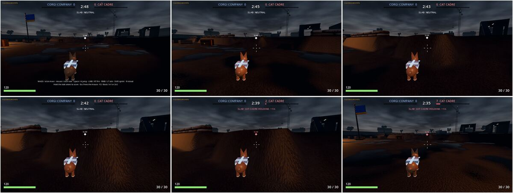
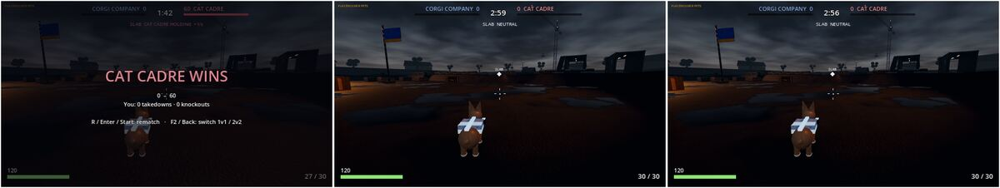
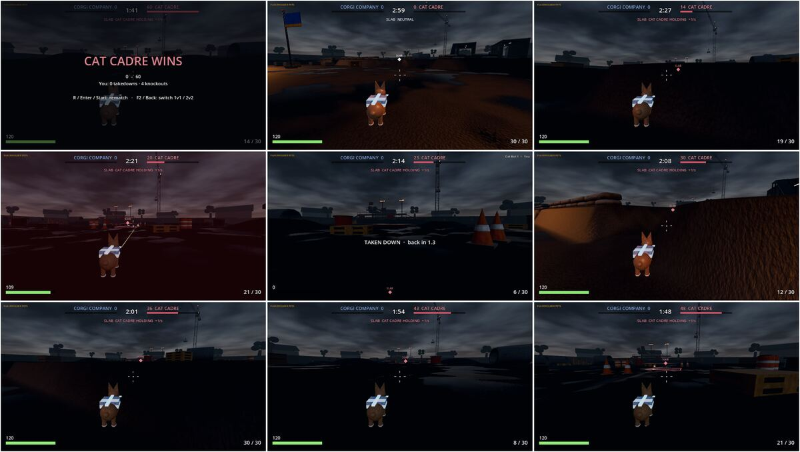
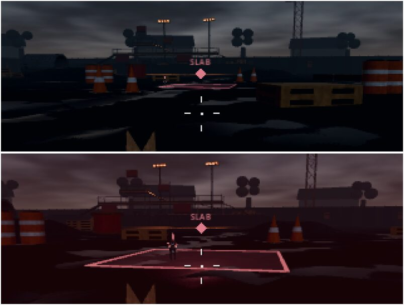
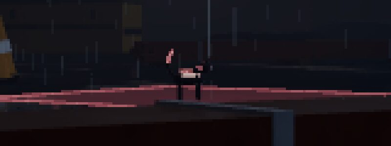
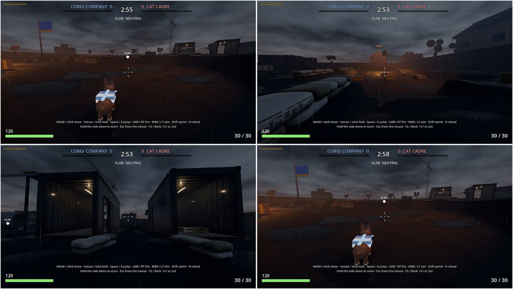
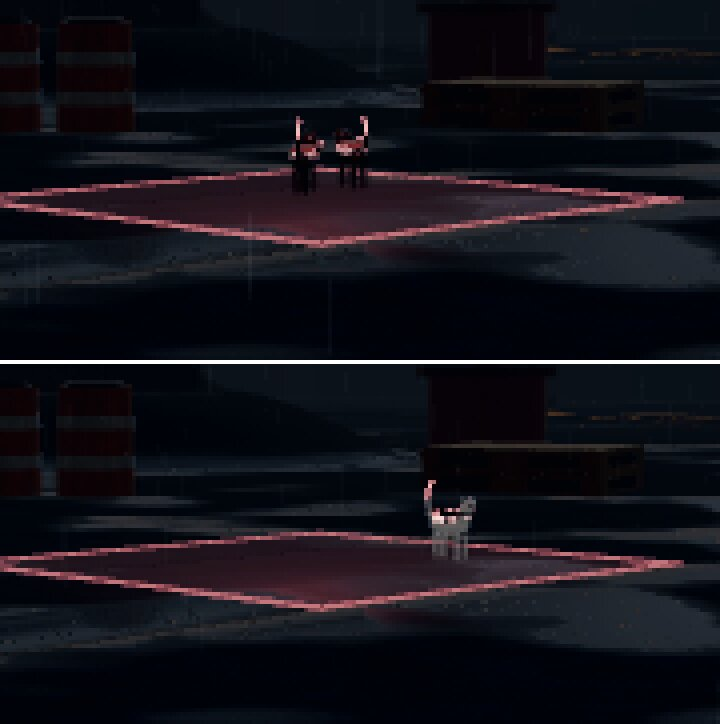

# W12 verification (Q6, independent): commit 7bcaa41

Snapshot: `git archive 7bcaa41 | tar -x` into `scratchpad/q6`, with `node_modules` symlinked. No product file was edited.
Mutations ran in a separate copy (`scratchpad/q6mut`) and were restored afterwards.
Godot 4.7.2 (official), `GODOT=` set as the launcher's own error message says. Xvfb :57 1280x720, xdotool 3.2016, ImageMagick `import`.
Evidence: the raw frames and logs (`q6/ev/`, about 60 MB) stayed in the verifier's session scratch and are not
committed. The images this report links are in `docs/qa/w12-q6/` (JPG copies). Files named `m*` are montages; each
lists the raw frames it was built from.

 

## Environment caveat (read first)
Everything here ran on software rendering (llvmpipe/lavapipe, 4 CPUs). The measured frame rate was:

| Setup | FPS |
|---|---|
| Documented default (Forward+ HIGH 1280x720, lavapipe) | 1 FPS (~1000 ms/frame; `--look-stats` frame_ms 779) |
| Compatibility MEDIUM, 1280x720 | 1 FPS |
| Compatibility MEDIUM, 320x180 | 2–3 FPS |
| Forward+ LOW, 640x360 | 2 FPS |
| Compatibility LOW, 640x360 | 6–8 FPS (median 7, n=565) |
| `--headless`, no render | 145 FPS (6.9 ms) |

The sim and scripts are cheap; the cost is software rasterisation. Below 7.5 FPS, game time runs slower than real time (8 physics steps per frame). None of these are GPU figures.

For the real-input tests I used `bash tools/godot/play.sh --rendering-method gl_compatibility --rendering-driver opengl3 --resolution 640x360 -- --look-quality low`, which is the same launcher with pass-through flags. The look was judged on the documented Forward+ default.

## Checks

| # | Check | Result | Evidence |
|---|---|---|---|
| 1 | `npm run godot` launches under Xvfb, no script errors | **PASS** | `ev/launch1.log` (only ALSA/pulse "no audio device" lines and `WORLD ... kit 6/6 loaded`); `ev/01_launch.png` shows the match with the HUD, timer, the controls hint and the Corgi. Without `GODOT`, the launcher prints the install and `GODOT=` hint (it is not in the README text itself). |
| 2a | Holding W moves; releasing stops; S reverses | **PASS** | `ev/m10_move.png` (10a→10c advance to the berm, 10d = 10e stationary after release, 10f back after S) |
| 2b | The mouse turns the view | **PASS** | `ev/m11_look_jump.png` (11a→11b turned right by 360 px, 11c back) |
| 2c | Space jumps | **PASS (weak visual)** | `ev/m11_look_jump.png` 11d: the horizon drops about 16 px mid-jump. `ev/m17_wjump.png`: W with Space taps gets over a berm that W alone could not climb. The headless test (peak ≥ 1 m) backs this. |
| 2d | Left click fires, with muzzle flash / hit feedback | **PASS (flash); hit NOT observed** | `ev/m25.png`: muzzle light pools on the wet ground, a tracer line, ammo 30→2. I never landed a hit, so the hitmarker was not seen. When the bot hits the player, the player gets a red vignette, the HP drops (120→81→42, `ev/m18_run.png`), a kill feed "Cat Bot 1 ▸ You" and "TAKEN DOWN · back in 1.3" (`ev/m28.png`). |
| 2e | A bot is visible and fights | **PASS, barely visible** | The bot took me down 4 times (`ev/m27.png`, `ev/m28.png` win screen "0 takedowns · 4 knockouts"). It is visible only as a small dark silhouette on the slab: `ev/mz27.png` (zoomed, about 10 m away). |
| 2f | Standing on the slab changes the HUD slab state and ticks the score | **PARTIAL: not proven for the human** | The HUD changes with real game state: SLAB NEUTRAL → "SLAB CAT CADRE HOLDING +1/s", and the Cat score ticks 0→60 (`ev/m10_move.png`, `ev/m26.png`). In 4 real-input runs I reached the slab edge (`ev/27_22.png`, the red outline at my feet, HP 46) but was downed before I stood on it. Covered only by `tests/test_game_slab.gd` (headless, logic only, not the HUD). |
| 2g | After the match ends, R rematches and resets score and timer | **PASS** | The bot won 60–0 (`ev/m14_fire.png`). R → 0–0, 2:59, ammo 30/30, back at spawn (`ev/m15_rematch.png`). Repeated in `ev/m28.png`. |
| 3 | Headless suite | **PASS, and the tests bite** | `ev/tests_head.log`: 9/9 PASS, `GODOT TESTS: PASS` (30 s). Mutations: (A) slab counts downed pets → FAIL test_game_slab; (C) jump disabled → FAIL test_game_move "jump rose only 0.00 m"; (D) rematch keeps the timer → FAIL test_game_rematch; (B) **W unbound (KEY_W→KEY_Q) → all PASS**. Logs: `ev/tests_mutAB.log`, `ev/tests_mutCD.log`. |
| 4 | Look: wet night, sodium, rain, fog, no ink | **PASS with caveats** | `ev/30_fwdplus_high_play.png` (my Forward+ HIGH gameplay shot) against the repo's `artifacts/godot/look_on_base_fplus.png` and `look_on_canyon_fplus.png` (montage `ev/m30_look.png`). The frame has rain streaks, puddles with reflections, distance fog, sodium glow on the horizon and container practicals, and **no ink outlines**. It is consistent with the committed shots. The caveats are listed below. |
| 5 | Draw budget (P-GLB4) | **PASS** | `ev/shot_fwd.log`, gameplay camera, Forward+ HIGH: **257 draws / 658 objects / 709k primitives**. `test_world_lot.gd` asserts one MultiMesh per kit piece plus one shadows-only KitShadow (the P-GLB4 "1 draw per piece plus a shared shadow" shape). That is under the web's ≤400 draws / 1.5M tris cap. It is higher than the 103–158 in the G-LOOK handoff, which measured bookmarks, not the play camera. |

## Honest gaps
- **Corgi vs cat at 30 m: no.** In `ev/31_id_30m.png` (Forward+ HIGH, `--cam` 30 m from the slab), the Cat is about 15×12 px: a black silhouette with a pink tail tip and plate (`ev/z31.png`, 5× zoom). You cannot tell the species. The HUD itself says "PLACEHOLDER PETS".
- **Ledges block movement: yes.** Sprinting into the berm north of the Corgi spawn stalled for about 8 game seconds (`ev/16_run_3..6.png` are identical). Jump taps got over it (`ev/m17_wjump.png`). Collision works; the straight route from spawn to the slab is not walkable without jumping.
- **Bot fairness:** by design it is fair (`bot.gd`: 150° cone, line of sight, 0.4–0.7 s reaction, 2° aim error, 5 rad/s turn). In practice it won every duel (0–4). In `--bots-only --demo`, the Cat bot downed the Corgi bot within about 2 s (`ev/31_id_30m.png` kill feed). The headless soak shows 6–29 for Cat. The near-invisible black Cat at night is an asymmetric advantage for the Cat team. I could not separate my software-FPS / scripted-aim handicap from bot strength.
- **Audio: none.** There is no AudioStream, `.ogg` or `.wav` in `engines/godot`. The game is silent even on a machine with a sound card.
- **Frame time:** see the environment caveat. It is 1 FPS at the documented default on software, and there is no real-GPU figure anywhere.

## Findings
**P1**
1. **The Cat bot is nearly invisible at night.** Repro: launch, go toward the slab, look for the enemy. Evidence: `ev/mz27.png`, `ev/z31.png`. At 10 m it is a dark silhouette; at 30 m it is about 15 px of black. The player takes damage from an enemy they cannot see (`ev/m18_run.png`), which undercuts "see a second body" and "fight over the slab". Suspected: `engines/godot/game/pet_model.gd`, and `look/look.gd` `pet_material` (a dark coat with no rim or key light on pets).
2. **Human-on-slab not proven with real input.** No run got the player onto the slab alive (4 tries, `ev/m26.png`, `ev/m27.png`, `ev/m28.png`). Only the headless logic test covers it, and no test checks the HUD label for Corgi or contested. It needs a re-run on a real GPU. Suspected area: `game/hud.gd` coverage.
3. **No audio at all.** There is no gunfire, hit, footstep or rain sound. Suspected: `engines/godot/game/` (no audio code).

**P2**
4. **The tests drive InputMap actions, not keys.** Unbinding W still passes all 9 tests (`ev/tests_mutAB.log`). A stranger-facing binding break would ship green. Suspected: `tests/test_game_move.gd` should assert `InputMap` events for WASD, Space, LMB and R.
5. **`--demo` does not place the human beside the slab.** It works for the bots. `ev/20a_demo_start.png` shows the normal spawn while the Cat starts on the slab (scoring from 2:59). Suspected: `game/match.gd` `start_match` / `_demo_spot`, or a later player respawn.
6. **Compatibility renderer warnings.** The look calls SSR and volumetric fog on Compatibility, which prints WARNINGs with a GDScript backtrace at `look/look.gd:205` and `:210` (`ev/fps_compat.log`). They are harmless but noisy.
7. **Look caveats (Forward+).** The sky reads as overcast dusk rather than night. The ground reads as brown mud with puddles, not wet asphalt. From the spawn and slab cameras, sodium pools on the ground are not visible, only glows on the horizon. On the Compatibility LOW path the frame is much flatter and darker (`ev/m10_move.png`).
8. **The README "Play the Godot game" section does not mention `GODOT=`** or list the controls. The launcher's error and the in-game hint cover both.

## Verdict on the owner's bar
**CONDITIONAL PASS: the Godot game (not only the Three.js client) launches as documented and plays.** With real xdotool input I proved move, stop, reverse, look, jump, fire with muzzle flash, a bot that fights and wins the slab, the score and timer HUD, match end and R rematch. Wet-night lighting with no ink is confirmed on Forward+. The draw count (257 in the play view) is inside the P-GLB4 contract. The gaps against the bar:
- the Cat bot is barely visible (P1);
- the human holding the slab was not demonstrated with real input (P1);
- there is no audio (P1);
- every frame-time figure is from a software rasteriser: 1 FPS at the default.

## Lead response (after Q6)
Fixed in the commit that adds this report:
- **P1-1, the Cat at night.** `look/pet_materials.gd`: the cat coat is a grey tabby (cool) against the corgi ochre
  (warm), not a dark tabby; both coats get a faint self-lit fill (emission 0.28, below the glow threshold) so a pet
  away from the floods keeps its colour and shape; the plate team band goes from 0.55 to 1.0. Same camera, 30 m
  from the slab, frame 240 (`--bots-only --2v2 --demo --cam 21,3,21:0,0.6,0`, Compatibility; the bots are not in the
  same spots in the two runs): before, two black specks; after, a grey cat with the red band and tail.
  
- **P2-4, tests press actions, not keys.** New `tests/test_lead_input.gd` builds the real key, mouse and pad events
  and asks the InputMap which action each triggers (WASD and the arrows, Space, Shift, LMB, RMB, R, Enter, Esc, F2,
  pad A and Start), and that W/A/S/D and Space trigger nothing else. Q6's mutation (B), W rebound to Q, now fails it.
- **A flaky headless test found while fixing P1-1.** One suite run in about 14 failed `test_game_move` with
  `texture_2d_initialize: Parameter "t" is null`. Cause: the world reads the six kit GLBs on worker threads, each read
  makes ImageTextures, and the headless dummy renderer's texture table is not thread-safe (a probe: 148 errors from
  worker threads, 0 from the main thread). `world/world.gd` now reads them in turn when the display is headless; real
  renderers keep the parallel read.
- **P2-8, README.** The root README's Godot section has `GODOT=/path/to/Godot npm run godot` and the controls for
  keyboard + mouse and gamepad.

Still open (logged as NEXT, not started under the usage cap): P1-2 a real-GPU run with the human holding the slab;
P1-3 audio; P2-5 `--demo` placing the human; P2-6 the Compatibility SSR / volumetric warnings; P2-7 the look caveats
(sky reads dusk, ground reads mud); the spawn berm that needs a jump (a step-up for ledges); bot balance; every frame
time is still a software-raster figure.
