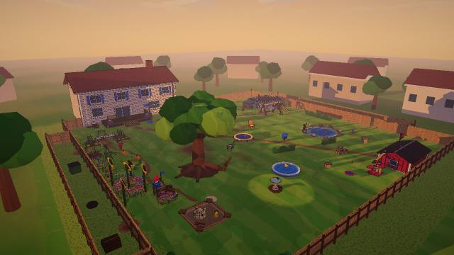
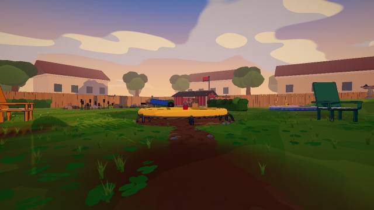
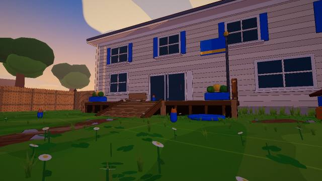
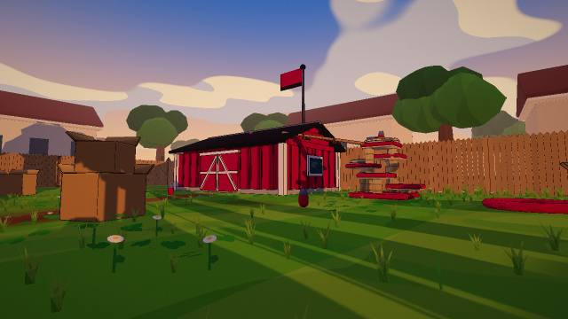
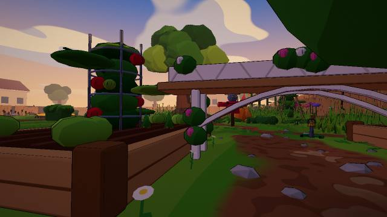
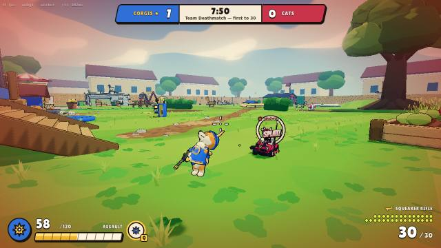

# Wave 7 gallery: before / after (HARDENED quality loop)

The owner's direction (2026-09-26, `docs/design/HARDENED.md`): battle-hardened warriors, a contested
battlefield, weapons that hit hard, and one gritty image, while keeping the humorous animal soul. This page
holds the fixed-bookmark evidence for each block. The images are 640×360 JPEGs made with `tools/gallery-jpeg.mjs`
from the probe PNGs.

## How the shots are taken
- **World bookmarks** (`labs/world.html`, t = 0.74 dusk):
  `PROBE_URL=http://localhost:<port>/labs/world.html node tools/world-shots.mjs 0.74 overview,deck,cats,center,flank <dir>`
- **Live match** (offline worker, bots 4 v 4, high tier):
  `node tools/probe.mjs '?webgl&autoplay&mode=team-deathmatch&bots=4,4&quality=high' 14 <dir>/tdm-play.png`
- **Renderer:** headless SwiftShader (WebGL2 fallback, 0.2–4 fps). Judge looks and draw/triangle counts here;
  fps only on a real GPU.

## Before: `1e92d12` (Wave 6 + M1, pre-HARDENED)

| Bookmark | Draw calls | Triangles | Luma | Contrast |
|---|---|---|---|---|
| overview | 278 | 1.33 M | 103.7 | 49.5 |
| deck | 112 | 0.74 M | 78.3 | 44.0 |
| cats | 133 | 0.63 M | 96.8 | 49.9 |
| center | 183 | 1.10 M | 96.3 | 60.1 |
| flank | 210 | 1.29 M | 70.3 | 54.5 |

 
 
 

**What it reads as:**
- A sunny, soft backyard: saturated lawn greens, pastel houses, flat 3-band toon light and a warm peach haze.
- The pets read as cute mascots: a round corgi in a blue tabard, a smiling cat in a kart.
- The yard reads as a playground (trampoline, sandbox, paddling pool), not a battlefield. Nothing is scarred,
  wet or fortified.
- Hit feedback is a comic "SPLAT!" word.
- In short, readable and charming, but not the hardened war the owner asked for.

## After
Filled in as each block lands (Block 1 characters · Block 2 battlefield · Block 3 weapons and FX · Block 4 look and
post), with the same bookmarks, tier and time of day.
