# Wave 7 gallery: before / after (HARDENED quality loop)

The owner's direction (2026-09-26, `docs/design/HARDENED.md`): battle-hardened warriors, a contested
battlefield, weapons that hit hard, and one gritty image, while keeping the humorous animal soul. This page
holds the fixed-bookmark evidence for each block. The images are 640×360 JPEGs made with `tools/gallery-jpeg.mjs`
from the probe PNGs.

## How the shots are taken
- **World bookmarks** (`labs/world.html`, t = 0.74 dusk):
  `PROBE_URL=http://localhost:<port>/labs/world.html node tools/world-shots.mjs 0.74 overview,deck,cats,center,flank <dir>`
- **Live match** (offline worker, bots 4 v 4, high tier):
  `node tools/probe.mjs '?webgl&autoplay&mode=team-deathmatch&bots=4,4&quality=high' 14 <dir>/tdm-play.png`
- **Renderer:** headless SwiftShader (WebGL2 fallback, 0.2–4 fps). Judge looks and draw/triangle counts here;
  fps only on a real GPU.

## Before: `1e92d12` (Wave 6 + M1, pre-HARDENED)

| Bookmark | Draw calls | Triangles | Luma | Contrast |
|---|---|---|---|---|
| overview | 278 | 1.33 M | 103.7 | 49.5 |
| deck | 112 | 0.74 M | 78.3 | 44.0 |
| cats | 133 | 0.63 M | 96.8 | 49.9 |
| center | 183 | 1.10 M | 96.3 | 60.1 |
| flank | 210 | 1.29 M | 70.3 | 54.5 |

 
 
 

**What it reads as:**
- A sunny, soft backyard: saturated lawn greens, pastel houses, flat 3-band toon light and a warm peach haze.
- The pets read as cute mascots: a round corgi in a blue tabard, a smiling cat in a kart.
- The yard reads as a playground (trampoline, sandbox, paddling pool), not a battlefield. Nothing is scarred,
  wet or fortified.
- Hit feedback is a comic "SPLAT!" word.
- In short, readable and charming, but not the hardened war the owner asked for.

## After: the full W7 tree (S4 `94336ce` + Block 1 `722d5cf` + Block 3 `199a98a` + E4)

Same bookmarks, tier and time of day, captured from a clean tree.

| Bookmark | Draw calls | Triangles | Luma | Contrast |
|---|---|---|---|---|
| overview | 289 | 1.40 M | 60.3 | 38.9 |
| deck | 123 | 0.79 M | 34.9 | 30.8 |
| cats | 144 | 0.67 M | 43.1 | 34.3 |
| center | 194 | 1.17 M | 46.0 | 36.2 |
| flank | 221 | 1.36 M | 31.4 | 35.4 |

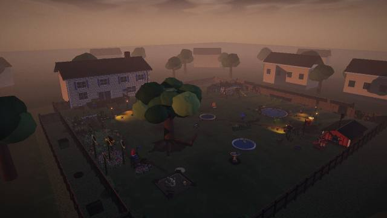 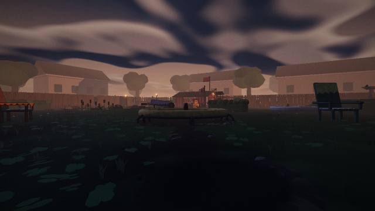
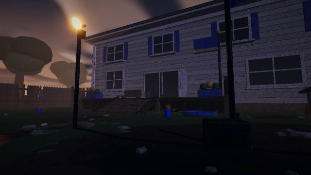 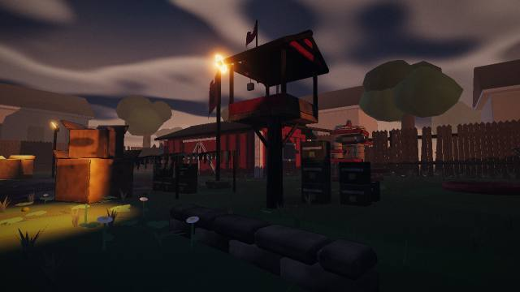
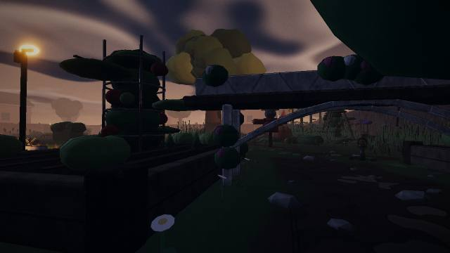 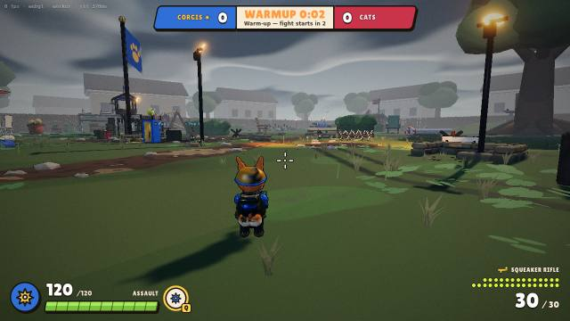

**What it reads as:**
- An overcast, hazy dusk over a fortified front: a torn paw banner on a 12.5 m flag, a bird-table watchtower, sodium
  floodlights pooling on wet ground, sack walls, an X-barricade and hedgehogs, and mud tracks across a darker lawn.
- The pets are armoured soldiers; the team read comes from the blue or red shells, bands and lamps.
- Luma fell from 70–104 to 31–60: the scene is darker and moodier by design.
- **Watch item:** the deck and flank views (luma 31–35) are near the floor for readability. The second loop should
  check them on a real GPU and monitor.

### Block 1: characters (K2)
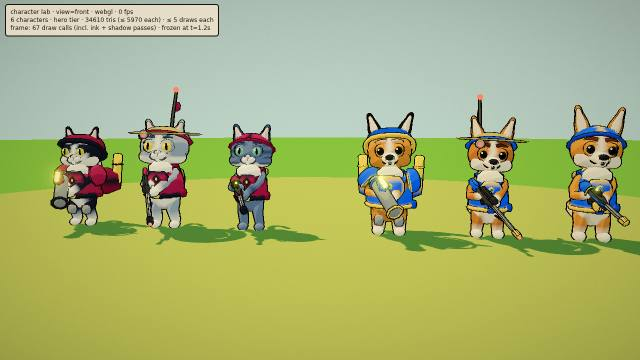 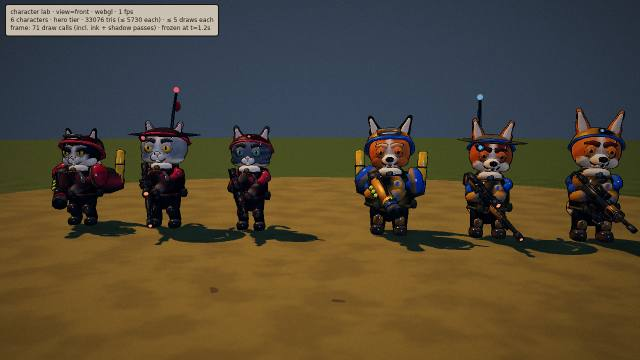
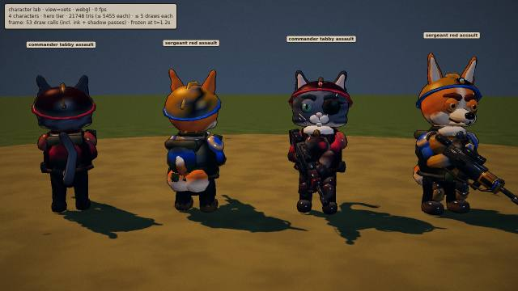 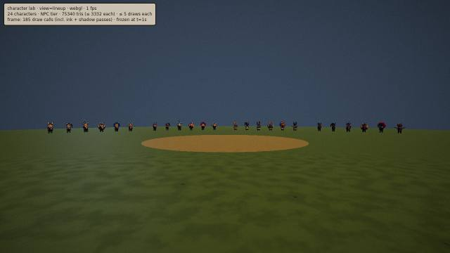

- Before: round mascots in tabards.
- After: plate carriers in faction camo, a squint under heavy brows, scars and wet fur.
- Veterans: a sergeant corgi and an eye-patched commander cat.
- At 35 m under dusk the under-suit makes pets near-silhouettes: a next-loop item.

### Block 3: weapons and combat feedback (X3)
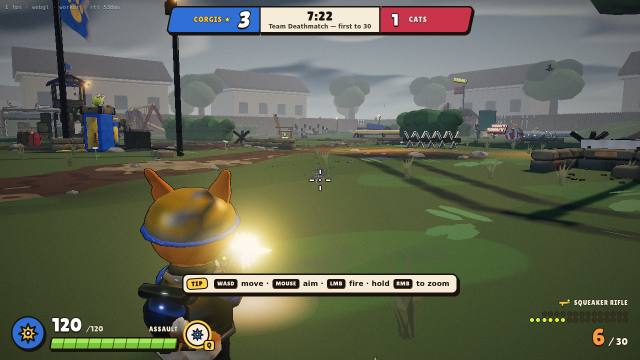 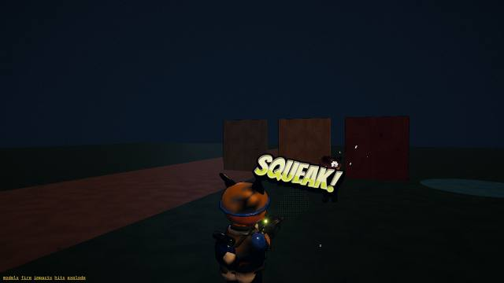

The muzzle flash lights the helmet, dust kicks up at the crosshair, brass is in the air, and pet hits show a fur tuft
and a comic splat.

### Block 4: look and post (S4)
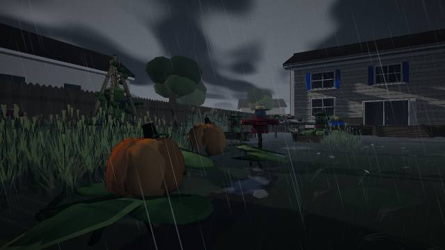 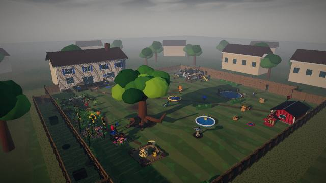

- Storm: rain streaks, wet ground and puddles, a dark slate sky.
- Clear weather is now an overcast late afternoon, no longer sunny.

### Budgets on the full W7 tree (tools/perf-render.mjs, high tier)
| View | Draws (≤ 400) | Triangles (≤ 1.5 M) |
|---|---|---|
| free view (no bots) | 138 | 1.29 M |
| live 4v4 TDM | 333 | **1.53 M ✗** |
| live 12v12 TDM (24 characters) | **512 ✗** | **1.69 M ✗** |
| low tier, live 4v4 TDM | 217 | 0.87 M |

### Budgets after the P3 budget pass (tools/perf-render.mjs, 1280×720, same queries; docs/handoff/P3.md)
| View | Draws (≤ 400) | Triangles (≤ 1.5 M) |
|---|---|---|
| free view (no bots) | 138 → 120 | 1.29 M → 0.98 M |
| live 4v4 TDM | 328 → 262 | 1.52 M → 1.19 M ✓ |
| live 12v12 TDM (24 characters) | 514 → 373 ✓ | 1.69 M → 1.32 M ✓ |
| The Lot, live 14v14 | 449 → 331 ✓ | 0.84 M → 0.69 M |
| low tier, live 4v4 TDM | 217 → 168 | 0.87 M → 0.71 M |

- The "before" column is P3's own re-measurement on the clean tree, so it differs by a few draws from the table above.
- Nothing changes within 18.5 m of the camera.
- The visible change: props 40–100 m away lose their 1.1 px crease hatching. It is subtle side by side; compare on a real
  GPU with `&inkmin=0` in `labs/look.html`.
- Still to measure: real-GPU frame times.
