# Wave 9 gallery: the war gets a purpose

What Wave 9 added, one image per feature, with the numbers behind it. The images are 640 or 960 px JPEGs made with
`tools/gallery-jpeg.mjs` from each lane's evidence (full-size PNGs in the lane's `artifacts/` folder, git-ignored). The
renderer is headless SwiftShader: judge the look and the draw counts here, frame times only on a real GPU.

Independent verification: `docs/qa/W9_VERIFICATION.md` (Q4, 75 / 100, no P0).

## Base Assault (G4a rules, G4b bots)
Steal the enemy's squeaky tennis ball from its stand and run it to your own flag's ring; first to 3.

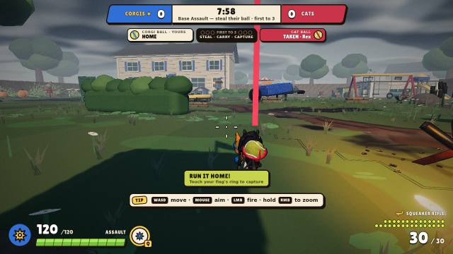 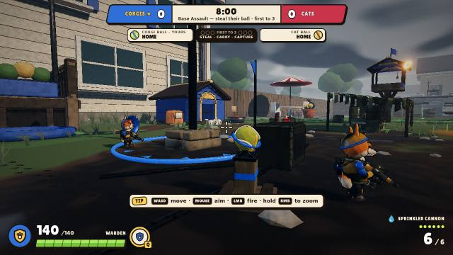 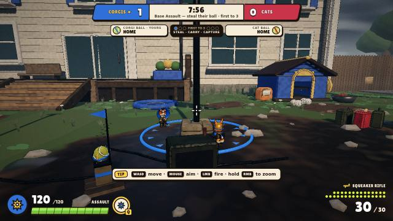

- **The carrier:** the ball rides on the pet's back. A red beacon shows where it is, and the HUD strip reads
  "CAT BALL · TAKEN · Rex". The carrier moves at 0.75× and can't glide or ride.
- **Home:** the ball sits on a pallet stand next to the team flag, with a ring painted on the ground to capture in.
- **Bots** take roles: attackers regroup 35 m short of the stand and storm it together; defenders guard; the carrier
  runs straight home.
- **Proof:** no ball was ever duplicated or lost in 70 bot matches (1.26 M ticks) or 9,000 wire snapshots against
  hostile clients.
- **Open:** on the West Yard the corgi side wins (25 : 12 captures; swapped sides flip it). Fix lane F1 adds cover on
  the corgi base's exit.

## Throwables (X4)
One Squeaker Grenade per corgi, one Hairball Bomb per cat; restocked at your own Ordnance Kiosk.

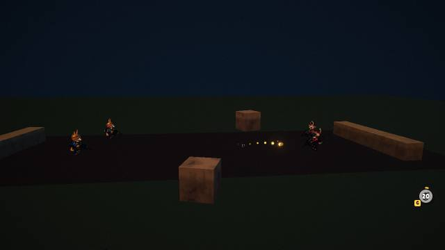 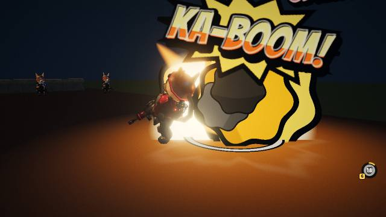

- **Flight:** the grenade's glowing trail reads against the dusk; the HUD slot (bottom right) shows the restock timer.
  The aim preview is a dotted arc with a landing ring while G is held.
- **Blast:** KA-BOOM!, a fireball and a shove.
- **Numbers:** 70 at the centre, never lethal from full health (the frailest class keeps 20 hp). The preview matches the
  real flight to under a millimetre.

## Squads and rank (K3)
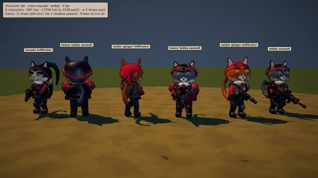 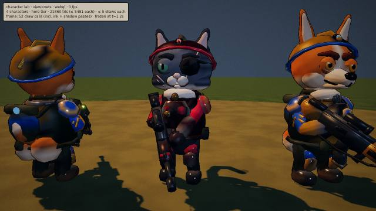

- **Squads:**
  - alley-cat raiders: bandana tails, a bottle-cap pauldron;
  - tabby heavies: a bin-lid shield and a nasal-guard helmet.

  They join Yard Skirmish from wave 2. Difficulty stays in band over 24 seeds.
- **Veteran rank:** a level-10 look (chevrons for corgis, a medal for cats), worn online. It changes nothing in play.

## The Lot at dusk and in the rain (L3)
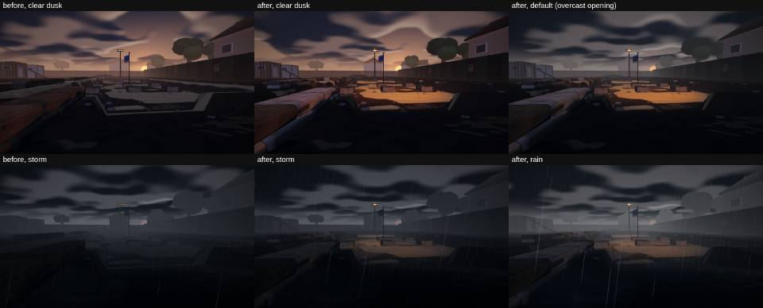
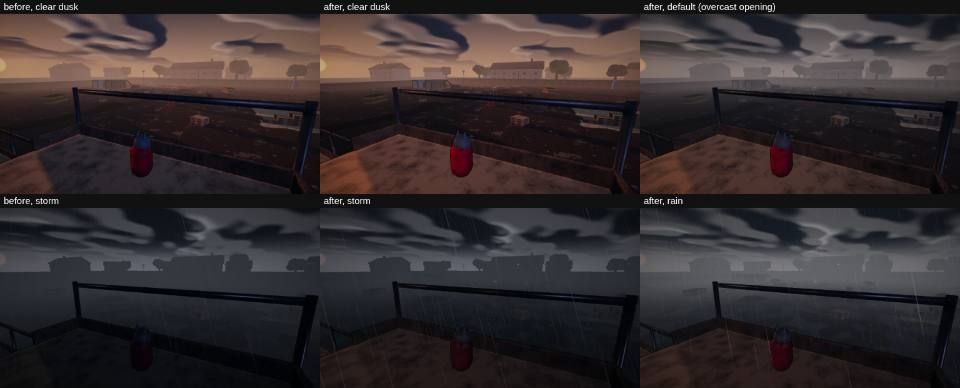

- **The corgi pit:** before, it was near-black; now floodlights pool warm sodium light on the pit floor.
- **The cat scaffold:** its deck is lit.
- **Weather:** the default opens overcast, and rain arrives after 1–2 minutes.
- **Bots:** they now use the Canyon and the Pipeworks as well as the Mud (0.36 and 0.38 of the Mud's bot time, from
  0.04), climb the scaffold and hold the perches.

## Readability (P4)
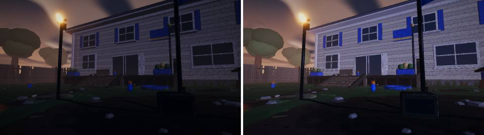
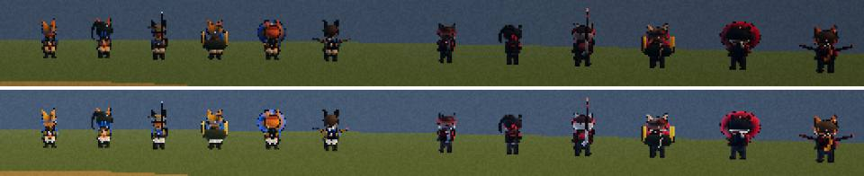

- **Deck bookmark** (before left, after right): luma 35 → 59 and contrast up. It still reads as dusk.
- **35 m lineup** (before top, after bottom): character luma 39 → 70, team hue 7.9 → 13.1 %. Blue and red now read at
  range.
- **How:** a rim and fill light on characters only, a dusk fill from the sky, and exposure 1.25. In storm, characters
  shed 60 % of the fog.

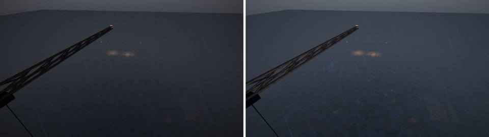

**Watch:** from the high overview camera, The Lot in storm is still a grey wash (before left, after right: a little
more detail, not much). Other watch items for a real monitor:
- daytime is ~18 % brighter (exposure is global);
- the pipe and container interiors on The Lot are now lit.

## Budgets (tools/perf-render.mjs, high tier, 1280×720)
| View | Draws (≤ 400) | Triangles (≤ 1.5 M) | Source |
|---|---|---|---|
| West Yard, live 12v12 TDM (24 characters) | 362 · max 383 | 1.27 M · max 1.29 M | Q4 |
| West Yard, live 4v4 TDM | 253 | 1.19 M | P3, P4 |
| The Lot, live 14v14 TDM | 358 | 0.72 M | L3 |
| West Yard, 12v12 Base Assault (`?bots=` only) | 412 → capped at 8 v 8 | 1.28 M | Q4, INT9 |

Server tick p95 ≤ 2.58 ms with 24 characters; download 4.20 MB gzipped (Q4).
