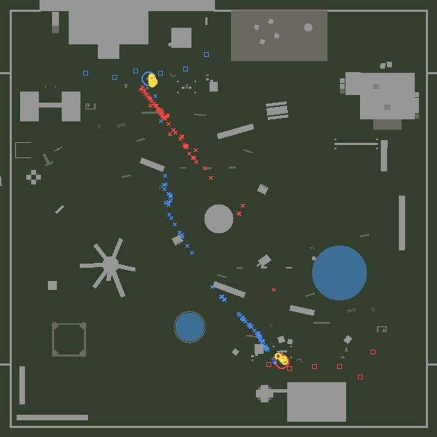
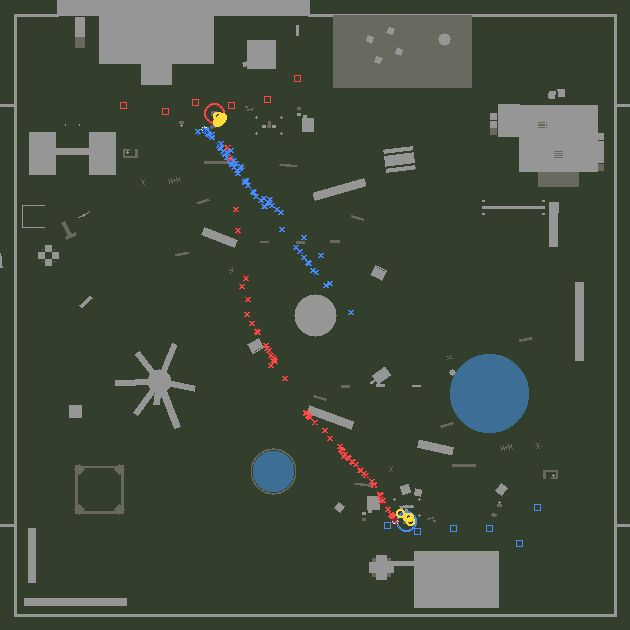
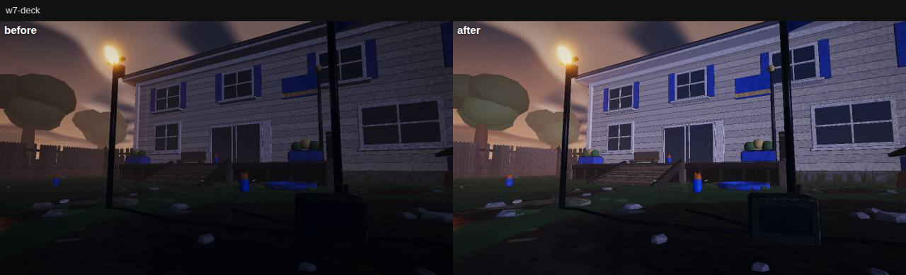
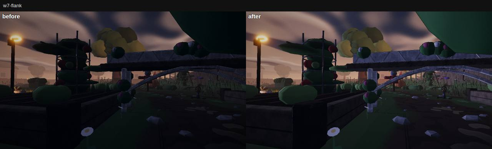
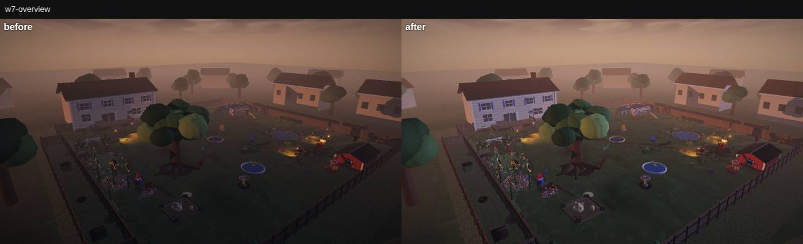
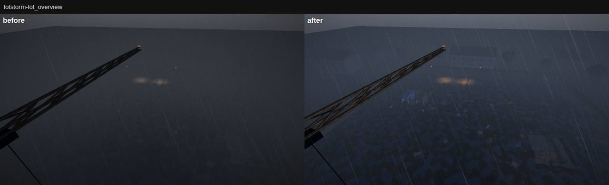
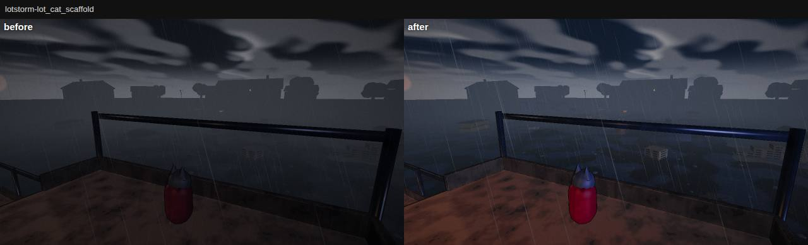
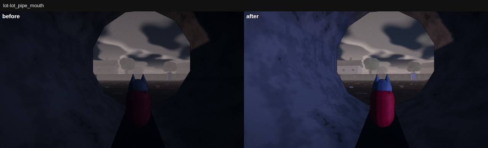
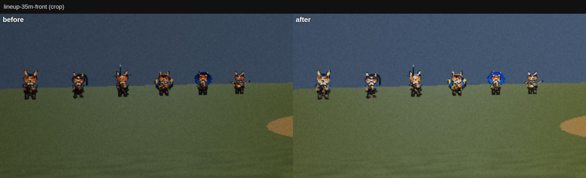
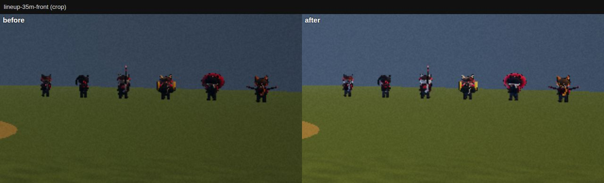

# W9 Verification: Q4 independent verifier (Waves 7–9)

**Verdict: Waves 7–9 are done and hold up under attack, with one P1 to fix before a human playtest: on the West Yard
the corgis' side of the map wins Base Assault.** The ball, the throwables, the Lot's weather, the rank and the netcode
survived every hostile client and every edge case I could build, on seeds the lanes never used, through the shipping
brain, the real Room and a real server. What fails is balance, not correctness.

- **Gate:** PASS on a clean `git archive 2cf62b9`:
  - typecheck, boundaries and **946 unit tests** (4 skipped);
  - the build and the `verify --e2e` specs, **7/7**;
  - soak **PASS** in all four PvP modes on **both maps** (score 95 and 95, 0 errors, stuck ≤ 1.5 s, tick p95 ≤ 1.67 ms).
  - and on **`f1b1d34`** (P4, the last lane): typecheck, boundaries and **954 unit tests** pass.
- **Base Assault is authoritative and airtight.** `checkBallInvariants()` held on **every tick of 70 bot matches**
  (1.26 M live ticks), through six hostile-message cases, 20 same-tick grab trials, a disconnect on the capture tick
  (±1 tick), a restart mid-carry and 111 socket reconnects. An observer client checked **9,000 wire snapshots**
  against hostile raw-WebSocket clients: 0 duplicated or lost balls, 0 non-finite values. Carriers never sit in a kart
  or a plane (0 ticks), and top out at 0.75× their sprint (median 7.2 m/s corgi, 6.6 cat).
- **P1-1: the West Yard's corgi side wins.** On 10 new seeds the corgis capture **25 : 12** and win **6 : 0** (4 draws).
  It is **the map side, not the species**: with the cats as fast as the corgis the lean stays (27 : 13); with the teams
  swapped onto each other's side it flips (**6 : 24**, cats win 9 : 0). The cause is the first 20–70 m of the run home: a
  cat thief crosses open lawn in view of 60–65 % of the corgi spawn and guard points, a corgi thief is in view of
  35–52 %. Cover on that exit flips the lean (2, 4 or 11 crates: 7 : 12, 10 : 16, 7 : 14), which proves the lever; the
  fix is one piece, tuned with a line-of-sight metric that takes seconds to run (§2.3).
- **Throwables (X4) are fair and spam-proof.** A 300 s kiosk spam throws 15 (cap 16); forged, dead, seated and taunting
  throws are refused; never lethal from full health (worst: a 90 hp Infiltrator keeps 20); teammates take 0; karts,
  planes and barriers take the throwable's own numbers (Assault, Breacher and Warden throwers deal identical damage).
- **The Lot (L3):** the weather agrees tick for tick between client and authority (20 seeds × 13 min, 0 mismatches);
  soak PASS in four modes; all four perches held; 25 pickups collected by bots in 4 × 90 s.
- **K3:** the skirmish band holds on 12 new seeds (won 10, unfinished 1, lost 1); the heavy's guard is PvE-only (12 of
  20 from the front, 20 from behind, 20 to a player); a ranked human plays out bit-identically to an unranked one
  (2,700 ticks).
- **Determinism:** 7/7 SAME (both maps, Base Assault with throws and restarts, and interleaved rooms). **Netcode:** a
  carrier's and a thrower's prediction error is **0** at every ack, up to 75 ms one way and 3 % loss.
- **Look (P4, `f1b1d34`): PASS.** Every P4 claim reproduces on its own snapshot: W7 bookmarks 46.5–79.2 luma (was
  31.2–60.6) with contrast up on all five; pets at 35 m 69.3 luma / 12.6 % team hue (was 39.5 / 7.5 %); storm team read
  ≥ 6.2 % per species on high and low; draws identical. The dusk mood holds. Two watch items became P2-8: the sky now
  lights the inside of the Lot's pipes and containers, and bright moments wash out (exposure is global).

**P2s** (full list in §9):
- a human joining a team deletes that team's newest bot even when it carries the ball (a second tab can exploit it);
- two bots pinned for 8 and 11 s against a kart parked in the corgi capture ring;
- bot throwables: 0–1 per TDM match, and in Base Assault 1 blast of 35 reaches an enemy;
- on the Lot: outside TDM bots never use the Canyon or the Pipeworks, and on new seeds the Canyon gets 0.22 of the Mud's
  bot-seconds (L3's gate is 0.25);
- a 12v12 Base Assault (URL only) draws 412;
- after P4 the sky lights enclosed spaces, and bright moments wash out.

Scorecard **75 / 100 (R 85 · I 73 · F 61), gate PASS**. What needs a real GPU or a human (60 fps, feel, the queue test,
whether a 15–25 % steal-to-capture rate feels like a war or a grind) remains open.

| | |
|---|---|
| Verified SHA | **`2cf62b9`** ("W9 L3: The Lot at night in the rain, and bots use the whole map") for §1–§7. This covers Wave 7 (S4, K2, X3, E4, P3), Wave 8 (M1, M2 The Lot) and Wave 9's lanes: C9, G4a `8b171aa`, X4 `282e2ec`, K3 `fe90dc1`, G4b `13dc2ee`, L3 `2cf62b9`. **`f1b1d34`** ("W9 P4: readability pass", the last Wave 9 lane) for §8, in a second clean snapshot. |
| Method | A clean `git archive 2cf62b9` in the scratchpad (`…/scratchpad/q4/snap`) with `node_modules` linked. Every run, build, server and browser used that snapshot; no product file was changed. My additions are read-only `tools/qa4-*.mjs` probes (below). Headless Chromium 1194 with SwiftShader (WebGL2) at 0–1 fps: I judged looks from screenshots I opened, and cost by draws and triangles. |
| Box | 4 shared cores, load **10–21** throughout (P4 and the lead ran alongside). Every timing below gives its load and is best-of-N where it matters. |
| Servers | `vite preview` of the snapshot build on **:5306** (render budgets), Playwright's e2e on the same port (scratch config, so :4173 stayed free), Vite dev on **:5306** (labs, gallery), `PORT=8796 npx tsx server/index.ts` (raw-socket abuse). |
| My outputs | New probes (the lead commits them with this report): • `qa4-ba.mjs` (matches with the lean variants `speed`, `mirror`, `cover`; `hostile`, `join`, `plane`, `stucktrace`); • `qa4-ord.mjs` (room abuse, the differential, the damage band, bot throw rates); • `qa4-ws.mjs` (hostile raw sockets + a wire observer), `qa4-net.mjs` (prediction for a carrier and a thrower, reconnect); • `qa4-determinism.mjs` (both maps, Base Assault, sequential and interleaved), `qa4-lot.mjs` (lanes, weather), `qa4-k3.mjs` (rank, guard); • `qa4-budget.mjs` (Q1's tick budget with `--map`), `qa4-map.mjs` (carrier-death maps), `qa4-shots.mjs` (the gallery). Raw output in the snapshot's `artifacts/q4/`; the images this report shows are in `docs/qa/w9-q4/`. |

---

## 1. Gate

| Check | Command (snapshot root) | Result | Verdict |
|---|---|---|---|
| Typecheck, boundaries | `npx tsc --noEmit`, `node tools/check-boundaries.mjs` | clean · `BOUNDARIES: PASS` | **PASS** |
| Unit | `npx vitest run` (load 10.6 → 14.0) | `Test Files 111 passed (111)` · `Tests 946 passed \| 4 skipped (950)` · 782 s | **PASS** |
| Typecheck, boundaries, unit on **`f1b1d34`** (P4) | the same, in the second snapshot (load 4.6 → 6.1) | clean · PASS · `Test Files 112 passed (112)` · `Tests 954 passed \| 4 skipped (958)` · 298 s | **PASS** |
| Build + e2e (what `verify --e2e` runs) | `npx playwright test -c playwright.q4.config.ts tests/e2e/{smoke,modes,locker}.spec.ts` (a copy of the config on :5306; the build is its web server step) | **7 passed (2.0 min)**: boots and renders · W moves · CORE RUSH from the menu · **BASE ASSAULT from the menu places both balls and the pet carries a throwable** · ADVENTURE → The Tall Grass · LOCKER equip and refusal · the look worn next match | **PASS** |
| Soak, West Yard, 4 PvP modes | `npx tsx tools/soak.mjs --modes yard-skirmish,team-deathmatch,core-rush,base-assault --repeat 3` (load 13 → 17) | `SOAK PASS \| score 95 \| modes 4 · errors 0 · stuck max 1.5s · tick p95 1.59 ms · completed 4/4`, deterministic across repeats. Skirmish 94, TDM 97, core-rush 97, base-assault 93 (the 45 s soak match ends 0:0 at the horn; see P2-9). Snapshots 9.1–11.6 KB/s wire. | **PASS** |
| Soak, The Lot, 4 PvP modes | same with `--map the_lot` (load 17 → 20) | `SOAK PASS \| score 95 \| … stuck max 1.5s · tick p95 1.67 ms · completed 4/4`. Skirmish 96, TDM 96, core-rush 94 (13:40), base-assault 93. | **PASS** |

## 2. Base Assault (G4a, G4b)

### 2.1 Authority under hostile clients

In-process, through `Room.handle` exactly as the server calls it after its guard (`npx tsx tools/qa4-ba.mjs hostile`,
`plane`, `join`), with `checkBallInvariants()` after every tick:

| Case | What the client does | Result | Verdict |
|---|---|---|---|
| Button spam | While carrying: every button bit every other tick, 8 copies of each input, sticks and angles `NaN`, `±Infinity`, `±1e308`, 50, a negative seq every 17th input, a 100-char string as `cmds`, an unknown message type | 168 inputs judged `abuse`, the carrier's state stays finite, one throwable thrown (it carries one), 0 violations | **PASS** |
| Team and class spam mid-carry | `team` and `class` every tick for 3 s away from deploy (315 ok · 45 abuse for a bad class) | still the same entity, still the carrier: the switch waits for the next respawn. A 30 m jump in one tick sends the ball home (teleport rule). | **PASS** |
| Reconnect storm | The carrier's connection leaves and rejoins 10 times in 10 s; a second connection joins/leaves the other team every 5 ticks | 10 rejoins, both balls home at the end, match live, 0 violations | **PASS** |
| Carrier leaves on the capture tick | Carry to 3 m outside the ring, walk in 0.1 m per tick, leave one tick before / on / after the entering tick | before and on: the ball drops at the ring's edge, **no capture**; after: **one** capture, ball home. Never both. | **PASS** |
| Restart mid-carry | The horn falls 6 s into the live phase while carrying, Throw held | `live → ended → warmup`: 0 carriers and 0 balls away in the ended phase, 2 ball entities, 0:0 after | **PASS** |
| Two grabs on one tick | 5 corgis placed on the same tick at exactly 0.45 m around the cat stand, 20 trials | 20/20: exactly one carrier | **PASS** |
| No rides | A human Skyraider carrier presses E for 60 ticks next to a parked kart, then next to a parked RC plane | **0 seated ticks** in either; still the carrier; no glide | **PASS** |

**Raw WebSocket clients** against a dev authority (`PORT=8796 npx tsx server/index.ts`; `npx tsx tools/qa4-ws.mjs --url
ws://127.0.0.1:8796 --map west_yard|the_lot --seconds 120`). One room per map with bots to 4 v 4, and six clients:
an **observer** decoding every raw snapshot, a **spammer** (every bit, Throw and Interact included, 3 inputs per frame),
**evil** (non-finite numbers), a **switcher** (team and class every ~50 ms), **storm** (reconnects every second), a
**jumper** (a far-ahead seq), a **forger** (valid numbers plus forged `x/y/z/hp/team/flags/ammo` in every input).

| Map | Snapshots checked | Ball-rule violations | Non-finite | Carries / captures seen | Kicked | Server |
|---|---|---|---|---|---|---|
| West Yard | 3,600 | **0** | 0 | 2 / 1 | evil `1008 input.cmds invalid`, jumper `1008 invalid input` | healthy; spammer and switcher played all 120 s; storm reconnected 111× |
| The Lot | 3,597 | **0** | 0 | 2 / 1 | the same two | healthy; storm 112× |
| West Yard (forger run, 60 s) | 1,803 | **0** | 0 | | the same two | the forger asked for y = 60 every frame: its body stayed on the ground (max y 0.08 m), hp never over max |

### 2.2 Bot-only matches on both maps

`npx tsx tools/qa4-ba.mjs matches --map <map> --seeds 6,…,15 --seconds 300 --limit 99`: a Room with 4 v 4 bots (the
server's default for the mode), the shipping brain, **10 seeds neither G4a nor G4b used**, 300 s each, played to the
horn (no first-to-3 cut, so every match gives the full capture rate). Invariants every tick.

| Map | Captures per match | Steals per match | Matches with ≥ 1 capture | Steal → capture | Median carry | Throws per match | Stuck max | Invariant violations |
|---|---|---|---|---|---|---|---|---|
| West Yard | **3.7** | 18.2 | **10/10** | 20 % | 3.5 s | 17.3 | **11 s** (P2-2) | 0 |
| The Lot | **2.5** | 12.1 | **10/10** | 21 % | 5.3 s | 7.6 | 4.5 s | 0 |

- Carrier speed, sampled every tick from 0.1 s after the steal: median top speed **7.2 m/s** for corgi carriers and
  **6.6** for cats, 0.75× their sprint.
- Most carries end close to the stand: a dropped carrier had covered a median 9–11 % of its way home on the West Yard
  and 3–4 % on the Lot (about 230 m runs) before a chaser dropped it.
- G4b's acceptance (≥ 1 capture on 4 of 5 seeds, both teams score, no bot stuck > 5 s) holds on new seeds except
  the stuck limit: 1 of these 20 matches (P2-2); the 50 variant matches of §2.3 stayed ≤ 3.5 s.

### 2.3 The West Yard corgi lean: cause and fix (P1-1)

G4b measured 15 : 3 on seeds 1–5 and named two suspects: the corgi carrier's faster sprint (7.2 vs 6.6 m/s) and the
base layout. I ran the same 10 new seeds in six variants. Every variant changes one thing inside the probe's own
process (a content table or a copy of the map's `WorldData`); no product file was touched.

| Variant (`--variant`) | What changes | Captures corgis : cats | Wins corgis : cats (draws) | Carry success corgis / cats |
|---|---|---|---|---|
| `base` | nothing | **25 : 12** | **6 : 0** (4) | 25 % / 15 % |
| `speed` | cats walk, run and sprint at the corgis' speeds (carrier 7.2 m/s both) | **27 : 13** | 6 : 0 (4) | 29 % / 15 % |
| `mirror` | the teams swap sides (spawns relabelled, bases swapped) | **6 : 24** | **0 : 9** (1) | 7 % / 26 % |
| `cover` | 11 crates, 1.6 m, every 5 m from 12 to 62 m along the cat thief's route, 2.2 m to the corgi-spawn side | **7 : 14** | 1 : 5 (4) | 9 % / 18 % |
| `cover --cover-every 10 --cover-from 15 --cover-to 45` | 4 crates at 15, 25, 35, 45 m | **10 : 16** | 3 : 6 (1) | 16 % / 21 % |
| `cover --cover-every 15 --cover-from 20 --cover-to 35` | 2 crates at 20 and 35 m | **7 : 12** | 2 : 5 (3) | 10 % / 15 % |
| The Lot `base`, for reference (point-symmetric) | | 9 : 16 | 0 : 4 (6) | 17 % / 24 % |

**Species speed is ruled out** (equal speed, same lean). **The side decides**: whoever holds the corgis' side wins,
even the cats with their slower carriers.

**Where the side matters.** The carrier-death maps (`npx tsx tools/qa4-map.mjs artifacts/q4/ba/wy-base.json …`; blue ×
= a corgi carrier dropped, red × = a cat carrier, squares = spawns, rings = capture rings; corgi base top left):

 

- A cat thief leaves the corgi stand south-east across open lawn, and dies in a dense trail over the first ~80 m. A
  corgi thief leaves the cat stand north-west past a crate pile and a long plank wall within 30 m. In the swapped run
  the colours swap and the trails stay.
- The trails match line of sight. From each team's spawns and 8 guard spots 9 m around its stand (eye 1.0 m, target
  0.8 m, ≤ 60 m), the share of those points that see the thief, along the nav route home:

  | Along the route | 0–10 m | 10–20 | 20–30 | 30–40 | 40–50 | 50–60 | 60–70 |
  |---|---|---|---|---|---|---|---|
  | cat thief (from the corgi stand) | 76 % | 73 % | 65 % | 65 % | 60 % | 60 % | 63 % |
  | corgi thief (from the cat stand) | 69 % | 66 % | 52 % | **35 %** | 44 % | 41 % | 43 % |

- The outcome follows: corgi thieves get past 60 m on 31 of 102 carries (17 whole runs home), cat thieves on 13 of 80
  (10 whole runs).
- Not the cause: run length (the cat thief's nav route is 8 m **shorter**, 156 vs 164 m) and spawns near the stand (the
  cat stand has cat spawns 2.9 and 8.1 m away, which should favour the cats).
- The Lot is point-symmetric (spawns 16–38.5 m from both stands, routes 270 / 271 m) and near fair. It leans slightly
  cat on these seeds (16 : 9; G4b's seeds 1–5 gave 8 : 7; pooled 17 : 23), which matches its own smaller exposure
  asymmetry (the corgi thief is more exposed 20–60 m out). A watch item, not a finding.

**Cover is a strong lever, and it is not smooth.** 2, 4 and 11 crates all flip the lean (the corgi share of captures
goes 68 % → 37 %, 38 %, 33 %), and total captures fall (37 → 19–26 per 10 matches). The line-of-sight metric explains
why (`qa4-ba.mjs los --variant cover --cover-every 15 --cover-from 20 --cover-to 35`): two crates near the corgi base
also move both teams' A* routes (169 → 178 m and 161 → 175 m), and after them the **corgi** thief is the exposed one
(66–81 % at 10–40 m against the cat thief's 56–68 %). The cats' rally point (35 m short of the corgi stand) sits in
the same lawn, so the crates shelter the cat attack too.

**Fix, with the expected effect.** Balance the two exits, measured by the line-of-sight metric on **both** routes,
not by a crate count:
1. Add one piece of cover (a half-height sack wall in E4's style, `fortifications.ts`) on the corgi FOB's south-east
   exit, 20–30 m out, on the side facing the corgi spawn row.
2. Iterate on `qa4-ba.mjs los` (seconds per try) until both routes' exposure 10–60 m out is within 10 points (today
   65 vs 45).
3. Then accept on the bot statistic: `qa4-ba.mjs matches --variant base` and `--variant mirror`, 10 seeds each.

**Expected:** each side's share of captures within 40–60 % in both runs, and neither side winning more than 6 of 10.
The other levers (move the corgi stand; move the corgi spawn row back) change more of E4's tested layout.

## 3. Throwables (X4)

| Check | Command | Result | Verdict |
|---|---|---|---|
| Kiosk fountain | `qa4-ord.mjs room`: a human at its own kiosk, Throw toggled every other tick for 300 s, through `Room.handle` | **15 throws, 14 restocks** (the limit is 1 + 300 / 20 = 16) | **PASS** |
| Forged Throw, no carry | 25 s of Throw spam with nothing carried | 0 throws, no Ordnance flag | **PASS** |
| Hostile numbers on the release | `NaN`, `±Infinity`: input rejected, no throw. `±1e308`: sanitised, a normal throw at 19 m/s, finite | | **PASS** |
| Seated, taunting, dead | E into a kart, then 3 s of Throw spam: 0 throws; out, 1. Emote, then Throw 0.5 s later: refused; 1.2 s later: thrown. Killed while carrying, spam through 181 dead ticks: 0; the respawn carries one again. (Stunned: X4's unit test; a crash stun is hard to stage through the Room, so I did not re-test it.) | | **PASS** |
| Damage band | `qa4-ord.mjs band`: the shared blast next to full-health pets of every class × species at 0–4.5 m | max **70**, **nobody dies** (worst: a corgi Infiltrator, 90 hp, keeps 20); 70 up to 1 m, 54 at 2, 37 at 3, 20 at 4, 0 at 4.5; teammates **0**; self at the centre 25 (35 %) | **PASS** |
| Vehicles and abilities take the throwable's numbers | `qa4-ord.mjs diff`: the same solved throw from the same spot by an Assault (a gun), a Breacher (the 85-damage mortar) and a Warden | kart **60 / 60 / 60**, RC plane **19 / 19 / 19**, Warden barrier **66 / 66 / 66**: identical, so the gun never leaks into the blast. (The Spotter drone was not tested.) | **PASS** |
| Bot throws per match | `qa4-ord.mjs bots`, 4 v 4 room bots, shipping configs, 3 seeds × 180 s per mode and map | see the table below | **P2-3** |

Bot throws, 3 matches × 180 s per cell (a blast "hits" when an enemy of the thrower takes damage on its tick):

| Mode | West Yard: throws / match · blasts that hit · kills | The Lot: throws / match · blasts that hit · kills |
|---|---|---|
| team-deathmatch | **0.7** · 0 of 2 · 0 | **1.0** · 1 of 3 · 0 |
| core-rush | 4.0 · 4 of 12 · 2 | 6.7 · 9 of 20 · 4 |
| yard-skirmish (bots vs PvE waves) | 4.0 · 4 of 12 · 0 | 0.3 · 1 of 1 · 0 |
| base-assault | 7.7 · **0 of 23** · 0 | 4.0 · **1 of 12** · 1 |

Teammates hit: **0** in all 24 matches. Why Base Assault throws miss is P2-3.

## 4. The Lot (L3)

| Check | Command | Result | Verdict |
|---|---|---|---|
| Soak, four PvP modes | §1 | PASS, score 95 | **PASS** |
| Client and server weather | `qa4-lot.mjs weather`: the schedule `main.ts` builds (`createWorldData(seed, map)`) against the authority's `simWeather` every 0.5 s for 13 min, 20 seeds | **0 mismatches** in any parameter (cloud, rain, storm, wind, wet, fog, dark, sight). First rain at **1.35–1.78 min**; storm 15 % of the time; the West Yard's world-keyed schedule equals its bare-seed one. A seed or map mismatch reloads the page (`map-sync.ts`), so both sides always build the same schedule. | **PASS** |
| Lanes, 14 v 14 TDM | `qa4-lot.mjs lanes --seeds 5,6,7,8` (L3's method on new seeds) | Pipeworks / Mud **0.42**; **Canyon / Mud 0.22** (per seed 0.16, 0.30, 0.27, 0.18). L3's gate is ≥ 0.25 each; L3's seeds 1–4 gave 0.36. Pooled over all 8 seeds the Canyon is 0.29. | **PARTIAL** (P2-5) |
| Lanes outside TDM | the same, Base Assault and Core Rush 4 v 4, 4 × 180 s | **Canyon 0, Pipeworks 0** in Base Assault; 0.02 / 0.01 in Core Rush: every attack runs through the Mud. Lanes are TDM-only by design (`LANE_MODES`). | design (P2-4) |
| Climb links and perches | the TDM lane run | all four perches held: deck 319.5, nest 310, container roof 271, pipe crown 172.5 bot-s | **PASS** |
| Pickups | the TDM lane run | **25 cores and kibble** collected by bots in 4 × 90 s; L3's hop search (unit) passes for both species | **PASS** |
| Stuck | all Lot runs | max **4.5 s** (a cat Overwatch on attack at (15.3, 96)) | **PASS** |
| Where a dropped ball rests | `dropSpot()` (the rule G4a tested on the West Yard's deck and pond) at the Lot's awkward places | pipe tunnel: on the pipe floor (0.53 m), not its crown (5.68); inside the west container: on its floor, not the roof (10.4); on the container roof, scaffold deck, crow's nest and pipe crown: on the perch; all 4 muddy ditches: afloat (−0.92 over a −1.9 bed) | **PASS** |

## 5. Squads and rank (K3)

| Check | Command | Result | Verdict |
|---|---|---|---|
| The heavy's frontal guard is PvE-only | `qa4-k3.mjs guard`: the same 20-damage hit, a live skirmish | tabby heavy from the front **12**, from behind **20**; a player assault at the same spot from the front **20** | **PASS** |
| Rank gives no combat power | `qa4-k3.mjs rank`: a TDM room with two humans (rifleman stand-ins through `Room.handle`) wearing `rank_sergeant` / `rank_commander`, against the same room with `rank_none` | **identical world hash on all 2,700 ticks**, 9 deaths each; the ranks are worn | **PASS** |
| Skirmish difficulty band | `qa-difficulty.mjs --seconds 480 --seeds 25,…,36` (12 seeds K3 never used) | offline default (you + 2 bots), competent stand-in: **won 10 · unfinished 1 · lost 1** (83 % won; K3's seeds 1–24: 79 %), wins at 423–476 s, the loss in wave 4. AFK: **lost 6 of 12**, all in wave 4, the rest reach the final wave (K3: 7 of 24). | **PASS** (competent); AFK a watch item (P2-6) |

## 6. Determinism and netcode

**Determinism** (`npx tsx tools/qa4-determinism.mjs …`: a per-tick hash of every entity, balls, stands, rings and
thrown ordnance included, plus deaths, captures and throws):

| Run | History | Result |
|---|---|---|
| sequential `base-assault:240` (West Yard, seed 5) | after `tdm@the_lot:30` | SAME (61 deaths, 15 throws, 4–5 matches with restarts) |
| sequential `base-assault@the_lot:240` (seed 2) | after `base-assault:40, core-rush:20` | SAME (27 deaths, 3 throws) |
| sequential `tdm@the_lot:180` (seed 4) | after `base-assault:30` | SAME (12 deaths, 2 throws) |
| sequential `core-rush@the_lot:120` (seed 6) | after `base-assault@the_lot:30` | SAME (21 deaths, 3 throws) |
| sequential `yard-skirmish@the_lot:120` (seed 7) | after `tdm:20` | SAME |
| interleaved `base-assault@the_lot:180` ‖ `base-assault:180` (seeds 1 / 2, B created at tick 300) | two Base Assault rooms on two maps in one process, as the server ticks them | SAME / SAME |
| interleaved `tdm@the_lot:120` ‖ `core-rush:120` (B at tick 60) | | SAME / SAME |

**7/7 SAME.** The 45 s configs above never reach a capture, so I also replayed a capture-rich match in two separate
processes (`qa4-ba.mjs matches --seeds 7 --seconds 300 --limit 99`, twice): 4 captures, 18 carries, 12 throws and 71
deaths, **every carry record identical** (positions, durations, killers).

**Prediction and reconnect online** (`npx tsx tools/qa4-net.mjs`: the Room, `LoopbackSession`, the real `NetClient`
and `LocalPredictor`; bots 3 v 2; a scripted human runs home with sprint, jumps and a slide every 3 s):

| Phase | Links | Acks | Reconcile error at acks | Corrections |
|---|---|---|---|---|
| carrying the ball, 12 s | 40 ± 10 ms / 1 % (both maps), 75 ± 15 ms / 3 % (The Lot) | 1,056 | **0** (mean, p95 and max) | **0** |
| throwing every 2 s while running, 12 s | all six (10 / 40 / 75 ms, 0 / 1 / 3 %, both maps) | ~2,140 | **0** | **0** |
| running free (baseline) | all six | 1,669 | max 0.16 m in 3 runs | 1 each (a bot's hit shoves the pet: an authority-only event) |

- In the other three runs the scripted steal was contested and the carry phase ran without the ball.
- **Reconnect mid-carry**, all six: the ball drops once; the new connection is welcomed and its snapshot shows the ball
  state the authority has (`dropped` or `taken`, as a bot took it back).

## 7. Budgets (§8.7)

**Render**, `vite preview` of the snapshot build, 1280×720, offline worker. `perf-render.mjs --frames 8` gives the
median frame; `qa3-render.mjs --frames 40` samples a 40-frame window and gives p95 and the worst frame. Characters =
bots + the local pet.

| View (characters) | Tier | Draws (≤ 400) | Triangles (≤ 1.5 M) | Tool | Before (lane, same view) |
|---|---|---|---|---|---|
| West Yard, live 4v4 TDM (8) | high | 243 | 1.13 M | median of 8 | P3 262 / 1.19 M |
| | low | 171 | 0.71 M | median of 8 | P3 168 / 0.71 M |
| West Yard, live 4v4 **Base Assault** (8) | high | 298 · p95 303 · **max 306** | 1.16 M (max) | median · 40-frame window | new |
| | low | 204 | 0.72 M | median of 8 | new |
| The Lot, live 4v4 **Base Assault** (8) | high | 269 | 0.59 M | median of 8 | new |
| | low | 196 | 0.48 M | median of 8 | new |
| West Yard, live 12v12 **Base Assault** (24, `?bots=12,12` only) | high | **412** ✗ | 1.28 M | median of 8 | new |
| West Yard, live 12v12 TDM (24) | high | 362 · p95 377 · **max 383** | 1.27 M · max **1.29 M** | 40-frame window | P3 373 / 1.32 M |
| | low | 273 | 0.81 M | median of 8 | |
| The Lot, live 14v14 TDM (28) | high | 351 · p95 376 · **max 379** | 0.73 M · max 0.77 M | 40-frame window | L3 358 / 0.72 M |
| | low | 267 | 0.59 M | median of 8 | L3 251 / 0.56 M |

- **Every view the menu offers is inside the budget.** The margin is thin at 24–28 characters: 17 draws at the worst
  12v12 TDM frame, 21 on the Lot.
- Base Assault costs about 55 draws over TDM on the West Yard (298 vs 243 at 4v4: stands, rings, balls, beacons, G4a's
  "30–33 draws"). Online a Base Assault room holds at most 12 humans with bots to 4 v 4, but offline `?bots=12,12`
  builds a 12v12 one, and that view is **over: 412 draws** (median of 8, high; 1.28 M triangles). P2-7.
- 0 page errors in all 14 render sessions (and the 7 e2e specs). I opened the frames; each is a live
  match with the HUD.

**Tick and bandwidth at 24 characters**: `qa4-budget.mjs` (Q1's method: 12 human slots fed AI inputs through
`Room.handle` + 12 bots, 60 s, best-of-3 min(wall, CPU); load 13–17):

| Map · mode | Tick p50 / **p95** / max (≤ 3 ms) | Snapshot KB/s per client (≤ 40) | Kills in 60 s |
|---|---|---|---|
| West Yard · TDM | 1.45 / **2.25** / 5.05 ms | 28.6 | 49 |
| The Lot · TDM | 1.20 / **2.00** / 6.26 ms | 24.1 | |
| West Yard · Base Assault | 1.47 / **2.28** / 3.94 ms | 27.7 | |
| The Lot · Base Assault | 1.60 / **2.58** / 8.59 ms | 24.7 | |

**PASS**, with 0.4–1.0 ms of p95 headroom. The single worst ticks (4–9 ms) are GC and preemption on a loaded box;
the soaks' best-of-3 p95 at 6–8 characters is 1.04–1.67 ms (§1).

**Characters** (`node tools/char-audit.mjs --seeds 7,11,19`, seeds K2 and K3 did not report): **24/24 kits PASS**, worst
5,670 / 6,000 triangles (hero) and 3,304 / 3,500 (NPC), 5 draws and 47 bones each, feet grounded. Veterans and squads
are pinned by K3's unit tests (in the 946).

**Download** (`npx tsx server/precompress.ts dist` on the snapshot build): 4 files, 11.50 MB → **4.20 MB gzip**
(3.14 MB Brotli), under the 5 MB budget. Q3 measured 4.06 MB at Wave 5: Waves 6–9 added 0.14 MB; 0.8 MB is left.

## 8. Look: the gallery after P4 (`f1b1d34`)

P4 landed after this report's main SHA. I exported **`f1b1d34`** as a second clean snapshot and shot the same set
on both (`node tools/qa4-shots.mjs`: one browser, a fresh page per shot, world-shots' Rec. 709 luma / contrast;
Vite dev on :5306 from each snapshot; 1280×720 SwiftShader, high tier). Every image below was opened and looked at.
On `f1b1d34` P4's style tests pass (3 files, 40 tests) and `char-audit` is still 24/24.

**The W7 bookmarks** (`labs/world.html`, t = 0.74). Draws and triangles are identical before and after on every one.

| Bookmark | Before `2cf62b9` (luma / contrast) | **After `f1b1d34`** | P4 claims |
|---|---|---|---|
| overview | 60.6 / 38.8 | **79.2 / 42.7** | 79 |
| deck | 35.3 / 31.4 | **59.3 / 44.8** | 58.9 |
| cats | 42.0 / 33.7 | **56.5 / 38.0** | |
| center | 46.0 / 36.3 | **60.2 / 41.6** | |
| flank | 31.2 / 34.9 | **46.5 / 39.9** | 46.7 |

All five are ≥ 45 (the card's floor) with contrast up on every one: **reproduced**.

  

**The Lot's heroes** (`labs/lot.html`, t = 0.74, frozen; the default overcast opening and `&wx=storm`). Draws identical.

| Bookmark | Dusk before → after | Storm before → after |
|---|---|---|
| corgi base | 42.7 / 33.7 → **55.3 / 40.9** | 31.0 / 22.9 → **39.6 / 28.0** |
| container canyon | 36.3 / 25.2 → **57.6 / 36.0** | 25.8 / 18.5 → **38.3 / 25.4** |
| pipe mouth | 26.0 / 28.3 → **43.6 / 31.1** | 17.0 / 20.1 → **27.6 / 23.4** |
| cat scaffold | 57.6 / 31.5 → **73.2 / 35.6** | 38.9 / 21.1 → **50.6 / 24.7** |
| overview | 56.8 / 27.3 → **63.2 / 34.2** | 44.1 / 13.6 → **51.0 / 18.8** |

  

**Pets at 35 m** (K3's lineup, `labs/characters.html?webgl&view=lineup&npc&t=1`, 24 pets). Luma and team hue inside
the pets' pixel mask (`&mask=1`), both passes scored on the before mask (same frozen geometry; P4's method):

| | Before `2cf62b9` | **After `f1b1d34`** | P4 claims |
|---|---|---|---|
| corgis | 47.5 / 6.0 % | **82.7 / 11.1 %** | |
| cats | 30.8 / 9.2 % | **54.6 / 14.2 %** | |
| all | 39.5 / 7.5 % | **69.3 / 12.6 %** | 69.9 / 13.1 % |

Scored on each pass's own mask, the after share reads 10.7 %: the lift widens the glow mask into the ink, which dilutes
the share. **Reproduced** within 0.6 luma and 0.5 points.

 

**Storm team read** (P4's real-sky bench, `labs/look.html … &lineup=35&wx=storm`, after only: the bench is new in P4;
own masks, so a lower bound):

| Tier, facing | Corgis luma / team hue | Cats | P4 claims (cats) |
|---|---|---|---|
| high, front | 68.5 / 14.2 % | 56.0 / 14.7 % | 55.9 / 14.8 % |
| high, back | 57.7 / 10.2 % | 47.6 / 8.8 % | 47.8 / 8.5 % |
| low, front | 68.0 / 14.7 % | 56.0 / 11.0 % | 56.0 / 11.3 % |
| low, back | 57.0 / 8.2 % | 46.1 / **6.2 %** | 45.6 / 6.7 % |

Every cell is ≥ 5 % (the card's floor); my minimum is 6.2 % against P4's 6.7 % (the mask method). **Reproduced.**

**Budgets unchanged** (`perf-render.mjs`, the same dev server for both): the deterministic free view is **identical**
(high 120 draws / 979,733 triangles, low 66 / 594,535). Live views move only by bot noise: 4v4 TDM high 243 → 254,
low 171 → 168; 12v12 TDM high 362 → 361, low 273 → 270; the Lot's Base Assault 4v4 high 269 → 287. All inside §8.7.

**What I saw.**
- **West Yard, dusk.** The backlit views come out of the black: the deck's facade, shutters and planters; the flank's
  beds, bean poles and arch; the cats' sack wall and crates. The sky's dusk band, the lamp blooms and the sodium pool
  are kept; the foreground mud stays dark. The overview is brighter and the pastel houses return: it reads more
  "overcast late afternoon" than "dusk", but the haze and the weathering are intact.
- **Pets.** At 35 m, corgis go from dark bodies with orange faces to cream faces with blue shells and trims; cats from
  black blobs with red accents to grey bodies with crimson bands. The cool rim reads as a thin pale outline, not a
  glow, and team colour survives it. In storm both teams read by colour; before, only their lamps did.
- **The Lot.** The biggest win is the storm overview: a blank grey sheet before, the pit, the containers and the far
  houses after (L3's fog-by-map-size snippet plus the exposure). The corgi pit keeps its sodium pool, the scaffold
  deck its warm light in rain.
- **Two things that look wrong** (both named in P4's own watch list):
  1. **Enclosed spaces are lit by the sky.** The pipe tunnel's inside wall turns a bright cool lilac at dusk and in
     storm (luma 26 → 44), as if the tunnel had no roof. The container interiors lift the same way. The sky fill is a
     directional light that nothing occludes.
  2. **Bright moments wash out.** Exposure is global: in a live Lot frame in the overcast opening, the pit's sand reads
     near white. P4 measured daytime ~18 % brighter.
- Pre-existing, not P4: rain streaks fall inside the pipe tunnel (the rain is a screen-space effect).

**Verdict: PASS.** P4 meets every measurable claim, and the game is far more readable: bookmarks, pets at range, team
colours in storm, the Lot in rain. Mood holds at dusk; it drifts lighter in the overview and in bright moments. The two
defects above are P2-8; neither blocks.

## 9. Findings

### P0: none

### P1: fun / fairness breaker

**P1-1. On the West Yard, the corgis' side of the map wins Base Assault.**
- **Repro:** `npx tsx tools/qa4-ba.mjs matches --seeds 6,7,8,9,10,11,12,13,14,15 --seconds 300 --limit 99 --variant base`,
  then the same with `--variant mirror` (about 10 minutes each on a loaded 4-core box).
- **Evidence** (§2.3): captures 25 : 12 and wins 6 : 0 on the shipping sides; 6 : 24 and 0 : 9 with the sides swapped;
  unchanged with equal species speed. G4b's seeds 1–5 gave 15 : 3. Under the first-to-3 rule the cats have won **0 of
  15** bot matches on this map.
- **Cause:** exposure on the corgi side's exit. For its first 70 m, a cat thief running home from the corgi stand is in
  view of 60–76 % of the corgi spawn and guard points; a corgi thief leaving the cat stand is in view of 35–69 %, behind
  a crate pile and a plank wall within 30 m. The cats' rally point (35 m short of the corgi stand, on the same route)
  sits in the same open lawn.
- **Why P1:** the headline mode on the default map is decided by the side you spawn on. A human team on the cat side
  plays uphill every match; no skill closes a 2 : 1 capture gap.
- **Files:** `src/shared/world/fortifications.ts` (E4's corgi FOB and the lawn south-east of it), or explicit West Yard
  `WorldData.bases` (C9's field).
- **Smallest fix:** one piece of cover on that exit, 20–30 m out on the side facing the corgi spawn row, in E4's style,
  tuned with the line-of-sight metric. It is a strong lever: 2, 4 or 11 crates all flip the lean (7 : 12, 10 : 16,
  7 : 14), because props there also move both teams' routes (§2.3).
- **Smallest test:** a cheap, deterministic geometry test: along each thief's nav route home, the share of the defenders'
  spawn and guard points with line of sight, 10–60 m out, within 10 points of each other (`qa4-ba.mjs los`; today 65
  vs 45). Keep the bot statistic (base + mirror, 10 seeds, each side's share of captures 40–60 %) as the acceptance
  run.

### P2 (highest player impact first)

**P2-1. A human joining a team deletes that team's newest bot, even when it is carrying the ball. A second tab can
use it to return a stolen ball.**
- **Repro:** `npx tsx tools/qa4-ba.mjs join --seeds 1,2`: a 4 v 4 bot room; whenever the carrier is its team's last bot
  slot, a human joins that team.
- **Evidence:** **9 of 9** joins removed the carrier; the ball dropped where it stood 8 times (a teammate re-took it
  once). `Room.fillBots()` removes `bots[target…]`, the most recently added, whatever they are doing.
- **Exploit:** your ball is being carried home by a bot → open a second tab on the same room, join the thief's team:
  if the thief is that team's last bot (the roster shows the order), it vanishes and your defender touches the ball
  home. Honest mid-match joins cause the same loss, and the carrier just disappears on screen.
- **File:** `src/host/room.ts` `fillBots()`.
- **Fix:** pick the bot to remove: dead first, then not carrying (`EFlag.Carrier`), not seated, not in a capture ring;
  a carrier is removed only after it drops or scores.
- **Test:** 4 v 4 bots, the last corgi bot carries, a corgi human joins → the ball stays carried by the same entity,
  another corgi bot leaves.

**P2-2. Bots pin themselves for 8–11 s against a kart parked inside the corgis' capture ring (the 5 s hard limit).**
- **Repro:** `npx tsx tools/qa4-ba.mjs stucktrace --seed 9 --over 3` (West Yard, base variant).
- **Evidence:** Pup 4 (chase) stuck **8 s** (241.5–247 s), then Pup 3 (attack) **11 s** (247.5–258 s) at the same spot,
  (−33.85, −63.92). They are between the FOB generator box (−34.2, −62.9) and an abandoned Mower Kart at
  (−33.13, −64.73), which a bot left 2.75 m from the corgi flag, inside the 3.2 m ring where carriers wait. It
  happened in 1 of the 20 shipping-layout matches in §2.2 (none of the 50 variant matches went past 3.5 s); the Lot's
  worst is 4.5 s.
- **Cause:** a parked kart is not in the nav grid, so the route runs through a 1.1 m gap that is not there, and the
  brain's stuck detour does not find a way out (the same mechanism as G4b §7.2's thin props).
- **Fix:** add idle karts to the per-sim nav fixtures (`setNavFixture`, as kiosks are), or keep bots from hopping out
  within a few metres of a stand or ring.
- **Test:** a kart parked 1 m from a static box across a bot's route → stuck ≤ 5 s.

**P2-3. Bot throwables are almost absent from TDM and hit nothing in Base Assault.**
- **Repro:** `npx tsx tools/qa4-ord.mjs bots`, then `npx tsx tools/qa4-ord.mjs whymiss --mode base-assault` and
  `--mode core-rush`.
- **Evidence** (§3): TDM 0.7–1.0 throws per 180 s match on the two maps, 1 blast of 5 reached an enemy. Base Assault
  7.7 / 4.0 per match, and **1 blast of 35** reached an enemy (Core Rush and Skirmish: 18 of 45). On the West Yard, 23
  bot throws in 3 Base Assault matches put **0** enemies in any blast. The targets were a median **19.3 m** from the
  blast when it went off (Core Rush 4.9 m, 3 of 12 blasts connect). The blast also lands a median **3.6 m** off the
  bot's own plan in both modes.
- **Cause:** `planThrow` aims at where a cluster stands, but in Base Assault the clusters are sprinting (rallies, ball
  runs, chases) and the fuse gives them 2.2 s: 20 m at a sprint. Separately, the brain keeps moving the thrower
  through the 12–45 tick wind-up, then releases at angles solved from where it stood.
- **The card's question** ("is TDM too low to matter?"): yes. About one throw per three minutes for eight bots, and in
  Base Assault the 7–10 per match are noise.
- **Fix:** in `ordnance-ai.ts`, skip clusters whose members move faster than ~3 m/s (or lead them by velocity × 2.2 s,
  clamped); hold the thrower still in the wind-up (or re-solve at the release). For TDM, X4/G4b's options still stand
  (a single enemy in cover, or `clusterR` 5–6 m).
- **Test:** a pair walking at 6 m/s → no throw; the same pair holding → the blast within 1.5 m of the plan.

**P2-4. Outside TDM, bots on The Lot use one lane: every attack runs down the Mud.**
- **Repro:** `npx tsx tools/qa4-lot.mjs lanes --mode base-assault --per 4 --seconds 180`, and `--mode core-rush`.
- **Evidence:** Container Canyon and the Pipeworks get **0** bot-seconds in Base Assault and 0.02 / 0.01 of the Mud's in
  Core Rush (W8 before lanes: 0.04 / 0.05). Lanes are TDM-only (`LANE_MODES`), and G4b's rally and carry routes are
  A* shortest paths. 6 of 10 Lot matches in §2.2 ended level at the horn.
- **Why it matters:** the Lot's identity (the canyon, the tunnels) is empty in the new mode, and attacks are
  predictable: one choke, no flank.
- **Fix:** let each Base Assault push pick a lane (L3's `pickLane`) for the rally and the carrier's route home.

**P2-5. On new seeds, Container Canyon falls below L3's own lane gate.**
- **Repro:** `npx tsx tools/qa4-lot.mjs lanes --mode team-deathmatch --per 14 --seeds 5,6,7,8`.
- **Evidence:** Canyon / Mud **0.22** (per seed 0.16, 0.30, 0.27, 0.18) against the 0.25 gate; Pipeworks 0.42. L3's
  seeds 1–4 gave 0.36; the 8 seeds pooled give 0.29.
- **Fix:** raise the canyon lanes' weights (today Canyon 0.23 + Canyon W 0.16), or gate on 8 pooled seeds.

**P2-6. K3's skirmish: a player who does nothing loses more often on new seeds.** A watch item.
- **Repro:** `npx tsx tools/qa-difficulty.mjs --seconds 480 --seeds 25,…,36`.
- **Evidence:** competent: won 10, unfinished 1, lost 1 of 12, **in band** (K3: 19 / 3 / 2 of 24). AFK: **lost 6 of 12,
  all in wave 4** (K3: 7 of 24; before K3: 6 of 24). Fisher p ≈ 0.28: not significant on this sample.
- **Next:** 24 more seeds before the human playtest; wave 4 (raiders + heavy + brute + snipers) is the pressure point K3
  named.

**P2-7. A 12v12 Base Assault on the West Yard renders 412 draws (budget 400).**
- **Repro:** `PROBE_URL=http://localhost:5306/ node tools/perf-render.mjs --tiers high --frames 8 --query '&mode=base-assault&bots=12,12'`.
- **Evidence:** 412 draws (66 shadow, 324 scene, 22 post), 1.28 M triangles; 12v12 TDM on the same map is 362 (max
  383). Only reachable offline through `?bots=`: the menu starts 4v4, and online rooms fill bots to 4 v 4.
- **Fix:** cap Base Assault's `?bots=` at 8 a side, or give the balls, stands and rings P3's ink/detail LOD past 20 m.

**P2-8. After P4, enclosed spaces are lit by the sky, and bright moments wash out.**
- **Repro:** `node tools/qa4-shots.mjs --base http://localhost:5306 --sets lot,lotstorm` on `f1b1d34` (Vite dev from
  its snapshot), `lot-lot_pipe_mouth` and `lotstorm-lot_pipe_mouth`; the live frame
  `perf-render.mjs --query '&mode=base-assault&bots=4,4&map=the_lot'`.
- **Evidence:** the pipe tunnel's inside wall goes from dark concrete to a bright cool lilac (bookmark luma 26 → 44 at
  dusk, 17 → 28 in storm) and the container interiors lift the same way (`docs/qa/w9-q4/cmp-lot-lot_pipe_mouth.jpg`).
  In a live Lot frame in the overcast opening, the pit's sand reads near white.
- **Cause:** P4's dusk fill is the sky's anti-sun directional light ×2.5, and nothing occludes it; exposure 1.25 is
  global, so daytime is ~18 % brighter too (P4's watch list).
- **Fix:** let enclosed surfaces opt out of the fill (a material flag like the rim's opt-in, set on the pipe and
  container interiors), and ramp exposure with the sun (1.25 at dusk, back towards 1.0 by midday), as the fill already
  ramps. Check on a real GPU.

**P2-9. Tooling and nits.**
- The soak's 45 s Base Assault match always ends 0 : 0 at the horn (both maps), so the soak cannot catch a broken
  capture pipeline. Give it a 150 s config, or check the pooled captures of a 3-seed run (G4b's gate does).
- `tools/qa-difficulty.mjs`'s "online default (0,4)" row is stale: the server's skirmish default is `[3, 0]`. That row
  loses in wave 1 on every seed and describes no real player.
- A throwable kill shows the killer's gun glyph in the kill feed (X4 §5.5: the `death` event has no weapon).
- L3's S-4 (fog scaled by map size) did not land with L3; it landed with P4 in `f1b1d34`, and the storm overview shows it
  working (§8).

## 10. Scorecard (game-sprint-gates: 0.40 R + 0.35 I + 0.25 F)

| Axis | Score | Justification |
|---|---|---|
| **Realism** | **85** | **For:** • gate PASS (946 unit, e2e 7/7), soak PASS in 8 mode-runs on two maps (0 errors, stuck ≤ 1.5 s); • conservation: 0 ball violations over 1.26 M ticks, 9,000 wire snapshots and every hostile case; throwables never break their rules; • no desync: 7/7 determinism SAME, a capture-rich match replays identically, prediction error 0 for a carrier and a thrower up to 75 ms / 3 %, weather identical on client and server; • budgets inside for every view the menu offers (worst 383 draws, 1.29 M triangles, tick p95 ≤ 2.58 ms at 24 characters, 4.20 MB gzip), unchanged by P4. **Against:** • two bots stuck 8 and 11 s on a parked kart (1 of 20 shipping-layout matches; the hard limit is 5 s, P2-2); • a joining human makes a carrier vanish (P2-1); • 12v12 Base Assault 412 draws (URL only, P2-7); • after P4 the sky lights the inside of pipes and containers (P2-8); • no real-GPU fps. |
| **Intensity** | **73** | **For:** • Base Assault plays: 3.7 (West Yard) and 2.5 (The Lot) captures per 300 s match, 12–18 steals, a capture in 20/20 matches; • soak drama 0.9–2.8 per player-minute, longest quiet stretch 12–19 s; • the Lot's rain and floodlit pit, bots on all four perches, throwables that land in Core Rush and Skirmish (1 blast in 3 reaches an enemy); • after P4 the dusk reads without losing its mood, and the Lot in a storm is a place, not a grey sheet (§8). **Against:** • most carries die early (a median 9–11 % of the way home on the West Yard, 3–4 % on the Lot): 15–25 % of steals become captures, a grind risk for humans; • the Lot's Base Assault runs down one lane (the Mud) and 6 of 10 matches end level (P2-4); • bot throws are noise in Base Assault (1 of 35 blasts connect) and nearly absent in TDM (P2-3); • P4's global exposure lightens bright moments (P2-8). |
| **Fairness** | **61** | **For:** • after P4 both teams read by colour at 35 m and in storm (cats' storm team hue 0.1–0.4 % → 6–15 %); • throwables never one-shot, never hurt a teammate, can't be spammed (15 per 300 s at the kiosk); • the rank carries no power, the heavy's guard is PvE-only; • hostile inputs are stripped or kicked, both teams predict the same, the Lot is near fair. **Against:** • **the West Yard's corgi side wins Base Assault** (25 : 12, the cats won 0 of 15 bot matches; P1-1); • a second tab can delete an enemy bot carrier (P2-1); • watch items: the Lot's slight cat lean (16 : 9 on new seeds), the AFK skirmish losses (P2-6). |
| **Total** | **75** | 0.40 × 85 + 0.35 × 73 + 0.25 × 61 = 74.8. **PASS** (minScore 70). No hard-limit failure except one stuck bot in 20 shipping-layout matches: no crash, desync, duplication or exploit that changes a score by itself. Q3 scored Wave 5 at 78; the difference is Fairness (P1-1). |

## 11. What to do next (ranked)

1. **P1-1:** balance the West Yard's Base Assault exits. One cover piece on the corgi FOB's south-east exit, tuned with
   `qa4-ba.mjs los` until both routes' exposure 10–60 m out is within 10 points; accept on `matches --variant base` and
   `--variant mirror` (each side 40–60 % of captures).
2. **P2-1:** `Room.fillBots()` removes dead or idle bots first and never a carrier (a few lines plus the join test).
3. **P2-3:** bot throws: skip moving clusters (or lead them), hold the thrower still in the wind-up; then decide TDM's
   trigger (a single enemy in cover, or a wider cluster).
4. **P2-2:** parked karts as per-sim nav fixtures, or no hop-out near stands and rings.
5. **P2-4:** a lane per Base Assault push on the Lot (L3's `pickLane` for the rally and the route home).
6. **P2-5, P2-6:** the Canyon's lane weight (or an 8-seed gate); 24 more AFK skirmish seeds.
7. **P2-8:** an opt-out from the sky fill for enclosed surfaces, and an exposure ramp with the sun; check on a real GPU.
8. **P2-7, P2-9:** cap Base Assault's `?bots=`; a 150 s Base Assault soak config; update `qa-difficulty.mjs`'s online
   lineup.
9. **The milestone DoD:** a human plays Base Assault 4v4 on both maps (after P1-1) and the queue test, on a real GPU.

## 12. What I could not verify, and why

- **Feel, fun, 60 fps, client and GPU milliseconds.** Headless SwiftShader renders at 0–1 fps. Whether a 15–25 %
  steal-to-capture rate feels like a war or a grind, whether the carrier's 0.75× reads as tense or as slow, and the
  queue test need humans on real GPUs.
- **Humans in Base Assault.** Every capture here was made by bots or a scripted stand-in. A human carrier plays
  differently (cover, the ball-run route, throws), so P1-1's size for humans is unmeasured; its direction is not in doubt
  (the sides swap cleanly).
- **The Spotter drone** against a throwable blast (the kart, plane and barrier are verified); ability entities use the
  same `blastProfile` path as the barrier.
- **Unlock integrity online.** A client can claim `rank_sergeant` in its hello without level 10: the profile is
  client-side by design (W6, no accounts). It is cosmetic only (§5); I note it, not as a finding.
- **Commits other than `2cf62b9`** were not verified in isolation; each landing's `verify --e2e` is INT9's claim.
- **P4 (`f1b1d34`)** was verified for the look (§8): the gallery, its style tests, `char-audit` and the budgets. The
  gameplay sections (§1–§7) ran on `2cf62b9`; P4 changes only client style files, the sky and a lab. On `f1b1d34`
  typecheck, boundaries and the unit suite pass (§1); its e2e is the lead's verify.

### Reproduce

In-process (snapshot root; `npx tsx`):
- Base Assault: `tools/qa4-ba.mjs matches [--map the_lot] [--seeds …] [--seconds 300] [--limit 99] [--variant base|speed|mirror|cover] [--cover-every/--cover-from/--cover-to] [--json f]`
  · `hostile [--cases spam,teamclass,reconnect,capturetick,restart,bothgrab]` · `join` · `plane` · `stucktrace --seed 9` · `los [--variant …]`
- Maps: `tools/qa4-map.mjs artifacts/q4/ba/wy-base.json out.png`
- Throwables: `tools/qa4-ord.mjs room | diff | band | bots [--modes …] [--maps …] | whymiss --mode base-assault|core-rush`
- The Lot: `tools/qa4-lot.mjs lanes --mode team-deathmatch|base-assault|core-rush --per 14|4 --seeds 5,6,7,8` · `weather`
- K3: `tools/qa4-k3.mjs rank | guard` · `tools/qa-difficulty.mjs --seconds 480 --seeds 25,…,36`
- Determinism: `tools/qa4-determinism.mjs sequential --target base-assault@the_lot:240 --pre base-assault:40,core-rush:20` ·
  `interleave --a base-assault@the_lot:180 --b base-assault:180 --late 300`
- Netcode: `tools/qa4-net.mjs [--maps …] [--links clean,mid,bad]`
- Tick budget: `tools/qa4-budget.mjs --map the_lot --mode base-assault --humans 12 --bots 12 --repeat 3`
- Soak: `tools/soak.mjs --modes yard-skirmish,team-deathmatch,core-rush,base-assault --repeat 3 [--map the_lot]`

Against a server (`PORT=8796 npx tsx server/index.ts` from the snapshot):
- `tools/qa4-ws.mjs --url ws://127.0.0.1:8796 --map west_yard|the_lot --seconds 120`

Browser (`npx vite preview --port 5306 --strictPort` of a build; labs need `npx vite --port 5306`):
- `PROBE_URL=http://localhost:5306/ node tools/perf-render.mjs --tiers high,low --frames 8 --query '&mode=base-assault&bots=4,4&map=the_lot'`
- `node tools/qa3-render.mjs --base http://127.0.0.1:5306/ --tier high --query '&mode=team-deathmatch&bots=12,12' --frames 40 --tag q4-wy-12v12`
- `node tools/qa4-shots.mjs --base http://localhost:5306 --out artifacts/q4/gallery/after`
- e2e without holding :4173: a copy of `playwright.config.ts` with the port changed, then
  `npx playwright test -c playwright.q4.config.ts tests/e2e/smoke.spec.ts tests/e2e/modes.spec.ts tests/e2e/locker.spec.ts`
