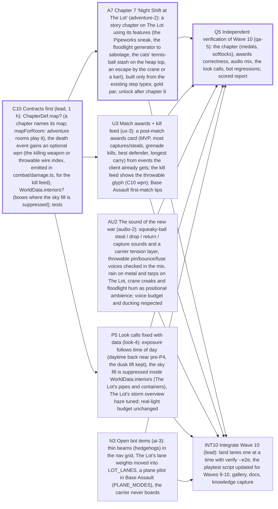

# Sprint plan — Wave 10 — Depth: a story on The Lot, match awards, the sound of the new war, the look calls fixed with data, and the open bot items; independent QA

8 tasks · 7 agents · 17 agent-hours · makespan **6 h** · utilization 40% · critical path 6 h

## Critical path
`C10` Contracts first (lead, 1 h): ChapterDef.map? (a chapter names its map; mapForRoom: adventure rooms play it), the death event gains an optional wpn (the killing weapon or throwable wire index, emitted in combat/damage.ts, for the kill feed), WorldData.interiors? (boxes where the sky fill is suppressed); tests → `A7` Chapter 7 'Night Shift at The Lot' (adventure-2): a story chapter on The Lot using its features (the Pipeworks sneak, the floodlight generator to sabotage, the cats' tennis-ball stash on the heap top, an escape by the crane or a kart), built only from the existing step types; gold par; unlock after chapter 6 → `Q5` Independent verification of Wave 10 (qa-5): the chapter (medals, softlocks), awards correctness, audio mix, the look calls, bot regressions; scored report

## Assignments
| Agent | Task | Lane | Start h | End h |
|---|---|---|---|---|
| adventure-2 | `A7` Chapter 7 'Night Shift at The Lot' (adventure-2): a story chapter on The Lot using its features (the Pipeworks sneak, the floodlight generator to sabotage, the cats' tennis-ball stash on the heap top, an escape by the crane or a kart), built only from the existing step types; gold par; unlock after chapter 6 | adventure | 1 | 4 |
| ai-3 | `N3` Open bot items (ai-3): thin beams (hedgehogs) in the nav grid, The Lot's lane weights moved into LOT_LANES, a plane pilot in Base Assault (PLANE_MODES), the carrier never boards | ai | 0 | 2 |
| audio-2 | `AU2` The sound of the new war (audio-2): squeaky-ball steal / drop / return / capture sounds and a carrier tension layer, throwable pin/bounce/fuse voices checked in the mix, rain on metal and tarps on The Lot, crane creaks and floodlight hum as positional ambience; voice budget and ducking respected | audio | 0 | 2 |
| lead | `C10` Contracts first (lead, 1 h): ChapterDef.map? (a chapter names its map; mapForRoom: adventure rooms play it), the death event gains an optional wpn (the killing weapon or throwable wire index, emitted in combat/damage.ts, for the kill feed), WorldData.interiors? (boxes where the sky fill is suppressed); tests | integration | 0 | 1 |
| lead | `INT10` Integrate Wave 10 (lead): land lanes one at a time with verify --e2e, the playtest script updated for Waves 9-10, gallery, docs, knowledge capture | integration | 4 | 6 |
| look-4 | `P5` Look calls fixed with data (look-4): exposure follows time of day (daytime back near pre-P4, the dusk lift kept), the sky fill is suppressed inside WorldData.interiors (The Lot's pipes and containers), The Lot's storm overview haze tuned; real-light budget unchanged | look | 1 | 3 |
| qa-5 | `Q5` Independent verification of Wave 10 (qa-5): the chapter (medals, softlocks), awards correctness, audio mix, the look calls, bot regressions; scored report | qa | 4 | 6 |
| ux-3 | `U3` Match awards + kill feed (ux-3): a post-match awards card (MVP, most captures/steals, grenade kills, best defender, longest carry) from events the client already gets; the kill feed shows the throwable glyph (C10 wpn); Base Assault first-match tips | ux | 1 | 4 |

## Waves (can start together once the previous wave is done)
1. C10, AU2, N3
2. A7, U3, P5
3. Q5, INT10

## Acceptance criteria
- `C10` Contracts first (lead, 1 h): ChapterDef.map? (a chapter names its map; mapForRoom: adventure rooms play it), the death event gains an optional wpn (the killing weapon or throwable wire index, emitted in combat/damage.ts, for the kill feed), WorldData.interiors? (boxes where the sky fill is suppressed); tests: every new field optional; existing chapters, maps and snapshots unchanged (tests); an old client decoding a death event with wpn keeps working (the field is additive)
- `A7` Chapter 7 'Night Shift at The Lot' (adventure-2): a story chapter on The Lot using its features (the Pipeworks sneak, the floodlight generator to sabotage, the cats' tennis-ball stash on the heap top, an escape by the crane or a kart), built only from the existing step types; gold par; unlock after chapter 6: a bot squad completes the chapter on 4 of 5 seeds inside the silver par; a scripted run reaches gold (tests); the chapter picker lists it after chapter 6; screenshots of every step, looked at; adventure soak on The Lot PASS; the six West Yard chapters unchanged (12/12 gold)
- `U3` Match awards + kill feed (ux-3): a post-match awards card (MVP, most captures/steals, grenade kills, best defender, longest carry) from events the client already gets; the kill feed shows the throwable glyph (C10 wpn); Base Assault first-match tips: awards computed from a recorded event stream in a test (no sim state on the client); ties and empty categories handled; a grenade kill shows the grenade glyph online and offline (test through the wire encoder); screenshots of the awards card in all four PvP modes, looked at
- `AU2` The sound of the new war (audio-2): squeaky-ball steal / drop / return / capture sounds and a carrier tension layer, throwable pin/bounce/fuse voices checked in the mix, rain on metal and tarps on The Lot, crane creaks and floodlight hum as positional ambience; voice budget and ducking respected: every new cue is procedural (no files), inside the voice limiter, and ducked under combat; a mix test proves no clipping; The Lot ambience changes with weather (dry / rain / storm) and position; a test samples it
- `P5` Look calls fixed with data (look-4): exposure follows time of day (daytime back near pre-P4, the dusk lift kept), the sky fill is suppressed inside WorldData.interiors (The Lot's pipes and containers), The Lot's storm overview haze tuned; real-light budget unchanged: W7 bookmarks at t = 0.74 keep P4's luma (>= 45) and contrast; noon and match-start luma within 5 % of pre-P4; The Lot pipe interior luma back under 30 at dusk; its storm overview contrast up; screenshots looked at; draws unchanged (perf-render before/after)
- `N3` Open bot items (ai-3): thin beams (hedgehogs) in the nav grid, The Lot's lane weights moved into LOT_LANES, a plane pilot in Base Assault (PLANE_MODES), the carrier never boards: no bot pinned > 2 s on a hedgehog in 10 West Yard matches (was 1-4 s); nav build time within 10 %; Base Assault bot-only on both maps still 5/5 seeds with a capture; lane shares unchanged within noise
- `Q5` Independent verification of Wave 10 (qa-5): the chapter (medals, softlocks), awards correctness, audio mix, the look calls, bot regressions; scored report: a scored report with P0/P1/P2 findings and repro commands; score >= 75 or blockers listed
- `INT10` Integrate Wave 10 (lead): land lanes one at a time with verify --e2e, the playtest script updated for Waves 9-10, gallery, docs, knowledge capture: verify --e2e green on every integration commit; soak PASS in all modes on both maps; budgets within §8.7

## Dependency graph

## Warnings
- agent utilization 40% — too many agents for this backlog shape (critical path 6 h dominates); fewer agents or split critical tasks