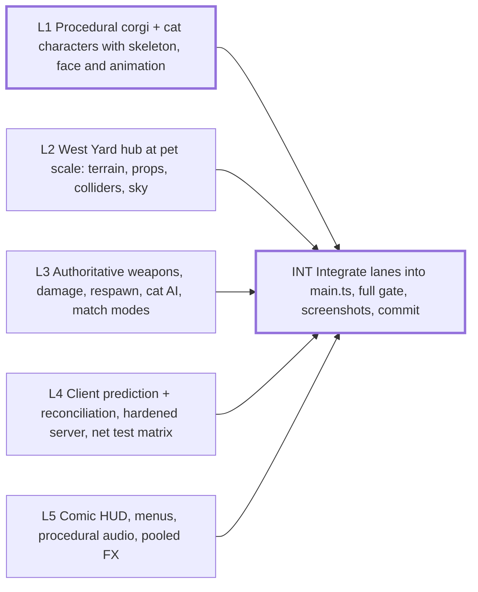

# Sprint plan — Wave 1 — parallel lanes on the walking skeleton

6 tasks · 6 agents · 17 agent-hours · makespan **5 h** · utilization 57% · critical path 5 h

## Critical path
`L1` Procedural corgi + cat characters with skeleton, face and animation → `INT` Integrate lanes into main.ts, full gate, screenshots, commit

## Assignments
| Agent | Task | Lane | Start h | End h |
|---|---|---|---|---|
| char-1 | `L1` Procedural corgi + cat characters with skeleton, face and animation | characters | 0 | 3 |
| combat-1 | `L3` Authoritative weapons, damage, respawn, cat AI, match modes | combat | 0 | 3 |
| juice-1 | `L5` Comic HUD, menus, procedural audio, pooled FX | juice | 0 | 3 |
| lead | `INT` Integrate lanes into main.ts, full gate, screenshots, commit | integration | 3 | 5 |
| net-1 | `L4` Client prediction + reconciliation, hardened server, net test matrix | netcode | 0 | 3 |
| world-1 | `L2` West Yard hub at pet scale: terrain, props, colliders, sky | world | 0 | 3 |

## Waves (can start together once the previous wave is done)
1. L1, L2, L3, L4, L5
2. INT

## Acceptance criteria
- `L1` Procedural corgi + cat characters with skeleton, face and animation: species/team/class readable at thumbnail size; tris <= 6k hero / 3.5k npc, bones <= 48; locomotion, jump, land, aim, fire, hit, death animate
- `L2` West Yard hub at pet scale: terrain, props, colliders, sky: collider matches rendered surface within 1 cm; spawns clear of props for both teams; 5 bookmark screenshots readable
- `L3` Authoritative weapons, damage, respawn, cat AI, match modes: lag-compensated hitscan tested; 60 s bot soak completes a match with no errors; bots navigate the yard without sticking
- `L4` Client prediction + reconciliation, hardened server, net test matrix: prediction error < 5 cm at 80 ms / 1% loss; 2 clients play over npm run server; invalid inputs rejected
- `L5` Comic HUD, menus, procedural audio, pooled FX: every action has audio + FX feedback; scoreboard/kill feed/hit markers readable at 720p; zero allocations per FX spawn after warm-up
- `INT` Integrate lanes into main.ts, full gate, screenshots, commit: npm run gate passes; in-game screenshot shows real characters in West Yard with HUD

## Dependency graph

