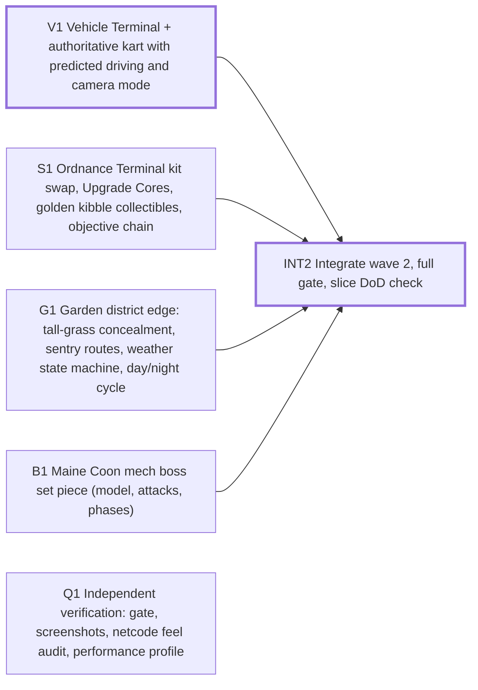

# Sprint plan — Wave 2 — the vertical slice

6 tasks · 6 agents · 16 agent-hours · makespan **5 h** · utilization 53% · critical path 5 h

## Critical path
`V1` Vehicle Terminal + authoritative kart with predicted driving and camera mode → `INT2` Integrate wave 2, full gate, slice DoD check

## Assignments
| Agent | Task | Lane | Start h | End h |
|---|---|---|---|---|
| boss-1 | `B1` Maine Coon mech boss set piece (model, attacks, phases) | boss | 0 | 3 |
| lead | `INT2` Integrate wave 2, full gate, slice DoD check | integration | 3 | 5 |
| qa-1 | `Q1` Independent verification: gate, screenshots, netcode feel audit, performance profile | qa | 0 | 2 |
| sys-1 | `S1` Ordnance Terminal kit swap, Upgrade Cores, golden kibble collectibles, objective chain | systems | 0 | 3 |
| veh-1 | `V1` Vehicle Terminal + authoritative kart with predicted driving and camera mode | vehicles | 0 | 3 |
| world-2 | `G1` Garden district edge: tall-grass concealment, sentry routes, weather state machine, day/night cycle | world | 0 | 3 |

## Waves (can start together once the previous wave is done)
1. V1, S1, G1, B1, Q1
2. INT2

## Acceptance criteria
- `V1` Vehicle Terminal + authoritative kart with predicted driving and camera mode: enter/exit never drops the player through geometry; kart handles distinctly from on-foot; authority decides collisions
- `S1` Ordnance Terminal kit swap, Upgrade Cores, golden kibble collectibles, objective chain: E interacts only within range and only server-side; cores reset at match end; 3-step objective chain completes
- `G1` Garden district edge: tall-grass concealment, sentry routes, weather state machine, day/night cycle: concealment reduces AI sight range; weather transitions blend without pops; dawn/noon/dusk screenshots readable
- `B1` Maine Coon mech boss set piece (model, attacks, phases): 3 readable telegraphed attacks; phase change at 50%; defeatable by 2 players in 3-5 min
- `Q1` Independent verification: gate, screenshots, netcode feel audit, performance profile: PASS/FAIL per Wave 1 claim with evidence; ranked defect list
- `INT2` Integrate wave 2, full gate, slice DoD check: npm run gate passes; vertical slice DoD checklist evaluated

## Dependency graph

