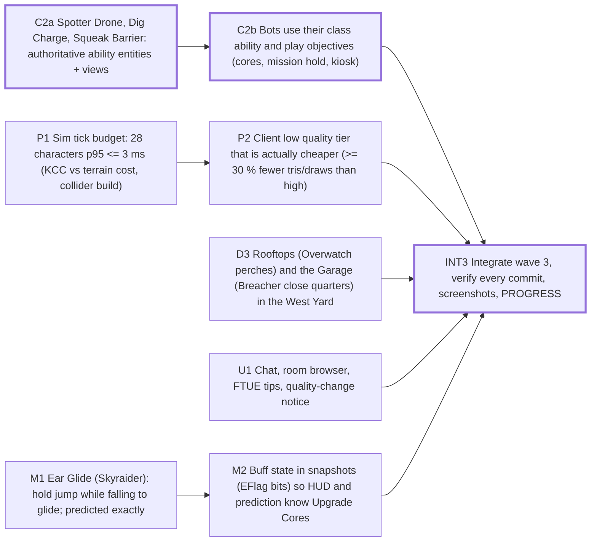

# Sprint plan — Wave 3 — depth: every class plays its fantasy, bots play the game, full rooms stay in budget

9 tasks · 5 agents · 23 agent-hours · makespan **8 h** · utilization 57% · critical path 8 h

## Critical path
`C2a` Spotter Drone, Dig Charge, Squeak Barrier: authoritative ability entities + views → `C2b` Bots use their class ability and play objectives (cores, mission hold, kiosk) → `INT3` Integrate wave 3, verify every commit, screenshots, PROGRESS

## Assignments
| Agent | Task | Lane | Start h | End h |
|---|---|---|---|---|
| combat-2 | `C2a` Spotter Drone, Dig Charge, Squeak Barrier: authoritative ability entities + views | combat | 0 | 3 |
| combat-2 | `C2b` Bots use their class ability and play objectives (cores, mission hold, kiosk) | combat | 3 | 6 |
| lead | `M1` Ear Glide (Skyraider): hold jump while falling to glide; predicted exactly | movement | 0 | 2 |
| lead | `M2` Buff state in snapshots (EFlag bits) so HUD and prediction know Upgrade Cores | movement | 2 | 4 |
| lead | `INT3` Integrate wave 3, verify every commit, screenshots, PROGRESS | integration | 6 | 8 |
| perf-1 | `P1` Sim tick budget: 28 characters p95 <= 3 ms (KCC vs terrain cost, collider build) | perf | 0 | 3 |
| perf-1 | `P2` Client low quality tier that is actually cheaper (>= 30 % fewer tris/draws than high) | perf | 3 | 5 |
| ux-1 | `U1` Chat, room browser, FTUE tips, quality-change notice | ux | 0 | 3 |
| world-3 | `D3` Rooftops (Overwatch perches) and the Garage (Breacher close quarters) in the West Yard | districts | 0 | 3 |

## Waves (can start together once the previous wave is done)
1. C2a, P1, D3, U1, M1
2. C2b, P2, M2
3. INT3

## Acceptance criteria
- `C2a` Spotter Drone, Dig Charge, Squeak Barrier: authoritative ability entities + views: drone marks enemies it sees for allies (flag) and can be shot down; charge arms, detonates on proximity or timer, never damages through walls; barrier blocks movement and bullets for its duration, both teams collide
- `C2b` Bots use their class ability and play objectives (cores, mission hold, kiosk): every class bot uses its ability at least once per 90 s of combat in a soak; corgi bots advance the Squeaker mission with no human; bots stay beatable: qa-difficulty first death >= 40 s
- `P1` Sim tick budget: 28 characters p95 <= 3 ms (KCC vs terrain cost, collider build): tools/perf-systems full-room tick p95 <= 3 ms; no movement or prediction test changes behavior; collider stays within 1 cm of the visual ground
- `P2` Client low quality tier that is actually cheaper (>= 30 % fewer tris/draws than high): low tier: >= 30 % fewer triangles and draw calls than high in the same view; quality change applies without a reload or says clearly that it needs one
- `D3` Rooftops (Overwatch perches) and the Garage (Breacher close quarters) in the West Yard: a corgi can reach every rooftop perch by a readable route; garage interior has 2+ entrances and cover; S1 kibble/core placements stay reachable (interact-yard tests green)
- `U1` Chat, room browser, FTUE tips, quality-change notice: Enter opens chat, messages show with team color, server rate limit respected; menu lists live rooms (players, mode) from the server and joins one; first match shows 3 contextual tips once, never again after
- `M1` Ear Glide (Skyraider): hold jump while falling to glide; predicted exactly: glide caps fall speed and keeps air control, ends on landing or release; prediction error stays 0 cm while gliding; only classes with the ability can glide
- `M2` Buff state in snapshots (EFlag bits) so HUD and prediction know Upgrade Cores: late joiner sees running buffs; Zoomies+ causes 0 prediction corrections
- `INT3` Integrate wave 3, verify every commit, screenshots, PROGRESS: npm run verify PASS on every integration commit; gate e2e PASS; 0 console errors in a 5 min skirmish probe

## Dependency graph

