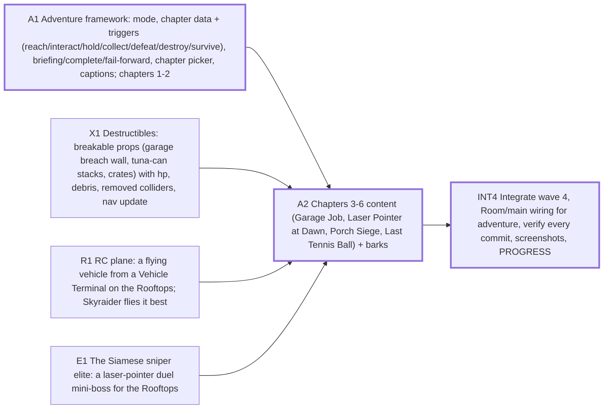

# Sprint plan — Wave 4 — the adventure: six district chapters, alone or in co-op (docs/design/ADVENTURE.md)

6 tasks · 5 agents · 17 agent-hours · makespan **8 h** · utilization 43% · critical path 8 h

## Critical path
`A1` Adventure framework: mode, chapter data + triggers (reach/interact/hold/collect/defeat/destroy/survive), briefing/complete/fail-forward, chapter picker, captions; chapters 1-2 → `A2` Chapters 3-6 content (Garage Job, Laser Pointer at Dawn, Porch Siege, Last Tennis Ball) + barks → `INT4` Integrate wave 4, Room/main wiring for adventure, verify every commit, screenshots, PROGRESS

## Assignments
| Agent | Task | Lane | Start h | End h |
|---|---|---|---|---|
| adv-1 | `A1` Adventure framework: mode, chapter data + triggers (reach/interact/hold/collect/defeat/destroy/survive), briefing/complete/fail-forward, chapter picker, captions; chapters 1-2 | adventure | 0 | 3 |
| adv-1 | `A2` Chapters 3-6 content (Garage Job, Laser Pointer at Dawn, Porch Siege, Last Tennis Ball) + barks | adventure | 3 | 6 |
| boss-2 | `E1` The Siamese sniper elite: a laser-pointer duel mini-boss for the Rooftops | boss | 0 | 3 |
| destruct-1 | `X1` Destructibles: breakable props (garage breach wall, tuna-can stacks, crates) with hp, debris, removed colliders, nav update | destruct | 0 | 3 |
| lead | `INT4` Integrate wave 4, Room/main wiring for adventure, verify every commit, screenshots, PROGRESS | integration | 6 | 8 |
| veh-2 | `R1` RC plane: a flying vehicle from a Vehicle Terminal on the Rooftops; Skyraider flies it best | vehicles | 0 | 3 |

## Waves (can start together once the previous wave is done)
1. A1, X1, R1, E1
2. A2
3. INT4

## Acceptance criteria
- `A1` Adventure framework: mode, chapter data + triggers (reach/interact/hold/collect/defeat/destroy/survive), briefing/complete/fail-forward, chapter picker, captions; chapters 1-2: chapter 1 is completable by a bot squad with no human, first objective inside 60 s; a squad wipe restarts at the last checkpoint, not from zero; chapter 2 stealth: being spotted starts the alarm spawns
- `A2` Chapters 3-6 content (Garage Job, Laser Pointer at Dawn, Porch Siege, Last Tennis Ball) + barks: every chapter completable by a bot squad (headless) inside 2x par; each chapter's featured kit matters (step needs its ability or vehicle)
- `X1` Destructibles: breakable props (garage breach wall, tuna-can stacks, crates) with hp, debris, removed colliders, nav update: dig charge / mortar blast breaks the breach wall and opens a walkable path (nav); authority decides; clients see the same break (snapshot); no floating debris colliders, no fps hitch > 5 ms on break
- `R1` RC plane: a flying vehicle from a Vehicle Terminal on the Rooftops; Skyraider flies it best: take off, bank, climb, land/crash without tunnelling through geometry; driver camera readable, other players see it interpolate smoothly; the kart still passes all its tests
- `E1` The Siamese sniper elite: a laser-pointer duel mini-boss for the Rooftops: telegraphed laser (1 s dot tracking) before each shot; cover beats it; relocates between perches; beatable by one Overwatch in 2-4 min; Vac-Tank tests stay green
- `INT4` Integrate wave 4, Room/main wiring for adventure, verify every commit, screenshots, PROGRESS: npm run verify -- --e2e PASS on every integration commit; all 6 chapters playable offline and in online co-op

## Dependency graph

## Warnings
- agent utilization 43% — too many agents for this backlog shape (critical path 8 h dominates); fewer agents or split critical tasks