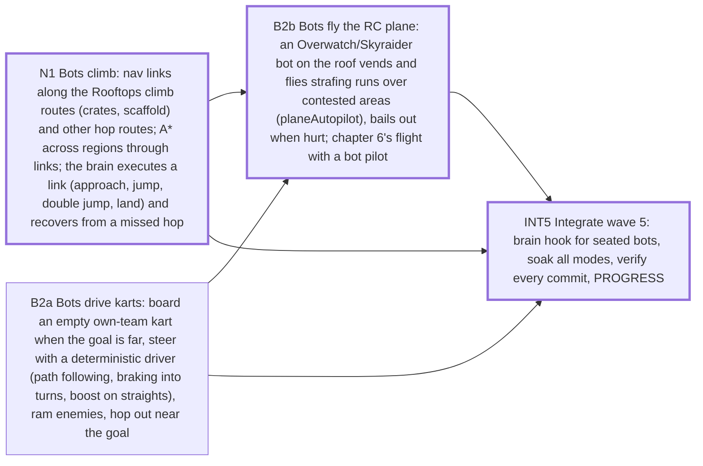

# Sprint plan — Wave 5 — bots use the whole yard: they climb to the roofs, drive the karts and fly the RC plane

4 tasks · 3 agents · 10 agent-hours · makespan **7 h** · utilization 48% · critical path 7 h

## Critical path
`N1` Bots climb: nav links along the Rooftops climb routes (crates, scaffold) and other hop routes; A* across regions through links; the brain executes a link (approach, jump, double jump, land) and recovers from a missed hop → `B2b` Bots fly the RC plane: an Overwatch/Skyraider bot on the roof vends and flies strafing runs over contested areas (planeAutopilot), bails out when hurt; chapter 6's flight with a bot pilot → `INT5` Integrate wave 5: brain hook for seated bots, soak all modes, verify every commit, PROGRESS

## Assignments
| Agent | Task | Lane | Start h | End h |
|---|---|---|---|---|
| drive-1 | `B2a` Bots drive karts: board an empty own-team kart when the goal is far, steer with a deterministic driver (path following, braking into turns, boost on straights), ram enemies, hop out near the goal | ai-vehicles | 0 | 3 |
| drive-1 | `B2b` Bots fly the RC plane: an Overwatch/Skyraider bot on the roof vends and flies strafing runs over contested areas (planeAutopilot), bails out when hurt; chapter 6's flight with a bot pilot | ai-vehicles | 3 | 5 |
| lead | `INT5` Integrate wave 5: brain hook for seated bots, soak all modes, verify every commit, PROGRESS | integration | 5 | 7 |
| nav-1 | `N1` Bots climb: nav links along the Rooftops climb routes (crates, scaffold) and other hop routes; A* across regions through links; the brain executes a link (approach, jump, double jump, land) and recovers from a missed hop | nav | 0 | 3 |

## Waves (can start together once the previous wave is done)
1. N1, B2a
2. B2b
3. INT5

## Acceptance criteria
- `N1` Bots climb: nav links along the Rooftops climb routes (crates, scaffold) and other hop routes; A* across regions through links; the brain executes a link (approach, jump, double jump, land) and recovers from a missed hop: an Overwatch bot told to hold a roof perch reaches it from its base by the climb routes in under 60 s, on 4 seeds; bots fall back to the ground route when a link is contested or they miss the hop twice (no bot stuck > 5 s); sim tick p95 at 28 characters stays within 3 ms; existing ai/world/destruct tests stay green
- `B2a` Bots drive karts: board an empty own-team kart when the goal is far, steer with a deterministic driver (path following, braking into turns, boost on straights), ram enemies, hop out near the goal: in a 4v4 TDM soak bots drive karts at least once per match and score ram kills; no kart stuck > 5 s; a bot-driven kart reaches a 60 m goal faster than walking in 4 of 5 seeds; chapter 3's escape step completes with a bot driver when the squad is bot-only (no waiver needed)
- `B2b` Bots fly the RC plane: an Overwatch/Skyraider bot on the roof vends and flies strafing runs over contested areas (planeAutopilot), bails out when hurt; chapter 6's flight with a bot pilot: in TDM the plane is used by a bot at least once per match on 3 of 4 seeds; bot pilots never crash into the house on take-off (5 runs); chapter 6 completes bot-only without the vehicle/airborne waivers
- `INT5` Integrate wave 5: brain hook for seated bots, soak all modes, verify every commit, PROGRESS: verify --e2e green on every integration commit; soak PASS in all five modes

## Dependency graph

## Warnings
- agent utilization 48% — too many agents for this backlog shape (critical path 7 h dominates); fewer agents or split critical tasks