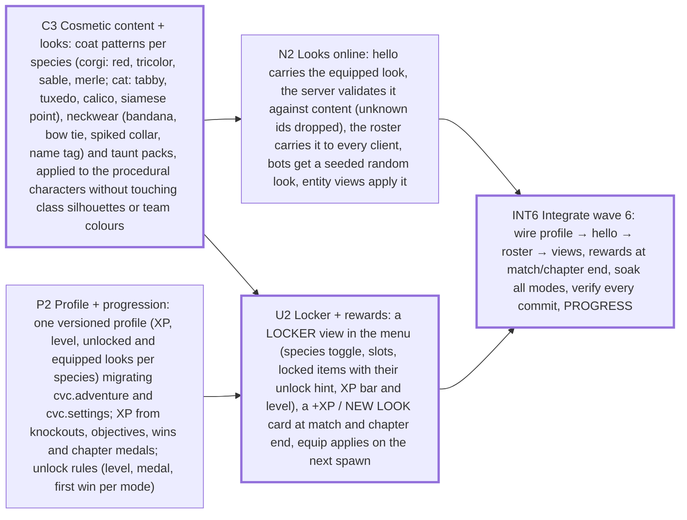

# Sprint plan — Wave 6 — earn your look: coat patterns, neckwear and taunts unlocked by play, seen by everyone, never stats

5 tasks · 3 agents · 13 agent-hours · makespan **8 h** · utilization 54% · critical path 8 h

## Critical path
`C3` Cosmetic content + looks: coat patterns per species (corgi: red, tricolor, sable, merle; cat: tabby, tuxedo, calico, siamese point), neckwear (bandana, bow tie, spiked collar, name tag) and taunt packs, applied to the procedural characters without touching class silhouettes or team colours → `U2` Locker + rewards: a LOCKER view in the menu (species toggle, slots, locked items with their unlock hint, XP bar and level), a +XP / NEW LOOK card at match and chapter end, equip applies on the next spawn → `INT6` Integrate wave 6: wire profile → hello → roster → views, rewards at match/chapter end, soak all modes, verify every commit, PROGRESS

## Assignments
| Agent | Task | Lane | Start h | End h |
|---|---|---|---|---|
| lead | `N2` Looks online: hello carries the equipped look, the server validates it against content (unknown ids dropped), the roster carries it to every client, bots get a seeded random look, entity views apply it | integration | 3 | 5 |
| lead | `INT6` Integrate wave 6: wire profile → hello → roster → views, rewards at match/chapter end, soak all modes, verify every commit, PROGRESS | integration | 6 | 8 |
| look-1 | `C3` Cosmetic content + looks: coat patterns per species (corgi: red, tricolor, sable, merle; cat: tabby, tuxedo, calico, siamese point), neckwear (bandana, bow tie, spiked collar, name tag) and taunt packs, applied to the procedural characters without touching class silhouettes or team colours | cosmetics | 0 | 3 |
| meta-1 | `P2` Profile + progression: one versioned profile (XP, level, unlocked and equipped looks per species) migrating cvc.adventure and cvc.settings; XP from knockouts, objectives, wins and chapter medals; unlock rules (level, medal, first win per mode) | profile | 0 | 3 |
| meta-1 | `U2` Locker + rewards: a LOCKER view in the menu (species toggle, slots, locked items with their unlock hint, XP bar and level), a +XP / NEW LOOK card at match and chapter end, equip applies on the next spawn | ux | 3 | 6 |

## Waves (can start together once the previous wave is done)
1. C3, P2
2. N2, U2
3. INT6

## Acceptance criteria
- `C3` Cosmetic content + looks: coat patterns per species (corgi: red, tricolor, sable, merle; cat: tabby, tuxedo, calico, siamese point), neckwear (bandana, bow tie, spiked collar, name tag) and taunt packs, applied to the procedural characters without touching class silhouettes or team colours: every coat × every class × both teams builds within the kit triangle budget and passes the style audit (toon/glow/ink only); class silhouette distance (K1 metric) and team colour readability are unchanged with any look applied (test); applyLook(avatar, look) is idempotent, disposes what it replaces, and an unknown id falls back to the default look; lab screenshots of all coats and neckwear on both species, looked at
- `P2` Profile + progression: one versioned profile (XP, level, unlocked and equipped looks per species) migrating cvc.adventure and cvc.settings; XP from knockouts, objectives, wins and chapter medals; unlock rules (level, medal, first win per mode): a v0 device (only cvc.adventure + cvc.settings) migrates without losing a medal or a setting; corrupt JSON falls back to defaults; XP for a match is a pure function of the match events (unit-tested); a level curve where the first unlock lands in the first match and one per ~2 matches after; unlocks are idempotent and never revoke; equipping a locked look is refused
- `N2` Looks online: hello carries the equipped look, the server validates it against content (unknown ids dropped), the roster carries it to every client, bots get a seeded random look, entity views apply it: two clients see each other's looks; a hostile look (unknown id, 10 kB string, wrong species) is dropped, never echoed; bot looks are deterministic per seed; the snapshot size is unchanged (the look rides the roster, not the snapshot)
- `U2` Locker + rewards: a LOCKER view in the menu (species toggle, slots, locked items with their unlock hint, XP bar and level), a +XP / NEW LOOK card at match and chapter end, equip applies on the next spawn: keyboard and gamepad navigable, readable at 1280×720 and 2560×1440 (screenshots looked at); the reward card shows the XP earned and any new look; it never blocks the next match or chapter; e2e: equip a look in the locker, start a match, the local avatar wears it
- `INT6` Integrate wave 6: wire profile → hello → roster → views, rewards at match/chapter end, soak all modes, verify every commit, PROGRESS: verify --e2e green on every integration commit; soak PASS in all five modes; a fresh device: first match → a level-up and one new look; an old device keeps its adventure medals

## Dependency graph

