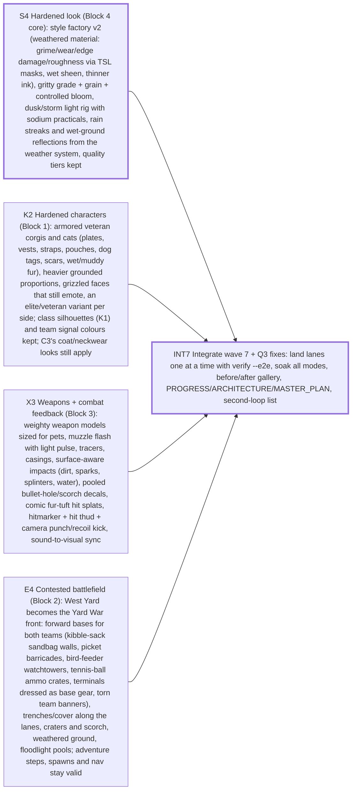

# Sprint plan — Wave 7 — HARDENED: battle-hardened warriors, a contested battlefield, weapons that hit hard, one gritty image (docs/design/HARDENED.md)

5 tasks · 5 agents · 14 agent-hours · makespan **5 h** · utilization 56% · critical path 5 h

## Critical path
`S4` Hardened look (Block 4 core): style factory v2 (weathered material: grime/wear/edge damage/roughness via TSL masks, wet sheen, thinner ink), gritty grade + grain + controlled bloom, dusk/storm light rig with sodium practicals, rain streaks and wet-ground reflections from the weather system, quality tiers kept → `INT7` Integrate wave 7 + Q3 fixes: land lanes one at a time with verify --e2e, soak all modes, before/after gallery, PROGRESS/ARCHITECTURE/MASTER_PLAN, second-loop list

## Assignments
| Agent | Task | Lane | Start h | End h |
|---|---|---|---|---|
| arms-1 | `X3` Weapons + combat feedback (Block 3): weighty weapon models sized for pets, muzzle flash with light pulse, tracers, casings, surface-aware impacts (dirt, sparks, splinters, water), pooled bullet-hole/scorch decals, comic fur-tuft hit splats, hitmarker + hit thud + camera punch/recoil kick, sound-to-visual sync | weapons-fx | 0 | 3 |
| char-2 | `K2` Hardened characters (Block 1): armored veteran corgis and cats (plates, vests, straps, pouches, dog tags, scars, wet/muddy fur), heavier grounded proportions, grizzled faces that still emote, an elite/veteran variant per side; class silhouettes (K1) and team signal colours kept; C3's coat/neckwear looks still apply | characters | 0 | 3 |
| env-4 | `E4` Contested battlefield (Block 2): West Yard becomes the Yard War front: forward bases for both teams (kibble-sack sandbag walls, picket barricades, bird-feeder watchtowers, tennis-ball ammo crates, terminals dressed as base gear, torn team banners), trenches/cover along the lanes, craters and scorch, weathered ground, floodlight pools; adventure steps, spawns and nav stay valid | environment | 0 | 3 |
| lead | `INT7` Integrate wave 7 + Q3 fixes: land lanes one at a time with verify --e2e, soak all modes, before/after gallery, PROGRESS/ARCHITECTURE/MASTER_PLAN, second-loop list | integration | 3 | 5 |
| look-2 | `S4` Hardened look (Block 4 core): style factory v2 (weathered material: grime/wear/edge damage/roughness via TSL masks, wet sheen, thinner ink), gritty grade + grain + controlled bloom, dusk/storm light rig with sodium practicals, rain streaks and wet-ground reflections from the weather system, quality tiers kept | look | 0 | 3 |

## Waves (can start together once the previous wave is done)
1. S4, K2, X3, E4
2. INT7

## Acceptance criteria
- `S4` Hardened look (Block 4 core): style factory v2 (weathered material: grime/wear/edge damage/roughness via TSL masks, wet sheen, thinner ink), gritty grade + grain + controlled bloom, dusk/storm light rig with sodium practicals, rain streaks and wet-ground reflections from the weather system, quality tiers kept: every material still comes from the style factory; the style audit and the existing style tests are green; bookmark screenshots (overview, center, deck, cats, garden) before/after at the high and low tiers, looked at: dusk/storm reads gritty, teams and silhouettes still read; high-tier live TDM stays ≤ 1.5 M triangles / ≤ 400 draws; the low tier costs no more than before
- `K2` Hardened characters (Block 1): armored veteran corgis and cats (plates, vests, straps, pouches, dog tags, scars, wet/muddy fur), heavier grounded proportions, grizzled faces that still emote, an elite/veteran variant per side; class silhouettes (K1) and team signal colours kept; C3's coat/neckwear looks still apply: 24/24 kits (6 classes × 2 species × 2 teams) within the kit triangle budget, style audit green, K1 silhouette distance not lower than before; lab turntable and in-game screenshots (both species, both teams, elite variants) looked at: they read as veterans at 5 m and as their class at 35 m; animation still clean: no floating gear, no skin tearing in idle/run/fire/emote
- `X3` Weapons + combat feedback (Block 3): weighty weapon models sized for pets, muzzle flash with light pulse, tracers, casings, surface-aware impacts (dirt, sparks, splinters, water), pooled bullet-hole/scorch decals, comic fur-tuft hit splats, hitmarker + hit thud + camera punch/recoil kick, sound-to-visual sync: every weapon has a model within budget and a distinct fire/impact read in screenshots and a slow-motion capture, looked at; effects are pooled: 0 allocations per shot after warm-up, decals capped, FX frame cost ≤ 0.5 ms in a firefight (unit perf test); no sim/gameplay change without a note in the handoff (recoil kick is visual; spread/fire rate stay unless justified)
- `E4` Contested battlefield (Block 2): West Yard becomes the Yard War front: forward bases for both teams (kibble-sack sandbag walls, picket barricades, bird-feeder watchtowers, tennis-ball ammo crates, terminals dressed as base gear, torn team banners), trenches/cover along the lanes, craters and scorch, weathered ground, floodlight pools; adventure steps, spawns and nav stay valid: every new solid prop has a collider matching its visual (≤ 1 cm, like L2's test), nav/links rebuild, bots are never stuck > 5 s in a soak, all adventure/world/destruct tests stay green; both team bases read as forward operating bases from the overview and spawn bookmarks (screenshots looked at); prop density up without breaking budgets: merged/instanced, ≤ +40 draw calls, triangle total within budget
- `INT7` Integrate wave 7 + Q3 fixes: land lanes one at a time with verify --e2e, soak all modes, before/after gallery, PROGRESS/ARCHITECTURE/MASTER_PLAN, second-loop list: verify --e2e green on every integration commit; soak PASS in all five modes; budgets re-measured; Q3 P1-1 fixed with a test that asserts who breaches the ch3 wall

## Dependency graph

