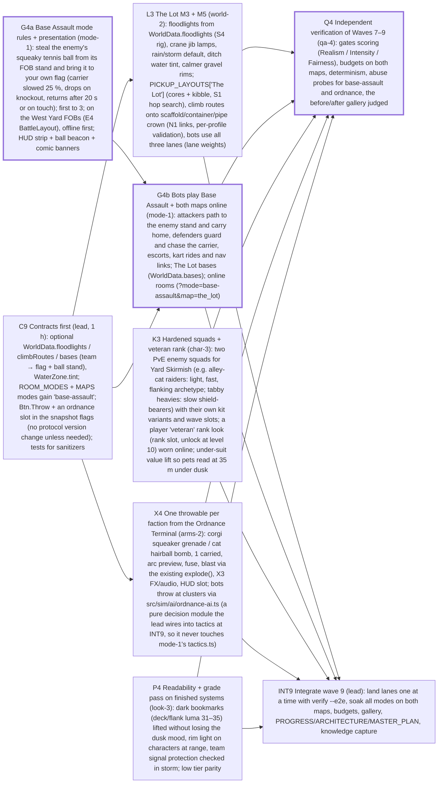

# Sprint plan — Wave 9 (PROPOSED, awaiting owner approval) — The war gets a purpose: base assault on both maps, The Lot finished (atmosphere + gameplay), enemy squads and veteran rank, one throwable ordnance, a readability pass; independent QA. Starts after W7 P3 (render budget pass) lands

9 tasks · 6 agents · 22 agent-hours · makespan **8 h** · utilization 46% · critical path 8 h

## Critical path
`G4a` Base Assault mode rules + presentation (mode-1): steal the enemy's squeaky tennis ball from its FOB stand and bring it to your own flag (carrier slowed 25 %, drops on knockout, returns after 20 s or on touch); first to 3; on the West Yard FOBs (E4 BattleLayout), offline first; HUD strip + ball beacon + comic banners → `G4b` Bots play Base Assault + both maps online (mode-1): attackers path to the enemy stand and carry home, defenders guard and chase the carrier, escorts, kart rides and nav links; The Lot bases (WorldData.bases); online rooms (?mode=base-assault&map=the_lot) → `Q4` Independent verification of Waves 7–9 (qa-4): gates scoring (Realism / Intensity / Fairness), budgets on both maps, determinism, abuse probes for base-assault and ordnance, the before/after gallery judged

## Assignments
| Agent | Task | Lane | Start h | End h |
|---|---|---|---|---|
| arms-2 | `X4` One throwable per faction from the Ordnance Terminal (arms-2): corgi squeaker grenade / cat hairball bomb, 1 carried, arc preview, fuse, blast via the existing explode(), X3 FX/audio, HUD slot; bots throw at clusters via src/sim/ai/ordnance-ai.ts (a pure decision module the lead wires into tactics at INT9, so it never touches mode-1's tactics.ts) | ordnance | 1 | 4 |
| char-3 | `K3` Hardened squads + veteran rank (char-3): two PvE enemy squads for Yard Skirmish (e.g. alley-cat raiders: light, fast, flanking archetype; tabby heavies: slow shield-bearers) with their own kit variants and wave slots; a player 'veteran' rank look (rank slot, unlock at level 10) worn online; under-suit value lift so pets read at 35 m under dusk | characters | 0 | 3 |
| char-3 | `P4` Readability + grade pass on finished systems (look-3): dark bookmarks (deck/flank luma 31–35) lifted without losing the dusk mood, rim light on characters at range, team signal protection checked in storm; low tier parity | look | 3 | 5 |
| lead | `C9` Contracts first (lead, 1 h): optional WorldData.floodlights / climbRoutes / bases (team → flag + ball stand), WaterZone.tint; ROOM_MODES + MAPS modes gain 'base-assault'; Btn.Throw + an ordnance slot in the snapshot flags (no protocol version change unless needed); tests for sanitizers | integration | 0 | 1 |
| lead | `INT9` Integrate wave 9 (lead): land lanes one at a time with verify --e2e, soak all modes on both maps, budgets, gallery, PROGRESS/ARCHITECTURE/MASTER_PLAN, knowledge capture | integration | 6 | 8 |
| mode-1 | `G4a` Base Assault mode rules + presentation (mode-1): steal the enemy's squeaky tennis ball from its FOB stand and bring it to your own flag (carrier slowed 25 %, drops on knockout, returns after 20 s or on touch); first to 3; on the West Yard FOBs (E4 BattleLayout), offline first; HUD strip + ball beacon + comic banners | mode | 0 | 3 |
| mode-1 | `G4b` Bots play Base Assault + both maps online (mode-1): attackers path to the enemy stand and carry home, defenders guard and chase the carrier, escorts, kart rides and nav links; The Lot bases (WorldData.bases); online rooms (?mode=base-assault&map=the_lot) | mode | 3 | 6 |
| qa-4 | `Q4` Independent verification of Waves 7–9 (qa-4): gates scoring (Realism / Intensity / Fairness), budgets on both maps, determinism, abuse probes for base-assault and ordnance, the before/after gallery judged | qa | 6 | 8 |
| world-2 | `L3` The Lot M3 + M5 (world-2): floodlights from WorldData.floodlights (S4 rig), crane jib lamps, rain/storm default, ditch water tint, calmer gravel rims; PICKUP_LAYOUTS['The Lot'] (cores + kibble, S1 hop search), climb routes onto scaffold/container/pipe crown (N1 links, per-profile validation), bots use all three lanes (lane weights) | world | 1 | 4 |

## Waves (can start together once the previous wave is done)
1. C9, G4a, K3, P4
2. L3, G4b, X4
3. Q4, INT9

## Acceptance criteria
- `C9` Contracts first (lead, 1 h): optional WorldData.floodlights / climbRoutes / bases (team → flag + ball stand), WaterZone.tint; ROOM_MODES + MAPS modes gain 'base-assault'; Btn.Throw + an ordnance slot in the snapshot flags (no protocol version change unless needed); tests for sanitizers: every new field optional; the West Yard, The Lot and every existing test unchanged; hostile ?mode=base-assault on adventure-only maps falls back like any unhostable mode (test)
- `L3` The Lot M3 + M5 (world-2): floodlights from WorldData.floodlights (S4 rig), crane jib lamps, rain/storm default, ditch water tint, calmer gravel rims; PICKUP_LAYOUTS['The Lot'] (cores + kibble, S1 hop search), climb routes onto scaffold/container/pipe crown (N1 links, per-profile validation), bots use all three lanes (lane weights): the five hero bookmarks reshot at dusk + storm, looked at: floodlight pools, crane lamps, muddy ditch water, no black floors; bots reach the scaffold deck and container roof via links; bot-seconds in Canyon and Pipeworks ≥ 25 % each of The Mud's in a 14v14 TDM; cores/kibble collectable by both species (hop search), soak PASS on The Lot in all three PvP modes
- `G4a` Base Assault mode rules + presentation (mode-1): steal the enemy's squeaky tennis ball from its FOB stand and bring it to your own flag (carrier slowed 25 %, drops on knockout, returns after 20 s or on touch); first to 3; on the West Yard FOBs (E4 BattleLayout), offline first; HUD strip + ball beacon + comic banners: authoritative: pickup/drop/return/capture only in the sim, duplicate-grab and carrier-disconnect cases tested; no ball duplication or loss; a human vs bots round is playable end to end offline on the West Yard (worker ?mode=base-assault), screenshots looked at
- `G4b` Bots play Base Assault + both maps online (mode-1): attackers path to the enemy stand and carry home, defenders guard and chase the carrier, escorts, kart rides and nav links; The Lot bases (WorldData.bases); online rooms (?mode=base-assault&map=the_lot): bot-only 4v4 on both maps: ≥ 1 capture per 5-minute match on 4 of 5 seeds, both teams score, no bot stuck > 5 s; an online room on The Lot plays a full round (two clients in-process); soak PASS with base-assault added to the mode list
- `K3` Hardened squads + veteran rank (char-3): two PvE enemy squads for Yard Skirmish (e.g. alley-cat raiders: light, fast, flanking archetype; tabby heavies: slow shield-bearers) with their own kit variants and wave slots; a player 'veteran' rank look (rank slot, unlock at level 10) worn online; under-suit value lift so pets read at 35 m under dusk: 24/24 + squad kits within the NPC budget, style audit green, K1 distance and team read not lower; 35 m lineup at dusk: team shells and suits read for both species (screenshot looked at; luma of the suit ≥ agreed floor); skirmish waves with the new squads stay inside the existing difficulty band (qa-difficulty), no new player combat power
- `X4` One throwable per faction from the Ordnance Terminal (arms-2): corgi squeaker grenade / cat hairball bomb, 1 carried, arc preview, fuse, blast via the existing explode(), X3 FX/audio, HUD slot; bots throw at clusters via src/sim/ai/ordnance-ai.ts (a pure decision module the lead wires into tactics at INT9, so it never touches mode-1's tactics.ts): authoritative throw (server validates carry, cooldown, arc), prediction-safe; damage within the soft-counter band (TTK tables unchanged for guns); grenade arc, fuse and blast read in slow-motion shots; 0 allocations per throw after warm-up
- `P4` Readability + grade pass on finished systems (look-3): dark bookmarks (deck/flank luma 31–35) lifted without losing the dusk mood, rim light on characters at range, team signal protection checked in storm; low tier parity: the W7 bookmark set reshot: luma of every bookmark ≥ 45 at t = 0.74, contrast not lower; looked at; budgets unchanged (perf-render before/after)
- `Q4` Independent verification of Waves 7–9 (qa-4): gates scoring (Realism / Intensity / Fairness), budgets on both maps, determinism, abuse probes for base-assault and ordnance, the before/after gallery judged: a scored report with P0/P1/P2 findings and repro commands; score ≥ 70 or blockers listed
- `INT9` Integrate wave 9 (lead): land lanes one at a time with verify --e2e, soak all modes on both maps, budgets, gallery, PROGRESS/ARCHITECTURE/MASTER_PLAN, knowledge capture: verify --e2e green on every integration commit; soak PASS in all modes on both maps; budgets within §8.7

## Dependency graph

## Warnings
- agent utilization 46% — too many agents for this backlog shape (critical path 8 h dominates); fewer agents or split critical tasks